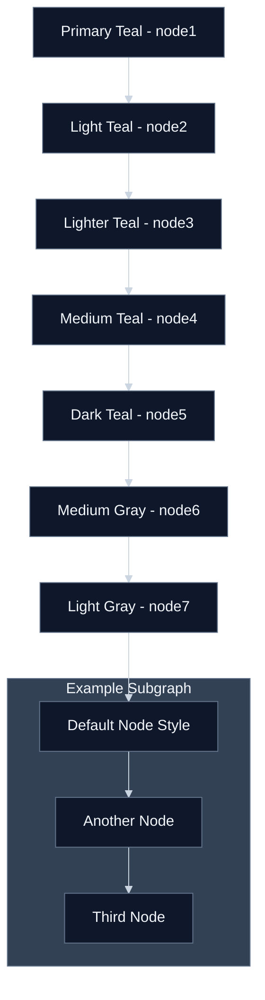

# Mermaid Color Test - Dark Mode

Test diagram using your app's color scheme for dark mode.

## Your App's Color Scheme (Dark Mode):
- **Primary**: Light teal scale (`#2dd4bf` to `#0d9488`)
- **Neutral**: Gray scale (`#64748b` to `#94a3b8`)
- **Background**: Dark navy with dark gray nodes
- **Text**: Light for high contrast
- **Arrows**: Light gray (`#cbd5e1`) - visible on dark background

