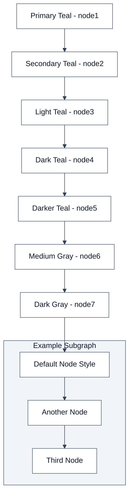

# Mermaid Color Test - Light Mode

Test diagram using your app's color scheme for light mode.

## Your App's Color Scheme (Light Mode):
- **Primary**: Teal scale (`#0d9488` to `#115e59`) 
- **Neutral**: Gray scale (`#475569` to `#1e293b`)
- **Background**: White with light gray nodes
- **Text**: Dark for high contrast
- **Arrows**: Dark gray (`#334155`) - visible on white