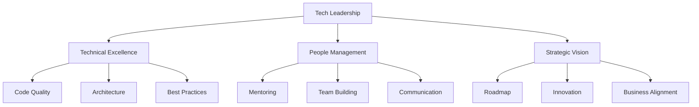

# Tech Leadership Framework

Technical leadership is a complex role that requires balancing multiple responsibilities. Here's a framework that outlines the key areas of focus:

## Key Components

### Technical Excellence
- Maintaining high code quality standards
- Making architectural decisions
- Implementing best practices

### People Management
- Mentoring team members
- Building effective teams
- Clear communication

### Strategic Vision
- Creating and maintaining roadmaps
- Driving innovation
- Aligning with business goals

This framework provides a structured approach to technical leadership, helping leaders balance their various responsibilities effectively. 