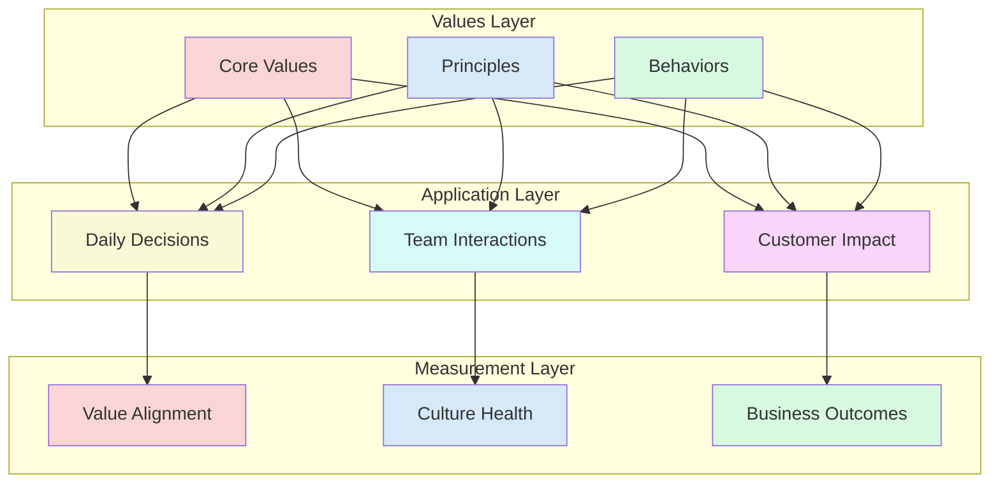

## Values Framework



## Core Values in Practice

### 1. Customer Obsession
```yaml
value:
  name: "Customer Obsession"
  principle: "Start with the customer and work backwards"
  behaviors:
    - "Gather customer feedback before making decisions"
    - "Measure impact on customer experience"
    - "Prioritize customer value over internal convenience"
  anti_patterns:
    - "Building features without user research"
    - "Ignoring customer feedback"
    - "Optimizing for internal metrics only"
```

### 2. Ownership
```yaml
value:
  name: "Ownership"
  principle: "Think long term and don't sacrifice long-term value for short-term results"
  behaviors:
    - "Take end-to-end responsibility"
    - "Fix root causes, not symptoms"
    - "Consider future maintenance and scalability"
  anti_patterns:
    - "That's not my problem" mentality
    - "Quick fixes without proper solutions"
    - "Ignoring technical debt"
```

### 3. Learn & Be Curious
```yaml
value:
  name: "Learn & Be Curious"
  principle: "Never stop learning and be open to new ideas"
  behaviors:
    - "Share knowledge proactively"
    - "Experiment with new approaches"
    - "Seek and give constructive feedback"
  anti_patterns:
    - "Resistance to change"
    - "Not sharing learnings"
    - "Avoiding difficult conversations"
```

## Value Implementation Tools

### 1. Decision Making Framework
```markdown
# Value-Based Decision Template

## Context
- What's the situation?
- What are the constraints?

## Values Check
- Which values apply here?
- How do they guide us?

## Options Analysis
- Option 1: [Description + Value Alignment]
- Option 2: [Description + Value Alignment]
- Option 3: [Description + Value Alignment]

## Decision
- Chosen option
- Value-based rationale
- Expected outcomes
```

### 2. Behavior Assessment
```yaml
assessment:
  value: "Customer Obsession"
  behaviors:
    - description: "Gathers customer feedback"
      evidence_required:
        - "Regular user interviews"
        - "Feature feedback cycles"
        - "Usage analytics review"
      
    - description: "Prioritizes customer impact"
      evidence_required:
        - "Impact assessments"
        - "Customer-centric KPIs"
        - "Feature adoption metrics"
```

## Value Evolution Process

### 1. Discovery Phase
- Gather input from all levels
- Identify existing cultural strengths
- Map current behaviors

### 2. Definition Phase
- Craft clear value statements
- Define observable behaviors
- Create measurement framework

### 3. Implementation Phase
- Communication campaign
- Training workshops
- Tool integration

### 4. Reinforcement Phase
- Regular assessments
- Recognition programs
- Continuous refinement

## Measuring Value Alignment

### 1. Quantitative Metrics
| Metric | Good | Warning | Action Needed |
|--------|------|---------|---------------|
| Value Survey Score | > 8/10 | 6-8/10 | < 6/10 |
| Behavior Observation | > 80% | 60-80% | < 60% |
| Decision Alignment | > 90% | 70-90% | < 70% |

### 2. Qualitative Indicators
- Stories shared in team meetings
- Peer recognition examples
- Customer feedback themes
- Interview responses

## Common Anti-patterns

### 1. Values as Wall Art
❌ **Problem**: Values posted but not lived
✅ **Solution**: Regular value demonstrations and discussions

### 2. Inconsistent Application
❌ **Problem**: Different standards for different people
✅ **Solution**: Clear behavior rubrics and fair assessment

### 3. Value Conflicts
❌ **Problem**: Competing values create confusion
✅ **Solution**: Clear prioritization guidelines

## Implementation Guide

### First 30 Days
1. Document current values
2. Gather team feedback
3. Create behavior guides

### 60-90 Days
1. Train on value framework
2. Start measurement program
3. Implement recognition system

### Beyond 90 Days
1. Regular value reviews
2. Evolution process
3. Impact assessment

## Integration Points

### With Other Practices
- Guides [Culture](culture)
- Informs [Mission & Objectives](mission-objectives)
- Shapes [Team Decoupling](decoupling_teams)

### With Tools & Systems
- HR systems
- Performance reviews
- Recognition platforms

## Related Topics
- [Operating Model Overview](operating_alignment_model_wiki)
- [Culture Guide](culture)
- [Alignment & Feedback](alignment-feedback)

> **Pro Tip:** Values should be verbs, not nouns. They should describe how we act, not just what we believe.

---

## Further Reading
- "Start with Why" by Simon Sinek
- "Tribal Leadership" by Dave Logan
- "The Culture Code" by Daniel Coyle
