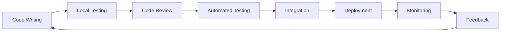

# Managing Building Activities

Building activities encompass the core development workflow from writing code to having it running in production. These activities—coding, reviewing, testing, and deploying—form the critical path for delivering software value. Optimizing building activities focuses on reducing cycle time while maintaining quality, creating faster feedback loops, and eliminating waste in the development process.

## Understanding the Building Workflow

### The Code-to-Production Pipeline

The modern software building workflow typically follows this pattern:



Each stage represents an opportunity for optimization or a potential bottleneck that can slow the entire delivery process.

### Key Building Activities

**Code Development**:
- Writing and refactoring code
- Local testing and validation
- Documentation creation
- Debugging and problem-solving

**Code Review**:
- Peer review of changes
- Knowledge sharing and learning
- Quality assurance and standards enforcement
- Collaborative problem-solving

**Continuous Integration**:
- Automated testing execution
- Code quality analysis
- Security scanning
- Integration validation

**Deployment and Release**:
- Environment provisioning
- Release coordination
- Rollback preparation
- Production monitoring

## Code Review Optimization

### The Role of Code Review in Engineering Effectiveness

Code review serves multiple purposes beyond defect detection:
- **Knowledge Sharing**: Spreads understanding across team members
- **Quality Assurance**: Catches issues before they reach production
- **Learning**: Helps team members improve their skills
- **Collaboration**: Creates opportunities for discussion and improvement

However, inefficient review processes create significant bottlenecks that impact overall engineering effectiveness.

### Common Code Review Bottlenecks

**Review Latency**:
- Long delays between review request and first review
- Multiple review rounds due to unclear expectations
- Reviewers unavailable or overloaded
- Timezone differences in distributed teams

**Review Quality Issues**:
- Inconsistent feedback quality and standards
- Focus on style over substance
- Missed important issues due to review fatigue
- Lack of context about business requirements

**Process Friction**:
- Complex review tools that slow down the process
- Unclear review criteria and expectations
- No clear ownership or accountability
- Manual coordination between reviewers

### Optimizing Code Review Effectiveness

**Review Size and Scope**:
```yaml
Optimal Review Characteristics:
- Size: <400 lines of code changed
- Scope: Single logical change or feature
- Context: Clear description of what and why
- Testing: Adequate test coverage included

Size Guidelines:
- Small reviews (<200 lines): 90% find all defects
- Medium reviews (200-400 lines): 60% find all defects  
- Large reviews (>400 lines): <30% find all defects
```

**Review Process Design**:
- **Clear Expectations**: Documented standards for what reviewers should focus on
- **Review Checklists**: Consistent criteria for different types of changes
- **Time Limits**: Maximum time for initial review and response to feedback
- **Escalation Paths**: Clear process when reviews are blocked or delayed

**Reviewer Selection and Assignment**:
- **Expertise Matching**: Assign reviewers with relevant domain knowledge
- **Load Balancing**: Distribute review work evenly across team members
- **Backup Reviewers**: Ensure reviews don't wait for single person availability
- **Learning Opportunities**: Pair junior and senior engineers for knowledge transfer

### Code Review Metrics and Measurement

**Velocity Metrics**:
```yaml
Review Cycle Time:
- Time from PR creation to first review: <4 hours
- Time from feedback to response: <8 hours
- Total review time (PR creation to merge): <24 hours
- Review rounds per PR: <2 on average

Quality Metrics:
- Defect detection rate in review vs. production
- Review coverage (percentage of changes reviewed)
- Review participation (reviewers per change)
- Learning indicators (questions asked, knowledge shared)
```

**Leading Indicators**:
- Average review queue size per engineer
- Review workload distribution across team
- Time spent in review vs. writing code
- Engineer satisfaction with review process

### Review Automation and Tool Support

**Automated Quality Checks**:
- Style and formatting validation
- Security vulnerability scanning
- Performance impact analysis
- Test coverage verification

**Review Tool Optimization**:
- Fast, responsive review interfaces
- Context-aware diff viewers
- Integration with development environments
- Mobile-friendly for quick feedback

**Workflow Integration**:
- Automatic reviewer assignment based on file ownership
- Integration with project management tools
- Automated status updates and notifications
- Template-based review requests

## Continuous Integration Optimization

### CI/CD as Engineering Effectiveness Enabler

Effective continuous integration dramatically improves engineering effectiveness by:
- **Fast Feedback**: Immediate validation of changes
- **Quality Assurance**: Automated detection of issues
- **Confidence**: Reduced risk of integration problems
- **Flow**: Smooth progression from development to production

### Common CI/CD Bottlenecks

**Build Performance Issues**:
- Long build times that discourage frequent integration
- Flaky tests that create false failures
- Resource contention during peak development hours
- Inefficient test suites that don't provide fast feedback

**Pipeline Reliability Problems**:
- Brittle infrastructure that fails unpredictably
- Complex deployment processes requiring manual intervention
- Poor error messages that make debugging difficult
- Lack of visibility into pipeline status and progress

**Workflow Friction**:
- Manual steps that interrupt automated flow
- Complex branching strategies that create merge conflicts
- Unclear failure resolution processes
- Inadequate rollback and recovery procedures

### CI/CD Optimization Strategies

**Build Performance Optimization**:
```yaml
Build Speed Targets:
- Unit tests: <5 minutes
- Integration tests: <15 minutes
- Full pipeline: <30 minutes
- Hot path feedback: <2 minutes

Optimization Techniques:
- Parallel test execution
- Smart test selection based on code changes
- Build caching and incremental builds
- Resource scaling for CI infrastructure
```

**Test Suite Design**:
- **Test Pyramid**: More unit tests, fewer integration tests, minimal UI tests
- **Fast Feedback**: Critical tests run first in pipeline
- **Isolation**: Tests don't depend on external services or shared state
- **Maintainability**: Clear, focused tests that are easy to debug

**Pipeline Reliability**:
- **Infrastructure as Code**: Consistent, reproducible CI environments
- **Monitoring and Alerting**: Visibility into pipeline health and performance
- **Graceful Degradation**: Fallback strategies when infrastructure fails
- **Capacity Planning**: Adequate resources for peak development activity

### Deployment Effectiveness

**Deployment Frequency and Speed**:
- Multiple deployments per day capability
- Sub-hour deployment processes
- Automated rollback on failure detection
- Zero-downtime deployment strategies

**Risk Management**:
- Feature flags for safe production changes
- Canary deployments for gradual rollout
- Comprehensive monitoring and alerting
- Automated rollback triggers

## Measuring Building Activity Effectiveness

### Key Performance Indicators

**Cycle Time Metrics**:
```yaml
Development Velocity:
- Commit to merge time: <24 hours average
- Merge to production time: <4 hours average
- Feature development cycle time: Track by feature size
- Bug fix cycle time: <2 hours for critical issues

Quality Metrics:
- Build success rate: >95%
- Test coverage: >80% for new code
- Deployment success rate: >98%
- Mean time to recovery: <30 minutes
```

**Efficiency Indicators**:
- Developer time spent waiting for builds
- Number of manual interventions per deployment
- Percentage of work that flows smoothly without rework
- Context switching due to build/deployment issues

### Team Health Metrics

**Developer Experience**:
- Satisfaction with build and deployment tools
- Confidence in making changes without breaking things
- Time spent on development vs. process overhead
- Frequency of "works on my machine" issues

**Learning and Improvement**:
- Knowledge sharing through code review
- Skill development visible in code quality improvements
- Innovation in development practices and tools
- Cross-team knowledge transfer

## Common Anti-Patterns

### The Big Bang Review

**Problem**: Large, complex changes that are difficult to review effectively and create long feedback cycles.

**Solution**: Encourage smaller, incremental changes that are easier to review and integrate.

### The Review Bottleneck

**Problem**: Single senior engineer becomes review bottleneck, slowing entire team delivery.

**Solution**: Distribute review responsibility, develop review skills across team, create backup review paths.

### The Flaky Test Problem

**Problem**: Unreliable tests that fail unpredictably reduce confidence in CI/CD pipeline.

**Solution**: Invest in test reliability, quarantine flaky tests, fix or remove unreliable tests.

### The Manual Deployment Ritual

**Problem**: Complex manual deployment processes that require expert knowledge and create delivery delays.

**Solution**: Automate deployment processes, document procedures, eliminate manual steps.

## Implementation Strategy

### Phase 1: Assessment and Baseline (Week 1-2)

**Current State Analysis**:
- Map existing code-to-production workflow
- Measure current cycle times and bottlenecks
- Assess code review effectiveness and satisfaction
- Evaluate CI/CD pipeline performance and reliability

**Pain Point Identification**:
- Engineer surveys about development workflow friction
- Analysis of where teams spend time waiting
- Review of deployment incidents and delays
- Assessment of tool effectiveness and usability

### Phase 2: Quick Wins and Foundation (Month 1)

**Code Review Improvements**:
- Implement review size guidelines and training
- Set up automated quality checks and formatting
- Create clear review criteria and expectations
- Establish review time targets and monitoring

**CI/CD Optimization**:
- Optimize most critical build and test performance
- Implement basic pipeline monitoring and alerting
- Automate manual deployment steps
- Create clear failure resolution procedures

### Phase 3: Advanced Optimization (Month 2-3)

**Advanced Review Practices**:
- Implement smart reviewer assignment
- Create review analytics and improvement feedback
- Develop code review training and standards
- Integrate review metrics into team retrospectives

**CI/CD Excellence**:
- Implement advanced testing strategies (parallel, smart selection)
- Create comprehensive deployment automation
- Build monitoring and rollback capabilities
- Optimize for multiple daily deployments

### Phase 4: Continuous Improvement (Ongoing)

**Measurement and Optimization**:
- Regular analysis of building activity metrics
- Continuous optimization based on bottleneck identification
- Investment in tools and infrastructure improvements
- Knowledge sharing across teams and organizations

**Culture Development**:
- Recognition of effective review and building practices
- Training and development of review and CI/CD skills
- Community of practice around development effectiveness
- Innovation and experimentation with new tools and approaches

## Integration with Engineering Practices

Building activity optimization directly supports our [engineering practices framework](../engineering-practices):

- **[Development Guidelines](../engineering-practices/normalization/development-guidelines)**: Consistent practices that speed review
- **[Golden Path](../engineering-practices/standardization/golden-path)**: Standardized workflows that eliminate decision overhead
- **[CI/CD Pipeline](../engineering-practices/expansion/cicd-pipeline)**: Advanced automation for efficient building
- **[DevSecOps](../engineering-practices/automation/devsecops)**: Security integration into building workflow
- **[Self-Service Platform](../engineering-practices/self-service)**: Developer tools that eliminate building friction

Effective building activities create the foundation for advanced engineering practices by ensuring that basic development workflows are optimized and frictionless.

## References and Further Reading

This section is based on the [Engineering Effectiveness Handbook](https://ee-handbook.io), particularly:
- [What is Engineering Effectiveness](https://ee-handbook.io/getting-started/what-is/) - Input optimization philosophy applied to building workflows
- Managing Building Activities section - Code review and CI/CD optimization strategies
- Workflow efficiency principles for development processes

Additional resources:
- Google's research on code review effectiveness and best practices
- DORA metrics and research on deployment frequency and lead time
- Lean software development principles applied to development workflows
- Microsoft's developer velocity research on building and deployment optimization

---

*Building activities are the heartbeat of software development. By optimizing these core workflows, organizations can dramatically improve engineering effectiveness while maintaining high quality and reducing time to market.*