# AI-Driven Operations

AI-driven operations transform reactive system management into proactive, intelligent automation that prevents issues before they impact users. When implemented strategically, AI enables organizations to operate at scale with higher reliability while reducing operational overhead and human toil.

## The Evolution to Intelligent Operations

### From Reactive to Predictive Operations

Traditional operations rely on monitoring thresholds and reactive responses to incidents. AI-driven operations shift this paradigm to predictive models that identify potential issues before they manifest as customer-impacting problems.

**Traditional Operations Challenges:**
- Alert fatigue from threshold-based monitoring creates noise and reduces effectiveness
- Reactive incident response leads to longer recovery times and customer impact
- Manual capacity planning results in over-provisioning or unexpected resource constraints
- Knowledge silos make troubleshooting dependent on individual expertise

**AI-Enhanced Operations Benefits:**
- Predictive analytics identify potential failures hours or days before they occur
- Automated remediation handles common issues without human intervention
- Intelligent alerting reduces false positives while improving signal-to-noise ratio
- Pattern recognition discovers complex multi-system correlations that humans miss

```mermaid
flowchart TD
    %% AI Operations Components
    PREDICTION["🔮 Predictive Analytics<br/>📊 Anomaly detection<br/>⏰ Capacity forecasting<br/>🎯 Failure prediction"]
    
    AUTOMATION["🤖 Automated Remediation<br/>⚡ Self-healing systems<br/>🔄 Auto-scaling responses<br/>🛠️ Intelligent troubleshooting"]
    
    OPTIMIZATION["📈 Performance Optimization<br/>🎛️ Resource allocation<br/>⚖️ Load balancing<br/>💰 Cost optimization"]
    
    INSIGHTS["💡 Operational Insights<br/>🔍 Root cause analysis<br/>📈 Trend identification<br/>🎯 Recommendation engines"]
    
    %% Outcomes
    RELIABILITY["🛡️ System Reliability"]
    EFFICIENCY["⚡ Operational Efficiency"]
    SCALABILITY["📈 Elastic Scalability"]
    
    %% Relationships
    PREDICTION --> RELIABILITY
    AUTOMATION --> EFFICIENCY
    OPTIMIZATION --> SCALABILITY
    INSIGHTS --> RELIABILITY
    
    RELIABILITY --> EFFICIENCY
    EFFICIENCY --> SCALABILITY
    
    class PREDICTION,AUTOMATION val1
    class OPTIMIZATION,INSIGHTS val2
    class RELIABILITY,EFFICIENCY,SCALABILITY val3
```



## Predictive Analytics Implementation

### Anomaly Detection and Early Warning Systems

Machine learning models analyze system behavior patterns to identify deviations that may indicate developing problems. These models learn normal operational baselines and alert on statistically significant anomalies.

**Time Series Anomaly Detection:**
- Monitor key performance indicators like response times, error rates, and resource utilization
- Detect seasonal patterns and account for regular business cycles
- Identify gradual degradation trends that threshold-based alerts miss
- Correlate multiple metrics to identify complex anomaly patterns

**Example Anomaly Detection Metrics:**
```yaml
Model Performance Targets:
  Detection Accuracy: >95% true positive rate for critical anomalies
  False Positive Rate: <5% to maintain alert credibility
  Detection Speed: Identify anomalies within 5 minutes of occurrence
  Coverage: Monitor 100% of critical services and infrastructure

Business Impact Measurement:
  Early Warning Value: Detect 80% of issues 2+ hours before customer impact
  Prevention Rate: Prevent 60% of predicted issues through proactive intervention
  Mean Time to Detection: Reduce MTTD by 70% compared to threshold alerts
  Operational Cost: Reduce incident response costs by 40% annually
```

### Capacity Planning and Resource Optimization

AI models analyze historical usage patterns, seasonal trends, and business growth projections to predict future resource needs. This enables proactive capacity planning and cost optimization.

**Predictive Capacity Models:**
- Analyze multi-dimensional resource consumption patterns
- Factor in business events, marketing campaigns, and seasonal variations
- Predict resource needs across different time horizons (hours, days, months)
- Optimize for both performance and cost efficiency

**Example Capacity Planning Metrics:**
```yaml
Prediction Accuracy:
  Short-term (1-24 hours): >90% accuracy within 10% margin
  Medium-term (1-7 days): >85% accuracy within 15% margin
  Long-term (1-3 months): >75% accuracy within 20% margin
  Peak Event Prediction: >95% accuracy for planned events

Resource Optimization:
  Over-provisioning Reduction: Decrease unused capacity by 30%
  Under-provisioning Prevention: Zero capacity-related service degradation
  Cost Savings: 25% reduction in infrastructure costs annually
  Auto-scaling Efficiency: 95% of scaling events triggered proactively
```

### Failure Prediction and Prevention

Machine learning models analyze system logs, metrics, and configuration changes to predict potential failures before they impact service availability.

**Failure Prediction Strategies:**
- Analyze error log patterns and escalation trends
- Monitor hardware health metrics and predict component failures
- Detect configuration drift that may lead to system instability
- Correlate deployment changes with historical failure patterns

**Example Failure Prediction Metrics:**
```yaml
Prediction Performance:
  Failure Detection Lead Time: Predict 70% of failures 4+ hours in advance
  Critical System Coverage: Monitor 100% of single-points-of-failure
  Prediction Confidence: Only act on predictions >80% confidence
  False Positive Management: <10% false positive rate for critical predictions

Business Impact:
  Prevented Outages: Prevent 50% of predicted critical failures
  Maintenance Window Optimization: Schedule 90% of maintenance proactively
  Customer Impact Reduction: 60% fewer customer-facing incidents
  Mean Time to Recovery: 40% improvement through predictive maintenance
```

## Automated Remediation and Self-Healing

### Intelligent Incident Response

AI systems can automatically execute remediation procedures for common operational issues, reducing mean time to recovery and eliminating human toil for routine problems.

**Automated Response Capabilities:**
- Restart failed services and clear temporary resource constraints
- Scale resources automatically based on predicted demand
- Reroute traffic away from failing components
- Execute predefined runbooks for known incident patterns

**Self-Healing Implementation:**
- Define clear automation boundaries and safety mechanisms
- Implement gradual rollout of automated responses with human oversight
- Create comprehensive logging and audit trails for all automated actions
- Establish escalation procedures when automation cannot resolve issues

**Example Automation Metrics:**
```yaml
Automation Coverage:
  Incident Auto-Resolution: 40% of incidents resolved without human intervention
  Response Time: Automated responses within 2 minutes of detection
  Success Rate: >95% success rate for automated remediation attempts
  Safety Measures: Zero false positive actions that cause additional issues

Operational Impact:
  Mean Time to Recovery: 50% improvement for automated incident types
  On-call Burden: 60% reduction in after-hours manual interventions
  Engineer Productivity: 30% more time available for strategic work
  Service Reliability: 99.9%+ availability for services with self-healing
```

### Dynamic Resource Management

AI-driven resource management automatically adjusts system capacity based on real-time demand and predicted usage patterns, optimizing both performance and cost.

**Intelligent Scaling Strategies:**
- Pre-emptive scaling based on traffic predictions
- Multi-dimensional scaling considering CPU, memory, and I/O patterns
- Cross-service resource rebalancing during peak demand
- Automated cost optimization during low-usage periods

**Example Resource Management Metrics:**
```yaml
Scaling Performance:
  Prediction Accuracy: Scale preemptively for 85% of traffic spikes
  Response Time: Complete scaling operations within 3 minutes
  Over-scaling Prevention: <5% unnecessary scaling operations
  Cost Efficiency: Maintain performance while reducing costs by 20%

System Performance:
  Service Availability: >99.9% during scaling operations
  Performance Impact: <1% degradation during scaling events
  Resource Utilization: Maintain 70-80% optimal utilization
  Waste Reduction: <10% unused capacity during normal operations
```

## Performance Optimization Through ML

### Intelligent Load Balancing and Traffic Management

Machine learning algorithms optimize traffic distribution across services and infrastructure based on real-time performance data and predicted load patterns.

**Advanced Load Balancing:**
- Route requests based on predicted service response times
- Implement canary routing for performance testing
- Optimize for user experience across geographic regions
- Balance load considering both current and predicted capacity

**Example Traffic Optimization Metrics:**
```yaml
Routing Performance:
  Response Time Optimization: 15% improvement in P95 response times
  Error Rate Reduction: 25% decrease in 5xx errors through intelligent routing
  Geographic Optimization: <100ms latency for 95% of users globally
  Canary Success Rate: >99% successful canary deployments with ML routing

Load Distribution:
  Utilization Balance: <10% variance in utilization across instances
  Hot Spot Prevention: Zero sustained hot spots >90% utilization
  Failover Speed: <30 seconds to reroute traffic from failed instances
  Capacity Utilization: Achieve 75% average utilization across fleet
```

### Database and Storage Optimization

AI systems analyze query patterns, data access trends, and performance metrics to optimize database configuration and storage allocation automatically.

**Intelligent Database Management:**
- Automatic index creation and optimization based on query patterns
- Dynamic query plan optimization and caching strategies
- Predictive backup and maintenance scheduling
- Automated data lifecycle management and archival

**Example Database Optimization Metrics:**
```yaml
Query Performance:
  Query Optimization: 30% improvement in average query execution time
  Index Efficiency: 95% of queries use optimal indexes
  Cache Hit Rate: >90% cache hit rate for frequently accessed data
  Slow Query Elimination: <1% of queries exceed performance thresholds

Storage Optimization:
  Storage Efficiency: 25% reduction in storage costs through optimization
  Data Lifecycle Management: 100% automated archival of old data
  Backup Optimization: 40% reduction in backup time and storage
  Capacity Planning: Zero unexpected storage capacity issues
```

## Intelligent Alerting and Noise Reduction

### ML-Powered Alert Correlation

Traditional monitoring generates numerous individual alerts that may represent a single underlying issue. AI systems correlate related alerts and present unified incident views to operators.

**Alert Intelligence Features:**
- Group related alerts into single incident contexts
- Identify root cause alerts versus downstream symptoms
- Predict alert escalation paths and recommend actions
- Learn from historical incident resolution patterns

**Example Alert Optimization Metrics:**
```yaml
Alert Quality:
  False Positive Reduction: 70% reduction in false positive alerts
  Alert Correlation: Group 80% of related alerts into single incidents
  Root Cause Identification: Correctly identify root cause in 85% of cases
  Alert Fatigue: Reduce alert volume by 60% while maintaining coverage

Response Efficiency:
  Mean Time to Acknowledgment: 50% improvement in alert response time
  Escalation Accuracy: 90% of escalations reach correct on-call engineer
  Resolution Guidance: Provide relevant runbooks for 95% of alerts
  Incident Classification: Automatically classify 80% of incidents by severity
```

### Context-Aware Incident Management

AI systems enhance incident management by providing context-aware recommendations, predicting incident severity, and suggesting resolution approaches based on historical patterns.

**Intelligent Incident Features:**
- Automatic severity classification based on impact prediction
- Recommend similar historical incidents and their resolutions
- Predict incident duration and resource requirements
- Generate initial incident summaries and communication templates

**Example Incident Intelligence Metrics:**
```yaml
Incident Classification:
  Severity Prediction: 90% accuracy in initial severity assessment
  Impact Estimation: Predict customer impact within 15% accuracy
  Duration Prediction: Estimate resolution time within 30% accuracy
  Resource Planning: Correctly predict team resources needed

Resolution Assistance:
  Runbook Recommendation: Provide relevant procedures for 85% of incidents
  Historical Pattern Matching: Find similar incidents in 70% of cases
  Communication Templates: Generate 90% of initial incident communications
  Escalation Prediction: Identify incidents requiring escalation early
```

## Implementation Strategy and Roadmap

### Phase 1: Foundation and Data Collection (Month 1-2)

**Data Infrastructure Setup:**
- Implement comprehensive logging and metrics collection across all systems
- Establish data pipelines for real-time and batch processing
- Create data warehouses for historical analysis and model training
- Set up data quality monitoring and validation processes

**Initial ML Model Development:**
- Start with simple anomaly detection models for critical services
- Implement basic capacity prediction for high-traffic applications
- Create alert correlation rules based on known patterns
- Establish model training and evaluation frameworks

**Example Foundation Metrics:**
```yaml
Data Quality Targets:
  Metrics Collection: 100% coverage of critical services
  Data Completeness: >99% of expected data points collected
  Data Accuracy: <1% of data points require correction
  Processing Latency: <5 minutes from event to analysis availability
```

### Phase 2: Predictive Analytics Expansion (Month 3-4)

**Advanced Model Development:**
- Deploy sophisticated anomaly detection across all services
- Implement predictive scaling models for auto-scaling systems
- Create failure prediction models for critical infrastructure components
- Develop intelligent alerting with correlation and noise reduction

**Automation Integration:**
- Connect ML predictions to automated response systems
- Implement self-healing capabilities for common issues
- Create intelligent load balancing and traffic management
- Establish automated capacity planning and resource optimization

**Example Analytics Metrics:**
```yaml
Model Performance Targets:
  Anomaly Detection: >90% accuracy with <5% false positives
  Failure Prediction: Predict 60% of failures 2+ hours in advance
  Capacity Forecasting: <10% error in 24-hour demand predictions
  Alert Correlation: Reduce alert volume by 50% while maintaining coverage
```

### Phase 3: Autonomous Operations (Month 5-6)

**Self-Healing Systems:**
- Implement comprehensive automated remediation for common incidents
- Deploy intelligent resource management across all services
- Create autonomous performance optimization systems
- Establish predictive maintenance and proactive issue resolution

**Advanced Intelligence:**
- Deploy sophisticated root cause analysis capabilities
- Implement cross-system correlation and dependency modeling
- Create intelligent incident management and resolution assistance
- Establish business impact prediction and cost optimization

**Example Autonomy Metrics:**
```yaml
Autonomous Operation Targets:
  Automated Resolution: 50% of incidents resolved without human intervention
  Proactive Prevention: 40% of potential issues prevented before impact
  Resource Optimization: 30% improvement in resource efficiency
  Operational Overhead: 50% reduction in manual operational tasks
```

### Phase 4: Continuous Learning and Optimization (Ongoing)

**Advanced AI Capabilities:**
- Implement reinforcement learning for dynamic optimization
- Deploy natural language processing for log analysis and documentation
- Create predictive business impact modeling
- Establish AI-driven capacity planning and cost optimization

**Organizational Integration:**
- Train teams on AI-enhanced operational practices
- Create governance frameworks for AI decision-making
- Establish continuous model improvement processes
- Develop AI operations expertise and knowledge sharing

## Common Implementation Challenges

### Model Accuracy and Trust

**Challenge:** Initial ML models may have accuracy issues that reduce operator trust
**Solution:** Start with human-in-the-loop systems, clearly communicate model confidence levels, and gradually increase automation as accuracy improves.

**Trust Building Strategy:**
- Begin with advisory systems that suggest actions rather than taking them automatically
- Provide clear explanations for AI decisions and recommendations
- Implement gradual rollout with extensive monitoring and rollback capabilities
- Celebrate successes and learn transparently from model failures

### Data Quality and Availability

**Challenge:** AI systems require high-quality, comprehensive data that may not exist initially
**Solution:** Implement robust data collection and quality assurance processes before deploying AI models.

**Data Quality Framework:**
```yaml
Data Requirements:
  Completeness: >95% of expected data points available
  Accuracy: <2% error rate in collected metrics
  Timeliness: <5 minutes from event to analysis availability
  Consistency: Standardized formats across all data sources
```

### Integration Complexity

**Challenge:** Integrating AI systems with existing operational tools and processes
**Solution:** Use API-first architectures and standard interfaces to minimize integration complexity.

**Integration Strategy:**
- Design AI systems with standard REST APIs and webhook interfaces
- Use existing monitoring and alerting systems as integration points
- Implement gradual migration from existing tools to AI-enhanced versions
- Maintain compatibility with existing operational procedures during transition

## Success Metrics and Measurement

### Operational Excellence Indicators

**System Reliability Metrics:**
```yaml
Availability Improvements:
  Overall System Uptime: Target >99.95% (26 minutes downtime/year)
  Critical Service MTTR: <15 minutes average recovery time
  Incident Prevention: 40% reduction in customer-impacting incidents
  Proactive Resolution: 60% of issues resolved before customer impact
```

**Operational Efficiency Metrics:**
```yaml
Team Productivity:
  Manual Task Reduction: 50% decrease in routine operational work
  On-call Burden: 40% reduction in after-hours emergency responses
  Time to Resolution: 60% improvement in average incident resolution time
  Operational Cost: 30% reduction in operational overhead expenses
```

### Business Impact Measurement

**Customer Experience Metrics:**
```yaml
Service Quality:
  Customer Satisfaction: >95% satisfaction with service reliability
  Performance Consistency: <5% variance in response times
  Error Rate: <0.1% error rate for critical user journeys
  Feature Availability: >99.9% availability for core features
```

**Financial Impact Metrics:**
```yaml
Cost Optimization:
  Infrastructure Efficiency: 25% reduction in infrastructure costs
  Operational Savings: $500K+ annual savings in operational overhead
  Productivity Gains: 30% increase in engineering team productivity
  Revenue Protection: Zero revenue loss due to preventable incidents
```

## References

1. **"The AI-First Company"** by Ash Fontana - Strategic implementation of AI in operations
2. **"Hands-On Machine Learning"** by Aurélien Géron - Practical ML implementation techniques
3. **"Site Reliability Engineering"** by Google - Operations practices enhanced by AI
4. **"Building Machine Learning Powered Applications"** by Emmanuel Ameisen - ML systems in production
5. **Gartner AIOps Research** - Industry trends and best practices in AI operations
6. **Netflix Technology Blog** - Real-world AI operations implementations
7. **Google Cloud AI/ML Operations** - Platform-specific AI operations guidance
8. **"Machine Learning Design Patterns"** by Lakshmanan, Robinson, and Munn - ML system architecture
9. **"Designing Data-Intensive Applications"** by Martin Kleppmann - Data systems for AI workloads
10. **ITIL and AI Integration** - Framework for AI-enhanced service management

## Next Steps

With AI-driven operations established, proceed to **[Self-Service Platform](../self-service)** to create comprehensive developer platforms that leverage AI insights for optimal user experiences.

> **AI Operations Philosophy**: AI doesn't replace human intelligence in operations—it amplifies it. The goal is to free operations teams from routine tasks so they can focus on strategic improvements, innovation, and complex problem-solving that requires human creativity and judgment.