# Automated Resource Provisioning

Automated resource provisioning transforms infrastructure management from manual, time-consuming processes into rapid, reliable, and cost-effective automation. When implemented strategically, automated provisioning enables organizations to respond quickly to demand while optimizing costs and maintaining operational excellence.

## The Strategic Value of Automated Provisioning

### From Manual to On-Demand Infrastructure

Traditional infrastructure provisioning involves lengthy procurement processes, manual configuration, and fixed capacity planning that creates bottlenecks and inefficiencies. Automated provisioning enables dynamic, demand-driven resource allocation that scales with business needs.

**Manual Provisioning Challenges:**
- Infrastructure procurement takes weeks or months, delaying project delivery
- Over-provisioning wastes resources to ensure adequate capacity for peak demand
- Under-provisioning causes performance issues and customer impact during high usage
- Manual scaling processes cannot respond quickly enough to demand fluctuations

**Automation Benefits:**
- Instant infrastructure provisioning enables rapid experimentation and deployment
- Dynamic scaling optimizes costs by matching resource allocation to actual demand
- Consistent provisioning eliminates configuration errors and deployment surprises
- Self-service capabilities reduce dependency on operations teams and accelerate development

```mermaid
flowchart TD
    %% Provisioning Components
    TEMPLATES["📋 Infrastructure Templates<br/>🏗️ Reusable blueprints<br/>✅ Pre-validated configurations<br/>🔒 Security compliance"]
    
    ORCHESTRATION["🎭 Orchestration Engine<br/>🤖 Automated deployment<br/>⚡ Parallel provisioning<br/>📊 Dependency management"]
    
    SCALING["📈 Auto-Scaling Systems<br/>📊 Demand-based scaling<br/>⏰ Predictive scaling<br/>💰 Cost optimization"]
    
    MANAGEMENT["⚙️ Lifecycle Management<br/>🔄 Resource tracking<br/>♻️ Automated cleanup<br/>📋 Inventory management"]
    
    %% Outcomes
    AGILITY["⚡ Infrastructure Agility"]
    EFFICIENCY["💰 Cost Efficiency"]
    RELIABILITY["🛡️ Operational Reliability"]
    
    %% Flow
    TEMPLATES --> AGILITY
    ORCHESTRATION --> RELIABILITY
    SCALING --> EFFICIENCY
    MANAGEMENT --> EFFICIENCY
    
    AGILITY --> RELIABILITY
    EFFICIENCY --> RELIABILITY
    
    class TEMPLATES,ORCHESTRATION val1
    class SCALING,MANAGEMENT val2
    class AGILITY,EFFICIENCY,RELIABILITY val3
```



## Infrastructure as Code Implementation

### Template-Based Provisioning

**Reusable Infrastructure Patterns:**
- Create standardized templates for common infrastructure patterns
- Implement parameterization for environment-specific customization
- Version control all infrastructure templates with proper change management
- Establish testing and validation procedures for template changes

**Example Template Structure:**
```yaml
Infrastructure Template Example:
  Web Application Stack:
    - Load balancer with auto-scaling groups
    - Application servers with health checks
    - Database cluster with backup configuration
    - Monitoring and logging infrastructure
    - Security groups and network configuration

Template Quality Metrics:
  Reusability: >80% of infrastructure uses standard templates
  Success Rate: >99% of template-based deployments succeed
  Deployment Time: <30 minutes for complete application stack
  Rollback Capability: Any deployment can be reverted within 10 minutes
```

### Multi-Cloud Provisioning Strategy

**Cloud-Agnostic Automation:**
- Use tools that support multiple cloud providers (Terraform, Pulumi)
- Implement provider-specific optimizations while maintaining portability
- Create disaster recovery capabilities across different cloud regions
- Establish cost optimization strategies leveraging multi-cloud competition

**Example Multi-Cloud Metrics:**
```yaml
Multi-Cloud Capabilities:
  Provider Coverage: Support for AWS, Azure, GCP, and hybrid environments
  Template Portability: >90% of templates work across multiple clouds
  Deployment Consistency: Identical application behavior across all clouds
  Failover Time: <15 minutes to failover between cloud providers

Cost Optimization:
  Cloud Cost Comparison: Automated analysis of costs across providers
  Workload Placement: Optimal placement based on cost and performance
  Reserved Instance Management: Automated optimization of committed usage
  Spot Instance Utilization: >30% of non-critical workloads use spot instances
```

## Dynamic Auto-Scaling Implementation

### Demand-Based Scaling Strategies

**Horizontal Scaling Automation:**
- Monitor application metrics and automatically adjust instance counts
- Implement predictive scaling based on historical usage patterns
- Create custom scaling policies for different application types
- Establish scaling boundaries to prevent runaway costs

**Example Scaling Configuration:**
```yaml
Auto-Scaling Policies:
  Web Tier Scaling:
    - Scale out when CPU > 70% for 5 minutes
    - Scale in when CPU < 30% for 10 minutes
    - Maximum instances: 20, Minimum instances: 2
    - Scale out by 50% of current capacity, scale in by 25%
    
  Database Scaling:
    - Scale read replicas when connection count > 80%
    - Scale storage when utilization > 85%
    - Automated backup before scaling operations
    - Maintenance window scheduling for major changes

Scaling Performance Metrics:
  Response Time: Scale out within 3 minutes of threshold breach
  Accuracy: >90% of scaling decisions improve performance or reduce costs
  Stability: <5% of scaling operations require manual intervention
  Cost Impact: 25% reduction in infrastructure costs through optimal scaling
```

### Predictive Scaling Analytics

**Machine Learning-Based Scaling:**
- Analyze historical usage patterns to predict future demand
- Implement pre-emptive scaling for known traffic patterns
- Account for business events and seasonal variations
- Continuously improve predictions based on actual usage

**Predictive Scaling Metrics:**
```yaml
Prediction Accuracy:
  Short-term Predictions (1-6 hours): >85% accuracy
  Medium-term Predictions (1-7 days): >75% accuracy
  Event-based Predictions: >90% accuracy for planned events
  Cost Savings: 20% additional cost reduction through predictive scaling

Business Impact:
  Performance Consistency: <5% variance in response times during scaling
  Customer Experience: Zero customer-facing performance degradation
  Resource Efficiency: >75% average resource utilization
  Waste Reduction: <10% of provisioned resources remain unused
```

## Cost Optimization and Resource Management

### Intelligent Resource Allocation

**Cost-Aware Provisioning:**
- Automatically select most cost-effective instance types for workload requirements
- Implement spot instance strategies for fault-tolerant workloads
- Create resource scheduling for non-production environments
- Establish automated resource tagging for cost allocation and management

**Example Cost Optimization:**
```yaml
Cost Management Strategies:
  Instance Type Optimization:
    - Automatically recommend optimal instance types for workloads
    - Migrate workloads to more cost-effective instances during maintenance windows
    - Use burstable instances for variable workloads
    - Implement AMD instances for compute-intensive workloads (30% cost savings)
    
  Environment Scheduling:
    - Automatically shut down development environments outside business hours
    - Scale down staging environments when not in use
    - Implement weekend and holiday scheduling policies
    - Provide self-service scheduling for teams

Cost Optimization Results:
  Overall Savings: 40% reduction in infrastructure costs
  Waste Reduction: <5% of resources unused for >24 hours
  Right-Sizing: >90% of instances running at optimal capacity
  Spot Instance Adoption: >50% of batch workloads use spot instances
```

### Resource Lifecycle Management

**Automated Cleanup and Governance:**
- Identify and terminate unused or orphaned resources
- Implement retention policies for temporary environments
- Create resource expiration and renewal workflows
- Establish compliance monitoring for resource usage policies

**Lifecycle Management Metrics:**
```yaml
Resource Governance:
  Orphaned Resource Detection: Identify unused resources within 24 hours
  Automated Cleanup: Remove unused resources within 7 days
  Policy Compliance: >98% compliance with resource governance policies
  Cost Recovery: Reclaim 15% of infrastructure budget through cleanup

Environment Management:
  Temporary Environment Cleanup: 100% of temporary environments have expiration
  Development Environment Optimization: 60% cost reduction in dev environments
  Resource Tagging: 100% of resources properly tagged for cost allocation
  Capacity Planning: Accurate forecasting 3-6 months ahead
```

## Infrastructure Orchestration and Dependencies

### Complex Deployment Orchestration

**Multi-Service Deployment Coordination:**
- Orchestrate complex deployments involving multiple interdependent services
- Implement deployment pipelines with proper dependency management
- Create rollback procedures for failed multi-component deployments
- Establish health checking and validation at each deployment stage

**Example Orchestration Workflow:**
```yaml
Microservices Deployment Pipeline:
  Phase 1: Infrastructure Provisioning (0-10 minutes)
    - Network and security infrastructure
    - Database clusters and storage
    - Load balancers and service discovery
    
  Phase 2: Service Deployment (10-25 minutes)
    - Backend services in dependency order
    - Health checks and integration testing
    - Frontend services and API gateways
    
  Phase 3: Validation and Activation (25-30 minutes)
    - End-to-end testing and validation
    - Traffic routing and load balancing
    - Monitoring and alerting activation

Orchestration Metrics:
  Deployment Success Rate: >95% of complex deployments succeed
  Rollback Capability: Any deployment phase can be reverted within 5 minutes
  Dependency Resolution: Automated handling of 90% of service dependencies
  Parallel Execution: 60% reduction in deployment time through parallelization
```

### Service Discovery and Registration

**Dynamic Service Management:**
- Automatically register services with discovery systems during provisioning
- Implement health checking and automatic service deregistration
- Create dynamic load balancer configuration based on service availability
- Establish service mesh integration for microservices communication

## Security and Compliance Automation

### Secure Provisioning Practices

**Security-First Infrastructure:**
```yaml
Security Automation:
  Network Security:
    - Automatic firewall rule creation based on service requirements
    - Network segmentation and micro-segmentation implementation
    - VPN and private network configuration
    - Traffic encryption and certificate management
    
  Access Control:
    - Role-based access control for provisioned resources
    - Temporary access credentials with automatic rotation
    - Service account creation and permission management
    - Audit logging for all provisioning activities

Security Compliance Metrics:
  Security Scan Coverage: 100% of provisioned infrastructure scanned
  Vulnerability Response: Critical vulnerabilities patched within 24 hours
  Access Compliance: >99% compliance with least-privilege access principles
  Encryption Coverage: 100% of data encrypted at rest and in transit
```

### Compliance and Audit Trail

**Automated Compliance Validation:**
- Implement compliance checking during infrastructure provisioning
- Create audit trails for all provisioning and configuration changes
- Generate compliance reports for regulatory requirements
- Establish automated remediation for common compliance violations

## Implementation Roadmap

### Phase 1: Basic Automation (Month 1-2)

**Foundation Infrastructure:**
- Deploy infrastructure as code tools and establish basic templates
- Implement automated provisioning for common infrastructure patterns
- Create basic auto-scaling policies for web and application tiers
- Establish cost monitoring and basic optimization practices

**Initial Automation:**
- Automate provisioning for development and staging environments
- Implement basic resource lifecycle management and cleanup
- Create self-service provisioning for development teams
- Establish monitoring and alerting for provisioning operations

**Example Phase 1 Metrics:**
```yaml
Foundation Targets:
  Template Coverage: 70% of infrastructure uses automated templates
  Provisioning Speed: <15 minutes for standard application stacks
  Cost Reduction: 20% reduction through basic optimization
  Self-Service Adoption: >80% of development teams use self-service provisioning
```

### Phase 2: Advanced Capabilities (Month 3-4)

**Sophisticated Automation:**
- Implement predictive scaling and machine learning-based optimization
- Deploy multi-cloud provisioning and disaster recovery capabilities
- Create advanced cost optimization and resource management
- Establish comprehensive security and compliance automation

**Integration and Optimization:**
- Integrate provisioning with CI/CD pipelines and development workflows
- Implement advanced monitoring and analytics for infrastructure performance
- Create sophisticated orchestration for complex multi-service deployments
- Establish governance and policy enforcement for resource usage

### Phase 3: Organizational Scaling (Month 5-6)

**Enterprise Integration:**
- Scale automated provisioning across all teams and environments
- Implement advanced analytics and AI-driven optimization
- Create comprehensive cost management and chargeback systems
- Establish centers of excellence for infrastructure automation

**Innovation and Evolution:**
- Implement cutting-edge technologies like serverless and edge computing
- Create advanced predictive analytics and capacity planning
- Develop industry-leading efficiency and cost optimization practices
- Establish thought leadership in infrastructure automation

## Success Metrics and ROI Measurement

### Operational Excellence Indicators

```yaml
Efficiency Metrics:
  Provisioning Speed: 90% improvement in infrastructure deployment time
  Resource Utilization: >75% average utilization across all resources
  Scaling Responsiveness: <3 minutes to respond to demand changes
  Deployment Success Rate: >99% of automated deployments succeed

Cost Optimization:
  Infrastructure Cost Reduction: 40% reduction in total infrastructure costs
  Waste Elimination: <5% of resources remain unused for >24 hours
  Right-Sizing Accuracy: >90% of instances running at optimal capacity
  Spot Instance Savings: 30% additional savings through spot instance usage
```

### Business Impact Assessment

```yaml
Strategic Benefits:
  Time to Market: 70% improvement in infrastructure delivery speed
  Developer Productivity: 50% reduction in infrastructure-related delays
  Innovation Velocity: 3x increase in experimental environment creation
  Business Agility: Infrastructure no longer constrains business initiatives

Risk Reduction:
  Infrastructure Failures: 60% reduction in infrastructure-related incidents
  Security Compliance: >99% compliance with security and regulatory requirements
  Disaster Recovery: <4 hours recovery time for critical infrastructure
  Vendor Lock-in: Multi-cloud capability reduces vendor dependency risk
```

## Common Implementation Challenges

### Complexity Management

**Challenge:** Complex infrastructure dependencies make automation difficult
**Solution:** Start with simple, isolated components and gradually increase automation complexity. Use dependency modeling and comprehensive testing.

### Cost Control and Governance

**Challenge:** Automated provisioning may lead to unexpected cost increases
**Solution:** Implement comprehensive cost monitoring, budget alerts, and governance policies. Establish clear ownership and accountability for resource usage.

### Security and Compliance

**Challenge:** Automated provisioning may introduce security vulnerabilities
**Solution:** Build security and compliance into automation from the beginning. Implement automated security scanning and compliance validation.

## References

1. **"Infrastructure as Code"** by Kief Morris - Comprehensive automation strategies
2. **"Cloud Native Infrastructure"** by Justin Garrison and Kris Nova - Modern infrastructure patterns
3. **"The DevOps Handbook"** by Gene Kim, Jez Humble, Patrick Debois, and John Willis - Automation practices
4. **"Site Reliability Engineering"** by Google SRE Team - Large-scale infrastructure automation
5. **"Building Secure and Reliable Systems"** by Google - Security automation practices
6. **AWS Well-Architected Framework** - Cloud infrastructure best practices
7. **Terraform Documentation** - Infrastructure as code implementation
8. **FinOps Foundation** - Cloud cost optimization and management

## Next Steps

With Automated Resource Provisioning established, proceed to **[DevSecOps Integration](devsecops)** to implement security practices that leverage automated infrastructure foundations, or explore **[AI-Driven Operations](ai-driven-operations)** for intelligent automation capabilities.

> **Provisioning Philosophy**: The goal of automated provisioning isn't to eliminate human oversight—it's to eliminate human toil while enabling humans to focus on strategic infrastructure decisions and optimization that create business value.