# Automated System Configuration

Automated system configuration eliminates manual configuration errors and ensures consistent, repeatable system setups across all environments. When implemented effectively, configuration automation reduces operational overhead while improving system reliability and security compliance.

## The Strategic Imperative for Configuration Automation

### From Manual to Declarative Configuration

Manual system configuration creates inconsistencies, security vulnerabilities, and operational bottlenecks that compound over time. Automated configuration management treats infrastructure as code, enabling version control, testing, and systematic improvement of system configurations.

**Manual Configuration Problems:**
- Configuration drift occurs as systems diverge from intended state over time
- Manual changes create undocumented modifications that are difficult to replicate
- Security vulnerabilities emerge from inconsistent security configuration application
- Knowledge silos develop around specific system configurations and procedures

**Automation Benefits:**
- Consistent system configuration across all environments eliminates deployment surprises
- Version-controlled configuration enables rollback and change tracking
- Automated compliance checking ensures security and regulatory requirements are met
- Self-healing capabilities automatically correct configuration drift and system issues

```mermaid
flowchart TD
    %% Configuration Components
    DEFINITION["📋 Configuration Definition<br/>📝 Declarative specifications<br/>📚 Version-controlled code<br/>🔄 Environment templates"]
    
    MANAGEMENT["⚙️ Configuration Management<br/>🤖 Automated deployment<br/>🔄 State enforcement<br/>📊 Compliance monitoring"]
    
    DRIFT["🔍 Drift Detection<br/>⏰ Continuous monitoring<br/>🚨 Change alerting<br/>📈 Compliance reporting"]
    
    HEALING["🔧 Self-Healing Systems<br/>⚡ Automatic remediation<br/>🔄 State restoration<br/>📋 Incident logging"]
    
    %% Outcomes
    CONSISTENCY["📏 System Consistency"]
    RELIABILITY["🛡️ Improved Reliability"]
    COMPLIANCE["✅ Automated Compliance"]
    
    %% Flow
    DEFINITION --> CONSISTENCY
    MANAGEMENT --> RELIABILITY
    DRIFT --> COMPLIANCE
    HEALING --> RELIABILITY
    
    CONSISTENCY --> RELIABILITY
    RELIABILITY --> COMPLIANCE
    
    class DEFINITION,MANAGEMENT val1
    class DRIFT,HEALING val2
    class CONSISTENCY,RELIABILITY,COMPLIANCE val3
```



## Configuration Management Strategy

### Declarative Configuration Principles

**Infrastructure as Code Implementation:**
- Define desired system state using declarative configuration languages
- Store all configuration in version control systems with proper change management
- Implement configuration testing and validation before deployment
- Create reusable configuration modules and templates for common patterns

**Example Configuration Standards:**
```yaml
Configuration Management Targets:
  Code Coverage: 100% of infrastructure defined as code
  Version Control: All configuration changes tracked in Git
  Testing: Configuration changes validated in staging before production
  Documentation: Every configuration module includes usage examples

Configuration Quality Metrics:
  Drift Rate: <1% of systems deviate from defined configuration
  Deployment Success: >99% of configuration deployments succeed
  Rollback Capability: Any configuration change can be reverted within 5 minutes
  Compliance Score: >98% compliance with organizational standards
```

### Tool Selection and Integration

**Configuration Management Tools:**
- **Ansible:** Agentless automation with playbook-based configuration
- **Puppet:** Agent-based configuration with declarative language
- **Chef:** Code-driven configuration management with recipes and cookbooks
- **SaltStack:** Event-driven automation with remote execution capabilities

**Cloud-Native Configuration:**
- **Terraform:** Infrastructure provisioning and configuration across multiple clouds
- **Kubernetes:** Container orchestration with declarative configuration management
- **Helm:** Package management and templating for Kubernetes applications
- **AWS Systems Manager:** Configuration management for AWS infrastructure

## Drift Detection and Monitoring

### Continuous Configuration Validation

Configuration drift occurs when running systems deviate from their intended configuration. Effective drift detection identifies these deviations quickly and provides automated remediation capabilities.

**Drift Detection Strategies:**
```yaml
Monitoring Capabilities:
  Real-time Detection: Configuration changes detected within 5 minutes
  Automated Scanning: Hourly compliance scans across all systems
  Change Attribution: Identify source and cause of configuration changes
  Impact Assessment: Evaluate security and operational impact of drift

Example Drift Scenarios:
  Security Configuration: Firewall rules modified outside of automation
  Software Packages: Unauthorized software installations or version changes
  System Settings: Performance tuning changes that affect stability
  User Access: Permission changes not reflected in access control systems
```

**Compliance Monitoring Integration:**
- Automated scanning against security baselines (CIS benchmarks, NIST frameworks)
- Regulatory compliance validation for industry-specific requirements
- Custom compliance rules for organizational policies and standards
- Integration with security information and event management (SIEM) systems

### Alerting and Response Procedures

**Intelligent Alerting:**
- Risk-based alerting that prioritizes security-critical configuration changes
- Correlation of configuration changes with system performance and availability
- Integration with incident management systems for rapid response
- Automated escalation for critical security or compliance violations

**Response Automation:**
```yaml
Automated Response Examples:
  Critical Security Changes: Immediate notification to security team and auto-revert
  Performance Configuration: Automatic rollback if metrics exceed thresholds
  Compliance Violations: Automated remediation for common compliance issues
  Unauthorized Access: Immediate revocation of unauthorized permissions

Response Time Targets:
  Critical Security Issues: <15 minutes detection to response
  Compliance Violations: <1 hour detection to remediation
  Performance Issues: <30 minutes detection to analysis
  Standard Drift: <4 hours detection to resolution
```

## Self-Healing System Implementation

### Automated Remediation Capabilities

Self-healing systems automatically detect and correct common configuration issues without human intervention, reducing operational overhead and improving system reliability.

**Self-Healing Scenarios:**
- Restart failed services and clear temporary resource constraints
- Restore missing configuration files and correct file permissions
- Update system packages and security patches according to policies
- Rebalance resource allocation and optimize system performance

**Example Self-Healing Metrics:**
```yaml
Self-Healing Effectiveness:
  Auto-Resolution Rate: >60% of configuration issues resolved automatically
  Resolution Speed: Average 5 minutes from detection to resolution
  Success Rate: >95% of automated remediation attempts succeed
  False Positive Rate: <2% of remediation actions cause additional issues

System Reliability Impact:
  Incident Reduction: 40% fewer configuration-related incidents
  Mean Time to Recovery: 70% improvement for configuration issues
  Operator Workload: 50% reduction in manual configuration tasks
  System Availability: >99.9% uptime despite configuration changes
```

### Safety Mechanisms and Constraints

**Automated Remediation Safeguards:**
- Implement circuit breakers to prevent cascading remediation failures
- Require manual approval for high-risk or business-critical system changes
- Maintain comprehensive audit logs for all automated actions
- Provide immediate rollback capabilities for failed remediation attempts

**Risk Management Framework:**
- Classify systems by risk level and apply appropriate automation constraints
- Implement progressive remediation that starts with low-risk actions
- Create human approval workflows for changes affecting multiple systems
- Establish clear escalation procedures when automation cannot resolve issues

## Implementation Strategies

### Immutable Infrastructure Patterns

**Container-Based Immutability:**
- Deploy applications as immutable container images
- Replace entire containers rather than modifying running instances
- Use container orchestration for automated deployment and scaling
- Implement blue-green deployment patterns for zero-downtime updates

**Infrastructure Immutability:**
```yaml
Immutable Infrastructure Benefits:
  Consistency: Identical environments across development, staging, production
  Reliability: Eliminate configuration drift through replacement not modification
  Security: Reduce attack surface by minimizing runtime configuration changes
  Scalability: Rapid deployment of new instances with known configurations

Implementation Metrics:
  Image Build Time: <10 minutes to create deployable infrastructure images
  Deployment Speed: <15 minutes to replace complete environment
  Configuration Coverage: 100% of runtime configuration baked into images
  Rollback Time: <5 minutes to revert to previous known-good configuration
```

### Progressive Configuration Rollout

**Staged Deployment Strategy:**
- Test configuration changes in isolated development environments
- Deploy to staging environments that mirror production configuration
- Use canary deployments for gradual production rollout
- Implement automated rollback triggers based on system health metrics

**Configuration Testing:**
- Unit tests for configuration syntax and basic validation
- Integration tests for configuration interaction with application code
- Performance tests to validate configuration impact on system performance
- Security tests to ensure configuration maintains security posture

## Monitoring and Analytics

### Configuration Performance Metrics

**System Health Indicators:**
```yaml
Performance Monitoring:
  Configuration Deployment Time: Track time to apply configuration changes
  System Boot Time: Monitor impact of configuration on system startup
  Resource Utilization: Measure CPU, memory, and storage impact
  Application Performance: Validate configuration doesn't degrade application metrics

Operational Metrics:
  Change Frequency: Track configuration change rate and patterns
  Error Rates: Monitor configuration deployment failures and causes
  Rollback Frequency: Track how often configurations need to be reverted
  Operator Productivity: Measure time saved through automation
```

### Trend Analysis and Optimization

**Configuration Analytics:**
- Identify patterns in configuration drift and common deviation sources
- Analyze correlation between configuration changes and system incidents
- Track configuration complexity growth and optimization opportunities
- Monitor configuration compliance trends and improvement areas

**Continuous Improvement:**
- Regular review of configuration management processes and tools
- Optimization of configuration deployment speed and reliability
- Enhancement of self-healing capabilities based on incident patterns
- Evolution of configuration standards based on operational experience

## Implementation Roadmap

### Phase 1: Foundation Building (Month 1-2)

**Basic Configuration Management:**
- Deploy configuration management tools and establish basic automation
- Define configuration standards and create initial templates
- Implement configuration version control and change management
- Train teams on configuration automation tools and processes

**Initial Automation:**
- Automate configuration of critical systems and applications
- Implement basic drift detection and alerting
- Create configuration testing and validation procedures
- Establish rollback and recovery procedures

### Phase 2: Advanced Capabilities (Month 3-4)

**Comprehensive Automation:**
- Extend configuration automation to all systems and environments
- Implement sophisticated drift detection and compliance monitoring
- Deploy self-healing capabilities for common configuration issues
- Create comprehensive configuration testing and validation

**Integration and Optimization:**
- Integrate configuration management with CI/CD pipelines
- Implement immutable infrastructure patterns where appropriate
- Create advanced monitoring and analytics for configuration performance
- Establish configuration optimization and continuous improvement processes

### Phase 3: Organizational Scaling (Month 5-6)

**Enterprise Integration:**
- Scale configuration automation across all teams and environments
- Implement advanced self-healing and automated remediation
- Create comprehensive compliance and audit reporting
- Establish configuration management centers of excellence

**Innovation and Evolution:**
- Implement AI-driven configuration optimization and recommendations
- Create predictive analytics for configuration-related issues
- Develop advanced testing and validation capabilities
- Establish industry-leading configuration management practices

## Common Implementation Challenges

### Configuration Complexity Management

**Challenge:** Complex systems may have interdependent configurations that are difficult to automate
**Solution:** Start with simple, isolated configurations and gradually increase complexity. Use dependency modeling and testing to validate configuration interactions.

### Legacy System Integration

**Challenge:** Older systems may not support modern configuration management approaches
**Solution:** Implement hybrid approaches that use configuration management for new systems while gradually modernizing legacy configurations.

### Change Management and Adoption

**Challenge:** Teams may resist automated configuration management due to fear of losing control
**Solution:** Implement gradual adoption with comprehensive training, clear rollback procedures, and demonstration of value through pilot projects.

## Success Metrics and ROI

### Operational Excellence Indicators

```yaml
Reliability Metrics:
  Configuration-Related Incidents: 60% reduction in configuration issues
  System Consistency: >99% of systems comply with standard configurations
  Deployment Success Rate: >99% of configuration deployments succeed
  Recovery Time: 70% improvement in mean time to recovery

Efficiency Gains:
  Manual Configuration Tasks: 80% reduction in manual configuration work
  Configuration Deployment Time: 90% improvement in deployment speed
  Compliance Reporting: Automated generation of compliance reports
  Security Posture: 50% improvement in security configuration compliance
```

### Business Impact Measurement

```yaml
Cost Savings:
  Operational Overhead: $300,000 annual savings in operational costs
  Incident Resolution: $150,000 annual savings in incident response costs
  Compliance Management: $100,000 annual savings in compliance activities
  Developer Productivity: 25% improvement in development team efficiency

Risk Reduction:
  Security Incidents: 70% reduction in configuration-related security issues
  Compliance Violations: 90% reduction in compliance audit findings
  System Downtime: 50% reduction in configuration-related downtime
  Data Loss Prevention: Zero data loss incidents due to configuration errors
```

## References

1. **"Infrastructure as Code"** by Kief Morris - Comprehensive guide to configuration automation
2. **"The DevOps Handbook"** by Gene Kim, Jez Humble, Patrick Debois, and John Willis - Configuration management practices
3. **"Ansible for DevOps"** by Jeff Geerling - Practical automation implementation
4. **"Site Reliability Engineering"** by Google SRE Team - Configuration management at scale
5. **"Building Secure and Reliable Systems"** by Google - Security configuration practices
6. **NIST Cybersecurity Framework** - Configuration security guidelines
7. **CIS Controls** - Security configuration benchmarks and standards
8. **HashiCorp Configuration Management Documentation** - Modern infrastructure automation

## Next Steps

With Automated System Configuration established, proceed to **[Automated Resource Provisioning](automated-resource-provisioning)** to build comprehensive infrastructure automation that leverages configuration management foundations.

> **Configuration Philosophy**: Perfect configuration doesn't exist at a point in time—it exists as a continuous process of defining, implementing, monitoring, and improving the desired state of your systems.