# DevSecOps Integration

DevSecOps integrates security practices throughout the software development lifecycle, making security everyone's responsibility through automation and shared tooling. When implemented effectively, it transforms security from a gate at the end of development into guardrails that enable teams to move faster with confidence.

## The Strategic Imperative for DevSecOps

### Shifting Security Left

Traditional security approaches create bottlenecks by treating security as a final checkpoint before deployment. This leads to expensive late-stage fixes, delayed releases, and adversarial relationships between development and security teams.

DevSecOps represents a fundamental shift toward "shifting security left"—integrating security considerations and controls throughout the development process rather than treating them as an afterthought.

**Early Detection Benefits:** Security issues found during development cost 10-100x less to fix than those discovered in production. DevSecOps enables early detection through automated scanning and security-aware development practices.

**Developer Empowerment:** Rather than creating friction, well-designed DevSecOps practices empower developers with tools and guidance to make secure choices automatically.

**Risk Reduction:** Continuous security validation reduces the likelihood of security incidents and their potential impact on business operations and customer trust.

### Business Value of Integrated Security

**Faster Secure Delivery:** Automated security controls enable rapid delivery without sacrificing security posture, maintaining competitive advantage while managing risk.

**Compliance Efficiency:** Built-in compliance controls reduce audit burden and enable faster certification processes for regulated industries.

**Cost Optimization:** Preventing security incidents is significantly less expensive than responding to breaches, both in direct costs and reputation impact.

**Customer Trust:** Demonstrable security practices build customer confidence and enable new business opportunities in security-conscious markets.

```mermaid
flowchart TD
    %% Security Integration Points
    DESIGN["🎨 Security by Design<br/>📋 Threat modeling<br/>🏗️ Secure architecture<br/>📊 Risk assessment"]
    
    DEVELOPMENT["💻 Secure Development<br/>🔍 SAST scanning<br/>📦 Dependency analysis<br/>🔐 Secret management"]
    
    TESTING["🧪 Security Testing<br/>🎯 DAST scanning<br/>🔬 Penetration testing<br/>📊 Compliance validation"]
    
    DEPLOYMENT["🚀 Secure Deployment<br/>🛡️ Runtime protection<br/>📊 Infrastructure scanning<br/>🔍 Configuration validation"]
    
    %% Security Outcomes
    PREVENTION["🛡️ Threat Prevention"]
    DETECTION["👁️ Early Detection"]
    RESPONSE["⚡ Rapid Response"]
    
    %% Flow
    DESIGN --> PREVENTION
    DEVELOPMENT --> DETECTION
    TESTING --> DETECTION
    DEPLOYMENT --> RESPONSE
    
    PREVENTION --> DETECTION
    DETECTION --> RESPONSE
    
    class DESIGN,DEVELOPMENT val1
    class TESTING,DEPLOYMENT val2
    class PREVENTION,DETECTION,RESPONSE val3
```



## Security-First Development Practices

### Threat Modeling Integration

**Continuous Threat Assessment:** Integrate threat modeling into the design phase of every feature, identifying potential security issues before code is written.

**Risk-Based Prioritization:** Use threat modeling outcomes to prioritize security controls and focus testing efforts on the highest-risk components.

**Team Education:** Threat modeling sessions educate development teams about security considerations specific to their applications and business context.

**Example Threat Modeling Metrics:**
```yaml
Threat Modeling Coverage:
- Features with threat models: >95%
- Threat model completion time: <4 hours per feature
- Security issues identified in design: Track count
- Design changes due to security review: <20% of features

Risk Assessment Metrics:
- High-risk threats identified: Track count and resolution time
- Security controls implemented: 100% of identified controls
- Threat model review participation: >80% of development team
```

### Secure Coding Standards

**Security-Aware Code Reviews:** Train developers to identify common security vulnerabilities during code review, making security validation a natural part of the development process.

**Automated Security Linting:** Integrate security-focused linting tools that catch common vulnerabilities like SQL injection, XSS, and insecure cryptography during development.

**Security Champions Program:** Establish security champions within development teams who receive additional security training and serve as local security expertise.

**Secure Coding Metrics:**
```yaml
Code Quality Metrics:
- Security-related code review comments: Track trends
- Security linting rule violations: <5 per 1000 lines of code
- Security champion training completion: 100% of champions
- Secure coding training completion: >90% of developers

Vulnerability Prevention:
- Security issues caught in code review: Track count
- SAST scan pass rate: >95%
- Developer security knowledge assessment: >80% pass rate
```

## Automated Security Scanning Integration

### Multi-Layer Scanning Strategy

**Static Application Security Testing (SAST):** Analyze source code for security vulnerabilities without executing the application, catching issues early in the development process.

**Dynamic Application Security Testing (DAST):** Test running applications for security vulnerabilities, simulating real-world attacks against deployed applications.

**Interactive Application Security Testing (IAST):** Combine static and dynamic analysis techniques to provide comprehensive vulnerability detection with lower false positive rates.

**Software Composition Analysis (SCA):** Scan dependencies and third-party components for known vulnerabilities, ensuring the software supply chain is secure.

### Scanning Implementation Metrics

**SAST Implementation:**
```yaml
Static Analysis Metrics:
- SAST scan coverage: 100% of code commits
- SAST scan execution time: <10 minutes
- False positive rate: <15%
- Critical vulnerabilities: 0 in production code
- High vulnerabilities: <5 in production code

Scan Quality Metrics:
- Scan reliability: >99% successful scans
- Time to fix critical issues: <24 hours
- Time to fix high issues: <7 days
- Developer remediation guidance usage: >80%
```

**DAST Implementation:**
```yaml
Dynamic Analysis Metrics:
- DAST scan frequency: Daily on staging environments
- DAST scan coverage: 100% of web applications
- API endpoint coverage: >95% of endpoints
- Authentication coverage: 100% of protected endpoints

Performance Metrics:
- DAST scan execution time: <2 hours for full scan
- Incremental scan time: <30 minutes
- Scan success rate: >95%
- Critical findings resolution: <48 hours
```

**Dependency Scanning:**
```yaml
Supply Chain Security:
- Dependency scan coverage: 100% of projects
- Known vulnerability detection: <1 hour after CVE publication
- High-risk dependency usage: 0 without justification
- Dependency update frequency: Weekly security updates

License Compliance:
- License compatibility check: 100% of dependencies
- Unapproved license usage: 0
- License risk assessment: Complete for all dependencies
```

## Infrastructure Security Automation

### Container Security Implementation

**Image Scanning:** Scan all container images for vulnerabilities before deployment, preventing known vulnerable software from reaching production environments.

**Runtime Security:** Monitor container behavior in production to detect anomalous activity that could indicate security breaches or misconfigurations.

**Policy Enforcement:** Implement and enforce security policies for container configuration, ensuring consistent security posture across all deployments.

**Container Security Metrics:**
```yaml
Image Security:
- Image scan coverage: 100% of production images
- Image scan execution time: <5 minutes
- Critical vulnerabilities in images: 0
- High vulnerabilities in images: <10

Runtime Monitoring:
- Runtime anomaly detection coverage: 100% of containers
- Security policy violations: <5 per month
- Container escape attempts: 0
- Unauthorized process execution: <1 per month

Configuration Security:
- Non-root container execution: 100%
- Read-only filesystems: >90% of containers
- Security context compliance: 100%
- Resource limit enforcement: 100%
```

### Infrastructure Compliance Automation

**Configuration Validation:** Automatically validate infrastructure configurations against security baselines and compliance requirements.

**Drift Detection:** Monitor infrastructure for unauthorized changes that could introduce security vulnerabilities or compliance violations.

**Policy as Code:** Implement security policies as code that can be version controlled, tested, and automatically enforced across all environments.

**Infrastructure Security Metrics:**
```yaml
Configuration Management:
- Infrastructure compliance score: >95%
- Policy violation detection time: <15 minutes
- Policy violation resolution time: <4 hours
- Configuration drift incidents: <10 per month

Compliance Monitoring:
- Automated compliance check coverage: 100% of infrastructure
- Manual compliance verification: Quarterly
- Compliance reporting generation time: <1 hour
- Audit readiness score: >90%
```

## Incident Response and Recovery

### Automated Incident Detection

**Security Event Correlation:** Implement automated systems that correlate security events across different tools and systems to identify potential security incidents quickly.

**Threat Intelligence Integration:** Integrate threat intelligence feeds to automatically identify and respond to emerging threats relevant to your technology stack and business context.

**Automated Response:** Implement automated response capabilities for common security incidents, reducing response time and ensuring consistent incident handling.

**Incident Response Metrics:**
```yaml
Detection Performance:
- Mean time to detection (MTTD): <15 minutes
- False positive rate: <10%
- Alert correlation accuracy: >85%
- Threat intelligence integration coverage: 100% of critical assets

Response Performance:
- Mean time to response (MTTR): <1 hour for critical incidents
- Automated response success rate: >90%
- Incident escalation time: <30 minutes
- Communication completion time: <2 hours

Recovery Metrics:
- Mean time to recovery: <4 hours for critical incidents
- Service restoration success rate: >99%
- Post-incident review completion: Within 48 hours
- Remediation implementation rate: 100% of action items
```

### Business Continuity Integration

**Backup Validation:** Regularly test backup and recovery procedures to ensure business continuity in the event of security incidents or system failures.

**Disaster Recovery Testing:** Conduct regular disaster recovery exercises that include security incident scenarios to validate response procedures and team readiness.

**Communication Protocols:** Establish clear communication protocols for security incidents that ensure appropriate stakeholders are informed quickly and accurately.

## Security Metrics and KPIs

### Comprehensive Security Dashboard

**Vulnerability Management Metrics:**
```yaml
Vulnerability Lifecycle:
- Time to vulnerability discovery: Track by severity
- Time to vulnerability assessment: <4 hours for critical
- Time to vulnerability remediation: <24 hours for critical, <7 days for high
- Vulnerability recurrence rate: <5%

Vulnerability Trends:
- New vulnerabilities per month: Track trend
- Vulnerability backlog: <50 total, 0 critical
- Third-party vulnerability response: <48 hours
- Zero-day vulnerability response: <6 hours
```

**Security Testing Effectiveness:**
```yaml
Testing Coverage:
- Code coverage by security tests: >80%
- API endpoint security test coverage: 100%
- User interface security test coverage: >95%
- Third-party integration test coverage: 100%

Test Quality:
- Security test execution time: <1 hour for full suite
- Security test reliability: >99% consistent results
- Test maintenance effort: <10% of security team time
- Test automation coverage: >90% of security tests
```

**Compliance and Audit Metrics:**
```yaml
Compliance Performance:
- Regulatory compliance score: >95% across all frameworks
- Audit finding resolution time: <30 days
- Control effectiveness rating: >90% effective controls
- Compliance training completion: 100% of required personnel

Audit Readiness:
- Evidence collection time: <4 hours for any audit request
- Control documentation currency: <90 days old
- Compliance report generation: <24 hours
- External audit findings: <5 per year
```

### Business Impact Measurement

**Security ROI Metrics:**
```yaml
Cost Avoidance:
- Security incidents prevented: Track count and estimated cost
- Compliance penalty avoidance: Track regulatory compliance
- Customer churn prevention: Measure trust-related retention
- Insurance premium reductions: Track security posture impact

Investment Efficiency:
- Security tool ROI: Measure cost per vulnerability found
- Training effectiveness: Measure skill improvement per dollar
- Automation savings: Hours saved through security automation
- Breach cost avoidance: Estimated cost of prevented incidents
```

## Implementation Roadmap with Metrics

### Phase 1: Foundation Building (Month 1-2)

**Security Scanning Implementation:**
- Deploy SAST scanning with <10 minute execution time
- Implement dependency scanning with daily updates
- Establish security training program with >80% completion rate
- Create threat modeling process with <4 hour completion time

**Baseline Metrics:**
- Current vulnerability count across all applications
- Current security training completion rate
- Current incident response time
- Current compliance score

### Phase 2: Automation Expansion (Month 3-4)

**Advanced Scanning and Monitoring:**
- Deploy DAST scanning with <2 hour execution time
- Implement container security scanning with 100% coverage
- Establish security monitoring with <15 minute alert time
- Create automated compliance checking with >95% accuracy

**Target Metrics:**
- Vulnerability detection improvement: 50% more issues found
- False positive reduction: <15% false positive rate
- Incident response improvement: 50% faster response time
- Compliance automation: >90% automated checks

### Phase 3: Integration and Optimization (Month 5-6)

**Full DevSecOps Integration:**
- Integrate security into all CI/CD pipelines
- Implement automated incident response for common scenarios
- Deploy comprehensive security monitoring and alerting
- Establish security metrics dashboard and reporting

**Excellence Metrics:**
- Pipeline security gate pass rate: >95%
- Automated response success rate: >90%
- Security metrics visibility: Real-time dashboard
- Team security knowledge: >85% assessment scores

### Phase 4: Continuous Improvement (Ongoing)

**Advanced Capabilities:**
- AI-driven threat detection and response
- Predictive security analytics and risk assessment
- Advanced threat hunting and intelligence integration
- Security orchestration and automated remediation

**Innovation Metrics:**
- Threat prediction accuracy: >80%
- Advanced threat detection coverage: 100% of critical assets
- Security automation coverage: >95% of routine tasks
- Security team efficiency: 40% improvement in productivity

## Success Measurement and Continuous Improvement

### Maturity Assessment Framework

**DevSecOps Maturity Levels:**
```yaml
Level 1 - Basic (Months 1-3):
- Basic security scanning implemented: >80% coverage
- Security training program established: >70% completion
- Incident response procedures documented: 100% coverage
- Vulnerability management process: <7 days average resolution

Level 2 - Developing (Months 4-6):
- Automated security testing: >90% pipeline integration
- Security metrics dashboard: Real-time visibility
- Advanced threat detection: >85% accuracy
- Compliance automation: >80% automated checks

Level 3 - Mature (Months 7-12):
- Predictive security analytics: >75% prediction accuracy
- Fully automated incident response: >85% automation rate
- Security-aware development culture: >90% developer participation
- Industry-leading security metrics: Top quartile performance

Level 4 - Optimizing (Year 2+):
- AI-driven security operations: >90% automation
- Proactive threat hunting: Continuous improvement
- Security innovation leadership: Industry recognition
- Business enablement through security: Revenue impact measurement
```

## References

1. **"DevSecOps: How to Seamlessly Integrate Security Into DevOps"** by Caroline Wong - Comprehensive implementation guide
2. **"Agile Application Security"** by Laura Bell, Michael Brunton-Spall, Rich Smith, and Jim Bird - Security in agile development
3. **"Building Secure and Reliable Systems"** by Google SRE Team - Large-scale security practices
4. **OWASP DevSecOps Guideline** - owasp.org/www-project-devsecops-guideline - Industry best practices
5. **NIST Cybersecurity Framework** - Framework for improving critical infrastructure cybersecurity
6. **"Security as Code"** by BK Sarthak Das and Virginia Chu - Infrastructure security automation
7. **SANS Secure Coding Practices** - Secure development lifecycle implementation
8. **Cloud Security Alliance (CSA)** - Cloud-specific security guidance and frameworks

## Next Steps

With DevSecOps integration established, proceed to **[AI-Driven Operations](ai-driven-operations)** to implement predictive analytics and automated remediation that builds on this security foundation.

> **DevSecOps Philosophy**: Security isn't a gate at the end of development—it's a guardrail throughout the journey that enables teams to move faster with confidence, transforming security from a blocker into an enabler of business velocity.