# Automation Stage

The automation stage achieves comprehensive automation of operational tasks, integrating security and AI-driven operations to minimize manual intervention and maximize reliability.

## Stage Overview

```mermaid
flowchart TD
    %% Automation Elements
    CONFIG["⚙️ System Configuration<br/>🤖 Automated setup<br/>📋 Configuration drift detection<br/>🔄 Self-healing systems"]
    
    PROVISIONING["☁️ Resource Provisioning<br/>📦 Auto-scaling infrastructure<br/>🚀 Rapid environment creation<br/>💰 Cost optimization"]
    
    DEVSECOPS["🛡️ DevSecOps Integration<br/>🔒 Security by design<br/>🔍 Vulnerability scanning<br/>📊 Compliance automation"]
    
    DEVAIOPS["🧠 AI-Driven Operations<br/>🔮 Predictive analytics<br/>🤖 Anomaly detection<br/>⚡ Automated remediation"]
    
    %% Outcomes
    RELIABILITY["🛡️ System Reliability"]
    EFFICIENCY["⚡ Operational Efficiency"]
    SECURITY["🔒 Security Posture"]
    
    %% Flow
    CONFIG --> RELIABILITY
    PROVISIONING --> EFFICIENCY
    DEVSECOPS --> SECURITY
    DEVAIOPS --> RELIABILITY
    
    RELIABILITY --> EFFICIENCY
    SECURITY --> EFFICIENCY
    
    class CONFIG,PROVISIONING val1
    class DEVSECOPS,DEVAIOPS val2
    class RELIABILITY,EFFICIENCY,SECURITY val3
```

## Key Practices

### 1. Automated System Configuration
**Objective**: Eliminate manual configuration errors and ensure consistency

**Implementation:**
- **Configuration Management**: Ansible, Chef, or Puppet for system configuration
- **Immutable Infrastructure**: Replace servers rather than modifying them
- **Configuration Drift Detection**: Continuous monitoring of system state
- **Self-Healing Systems**: Automatic correction of configuration deviations

**Success Criteria:**
- Zero manual configuration changes in production
- Configuration drift detected within 5 minutes
- 99%+ system configuration compliance
- Automated remediation for common issues

**References:**
- "Infrastructure as Code" by Kief Morris¹
- Netflix's Chaos Engineering and automation²
- Google's approach to configuration management³
- "The DevOps Handbook" automation practices⁴

### 2. Automated Resource Provisioning
**Objective**: Enable quick, repeatable, and error-free infrastructure setup

**Implementation:**
- **Infrastructure as Code**: Complete infrastructure automation with Terraform/CloudFormation
- **Auto-Scaling**: Dynamic resource allocation based on demand
- **Environment Provisioning**: On-demand creation of complete environments
- **Cost Management**: Automated resource optimization and cleanup

**Success Criteria:**
- New environments provisioned in <30 minutes
- Auto-scaling responds to load within 2 minutes
- 40%+ cost reduction through automation
- Zero manual infrastructure provisioning

**References:**
- HashiCorp's Infrastructure automation principles⁵
- AWS Auto Scaling best practices⁶
- Kubernetes cluster autoscaling patterns⁷
- FinOps Foundation cost optimization⁸

### 3. DevSecOps Integration
**Objective**: Integrate security practices throughout the software lifecycle

**Implementation:**
- **Security by Design**: Security requirements in every development phase
- **Automated Security Testing**: SAST, DAST, and dependency scanning in pipelines
- **Compliance as Code**: Automated compliance checking and reporting
- **Incident Response Automation**: Automated response to security events

**Success Criteria:**
- 100% of code goes through security scanning
- Security vulnerabilities fixed within SLA (Critical: 24h, High: 7 days)
- Compliance reports generated automatically
- Security incidents detected and contained within 15 minutes

**References:**
- "DevSecOps" by Jim Bird and others⁹
- OWASP DevSecOps Guideline¹⁰
- NIST Cybersecurity Framework¹¹
- "Accelerate" security practices research¹²

### 4. AI-Driven Operations (DevAIOps)
**Objective**: Use AI to optimize performance, predict issues, and automate operations

**Implementation:**
- **Predictive Analytics**: ML models for capacity planning and failure prediction
- **Anomaly Detection**: AI-powered identification of unusual system behavior
- **Automated Remediation**: AI-driven response to common operational issues
- **Intelligent Alerting**: ML-based alert correlation and noise reduction

**Success Criteria:**
- 80% of capacity issues predicted 24+ hours in advance
- 50% reduction in false positive alerts
- 30% of incidents auto-remediated without human intervention
- Mean time to detection improved by 70%

**References:**
- "AI for Cloud Operations" research and practices¹³
- Google's SRE approach to AI/ML in operations¹⁴
- Microsoft's AIOps practices¹⁵
- "Machine Learning for DevOps" by various practitioners¹⁶

## Implementation Roadmap

### Month 1: Configuration Automation
- [ ] Implement configuration management for critical systems
- [ ] Set up configuration drift detection
- [ ] Create automated remediation for common issues
- [ ] Establish immutable infrastructure patterns

### Month 2: Resource Provisioning
- [ ] Fully automate infrastructure provisioning
- [ ] Implement auto-scaling for all services
- [ ] Set up cost monitoring and optimization
- [ ] Create environment provisioning automation

### Month 3: DevSecOps Implementation
- [ ] Integrate security scanning in all pipelines
- [ ] Implement compliance as code
- [ ] Set up automated vulnerability management
- [ ] Create security incident response automation

### Month 4: AI Operations
- [ ] Deploy predictive analytics for capacity planning
- [ ] Implement anomaly detection systems
- [ ] Create automated remediation workflows
- [ ] Set up intelligent alerting and correlation

## Common Challenges & Solutions

### Challenge: Automation Complexity
**Problem**: Complex systems are difficult to automate reliably
**Solution**: 
- Start with simple, repetitive tasks
- Build automation incrementally
- Invest in robust testing for automation
- Create fallback procedures for automation failures

### Challenge: Security vs. Speed
**Problem**: Security checks slow down development velocity
**Solution**:
- Shift security left in the development process
- Automate security testing and remediation
- Use risk-based security approaches
- Parallel security scanning with development

### Challenge: AI/ML Model Reliability
**Problem**: ML models can make incorrect predictions
**Solution**:
- Start with human-in-the-loop systems
- Continuous model validation and retraining
- Clear confidence thresholds for automated actions
- Comprehensive logging and audit trails

## Success Metrics

| Metric | Target | Measurement |
|--------|--------|-------------|
| **Configuration Drift** | <1% | Config compliance scans |
| **Provisioning Time** | <30 min | Infrastructure automation logs |
| **Security Scan Coverage** | 100% | Pipeline security reports |
| **Vulnerability Response Time** | Critical: <24h | Security dashboard |
| **Prediction Accuracy** | >85% | ML model performance |
| **Auto-remediation Rate** | >30% | Incident management system |

## Tools & Technologies

### Recommended Stack
- **Configuration**: Ansible, Chef, Puppet, AWS Systems Manager
- **Provisioning**: Terraform, CloudFormation, Pulumi, Crossplane
- **Security**: SonarQube, Snyk, Aqua Security, Prisma Cloud
- **AI/ML**: TensorFlow, PyTorch, AWS SageMaker, DataDog Watchdog
- **Monitoring**: Prometheus, Grafana, Elasticsearch, Splunk

## Anti-patterns to Avoid

### 1. Over-Automation
❌ **Problem**: Automating everything without considering maintenance cost
✅ **Solution**: Automate high-frequency, high-impact tasks first

### 2. Security Afterthought
❌ **Problem**: Adding security scans at the end of the pipeline
✅ **Solution**: Integrate security throughout the development lifecycle

### 3. Black Box AI
❌ **Problem**: AI systems that can't explain their decisions
✅ **Solution**: Use explainable AI with clear decision audit trails

## Compliance & Governance

### Security Frameworks
- **SOC 2 Type II**: Automated compliance reporting and evidence collection
- **ISO 27001**: Security management system automation
- **PCI DSS**: Automated compliance for payment processing
- **GDPR**: Automated data privacy and protection controls

### Audit Requirements
- All automation changes are logged and traceable
- Security controls are continuously validated
- AI/ML decisions are auditable and explainable
- Incident response procedures are documented and tested

## References

1. Morris, K. "Infrastructure as Code" (2020)
2. Netflix Technology Blog - netflixtechblog.com
3. Google SRE Blog - sre.google
4. Kim, G. et al. "The DevOps Handbook" (2016)
5. HashiCorp Learn - learn.hashicorp.com
6. AWS Auto Scaling User Guide - aws.amazon.com
7. Kubernetes Documentation - kubernetes.io
8. FinOps Foundation - finops.org
9. Bird, J. "DevSecOps" practices and principles
10. OWASP DevSecOps Guideline - owasp.org
11. NIST Cybersecurity Framework - nist.gov
12. Forsgren, N. et al. "Accelerate" (2018)
13. Various "AI for Cloud Operations" research papers
14. Google Cloud AI/ML Operations - cloud.google.com
15. Microsoft AIOps documentation - microsoft.com
16. O'Reilly "Machine Learning for DevOps" resources

## Next Stage

Ready for **[Self-Service](../self-service)** - the final stage where you'll create comprehensive developer platforms and enable citizen developers.

> **Automation Philosophy**: The goal isn't to eliminate humans from operations—it's to eliminate humans from doing repetitive, error-prone tasks so they can focus on creative problem-solving and strategic improvements.