# Autonomous Teams

Autonomous teams represent a fundamental shift from traditional hierarchical development models to self-organizing units that own complete product capabilities from conception to production support. When implemented effectively, autonomous teams dramatically increase delivery velocity while improving quality and developer satisfaction.

## The Strategic Case for Team Autonomy

### Breaking Conway's Law Through Intentional Design

Conway's Law states that organizations design systems that mirror their communication structure. Autonomous teams intentionally design organizational structures that produce better software architectures—loosely coupled systems that can evolve independently.

**Traditional Team Problems:**
- Hand-offs between specialized teams create delays and knowledge loss
- Dependencies between teams slow delivery and create coordination overhead
- Shared ownership leads to diluted responsibility and quality degradation
- Communication bottlenecks emerge as organizations scale

**Autonomous Team Benefits:**
- End-to-end ownership eliminates hand-offs and increases accountability
- Teams can move at their own pace without waiting for external dependencies
- Direct customer feedback loops improve product quality and market fit
- Reduced coordination overhead enables faster decision-making

```mermaid
flowchart TD
    %% Team Structure Components
    OWNERSHIP["🎯 End-to-End Ownership<br/>📦 Complete service lifecycle<br/>🔄 Build, deploy, operate<br/>📊 Business outcome responsibility"]
    
    SKILLS["🔧 Cross-Functional Skills<br/>👨‍💻 Development capabilities<br/>🧪 Testing expertise<br/>⚙️ Operations knowledge"]
    
    AUTHORITY["⚡ Decision-Making Authority<br/>🏗️ Technical architecture choices<br/>📈 Performance optimization<br/>🛠️ Tool selection freedom"]
    
    BOUNDARIES["🏛️ Clear Service Boundaries<br/>📋 API contracts<br/>🗄️ Data ownership<br/>🔒 Security responsibilities"]
    
    %% Outcomes
    VELOCITY["🚀 Delivery Velocity"]
    QUALITY["💎 Product Quality"]
    SATISFACTION["😊 Team Satisfaction"]
    
    %% Relationships
    OWNERSHIP --> VELOCITY
    SKILLS --> QUALITY
    AUTHORITY --> SATISFACTION
    BOUNDARIES --> VELOCITY
    
    VELOCITY --> QUALITY
    QUALITY --> SATISFACTION
    
    class OWNERSHIP,SKILLS val1
    class AUTHORITY,BOUNDARIES val2
    class VELOCITY,QUALITY,SATISFACTION val3
```



## Team Topology and Structure Design

### The Stream-Aligned Team Model

Stream-aligned teams organize around business capabilities rather than technical functions. This alignment ensures teams understand customer value and can make decisions that optimize for business outcomes.

**Core Characteristics:**
- **Business Capability Focus:** Teams own complete customer-facing capabilities
- **Minimal External Dependencies:** Can deliver value independently most of the time
- **Fast Feedback Loops:** Direct access to customer feedback and business metrics
- **Cognitive Load Management:** Team responsibilities fit within human cognitive limits

### Essential Team Capabilities

**Development Capabilities:**
- Full-stack development skills covering frontend, backend, and data layers
- Understanding of system architecture and design patterns
- Proficiency in the team's chosen technology stack
- Knowledge of performance optimization and scaling techniques

**Quality Assurance Integration:**
- Test automation development and maintenance
- Performance testing and monitoring
- Security testing and vulnerability assessment
- User experience testing and validation

**Operations Expertise:**
- Deployment automation and CI/CD pipeline management
- Production monitoring and alerting setup
- Incident response and troubleshooting
- Capacity planning and resource optimization

**Business Understanding:**
- Customer needs and pain points
- Business metrics and key performance indicators
- Market context and competitive landscape
- Product strategy and roadmap alignment

### Team Size and Composition Guidelines

**Optimal Team Size: 5-9 Members**
- Small enough for effective communication and decision-making
- Large enough to include necessary skills and provide coverage
- Based on research from high-performing organizations

**Core Roles and Responsibilities:**
```yaml
Team Composition Example:
  Product Owner (1):
    - Business requirements and prioritization
    - Customer feedback integration
    - Feature specification and acceptance criteria
    - Stakeholder communication and alignment
    
  Senior Engineers (2-3):
    - Architecture design and technical leadership
    - Code review and mentoring
    - Complex problem solving and debugging
    - Technology evaluation and adoption
    
  Mid-Level Engineers (2-3):
    - Feature development and implementation
    - Test automation and quality assurance
    - Documentation and knowledge sharing
    - Operations and monitoring tasks
    
  Site Reliability Engineer (1):
    - Infrastructure and deployment automation
    - Performance monitoring and optimization
    - Incident response and troubleshooting
    - Security and compliance implementation
```

## End-to-End Ownership Implementation

### Service Lifecycle Responsibility

Autonomous teams own their services from initial concept through retirement. This ownership model ensures accountability and encourages teams to build sustainable, maintainable systems.

**Development Phase Ownership:**
- Requirements analysis and technical design
- Implementation and testing
- Code review and quality assurance
- Documentation and knowledge sharing

**Deployment Phase Ownership:**
- CI/CD pipeline configuration and maintenance
- Environment provisioning and management
- Release planning and execution
- Rollback procedures and disaster recovery

**Operations Phase Ownership:**
- Production monitoring and alerting
- Performance optimization and scaling
- Incident response and resolution
- Security patching and compliance

**Retirement Phase Ownership:**
- Migration planning and execution
- Data archival and cleanup
- Service decommissioning
- Knowledge transfer and documentation

### Ownership Metrics and Measurement

**Service Reliability Metrics:**
```yaml
Availability Targets:
  Critical Services: >99.9% uptime (8.76 hours downtime/year)
  Important Services: >99.5% uptime (43.8 hours downtime/year)
  Supporting Services: >99.0% uptime (87.6 hours downtime/year)

Performance Targets:
  API Response Time: P95 <200ms, P99 <500ms
  Database Query Time: P95 <50ms, P99 <100ms
  Page Load Time: P95 <2 seconds, P99 <5 seconds

Error Rate Targets:
  Critical Endpoints: <0.1% error rate
  Standard Endpoints: <0.5% error rate
  Experimental Features: <2.0% error rate
```

**Development Velocity Metrics:**
```yaml
Lead Time Measurement:
  Elite Teams: <1 hour from commit to production
  High-Performing Teams: <1 day from commit to production
  Medium Teams: <1 week from commit to production
  Target Improvement: 50% reduction quarterly

Deployment Frequency:
  Elite Teams: Multiple deployments per day
  High-Performing Teams: Daily deployments
  Medium Teams: Weekly deployments
  Target: Increase frequency by 100% annually

Change Failure Rate:
  Elite Teams: 0-15% of deployments require fixes
  High-Performing Teams: 16-30% failure rate
  Target: <10% failure rate consistently
```

**Team Productivity Metrics:**
```yaml
Feature Delivery:
  Story Cycle Time: <5 days from start to production
  Feature Completion Rate: >85% of committed features delivered
  Technical Debt Ratio: <20% of development time spent on debt
  Code Quality Score: >8.0/10 based on automated analysis

Knowledge Sharing:
  Documentation Coverage: >80% of features documented
  Code Review Participation: 100% of code reviewed by peers
  Cross-Training Progress: Each team member can work in 2+ areas
  Onboarding Time: New team members productive within 2 weeks
```

## Decision-Making Authority and Boundaries

### Empowering Teams Within Clear Constraints

Effective autonomy requires clear boundaries—areas where teams have full authority and areas where they must coordinate with others. Well-defined constraints actually increase autonomy by reducing uncertainty and enabling faster decisions.

### Areas of Full Team Authority

**Technical Architecture Decisions:**
- Programming languages and frameworks within approved technology radar
- Database design and data modeling for owned services
- Internal API design and evolution strategies
- Performance optimization and scaling approaches

**Development Process Choices:**
- Development methodologies (Scrum, Kanban, etc.)
- Sprint planning and estimation techniques
- Code review processes and quality standards
- Testing strategies and automation approaches

**Operational Practices:**
- Monitoring and alerting configuration
- Deployment scheduling and frequency
- Incident response procedures
- Capacity planning and resource allocation

### Areas Requiring Coordination

**Cross-Team Dependencies:**
- Shared infrastructure and platform services
- External API integrations and contracts
- Data sharing and event schemas
- Security policies and compliance requirements

**Organizational Standards:**
- Technology selection outside approved radar
- Architecture patterns that affect multiple teams
- Security frameworks and audit requirements
- Cost management and budget allocation

### Decision-Making Framework

**RACI Matrix for Common Decisions:**
```yaml
Technology Selection:
  Programming Languages: Team (Responsible), Architecture (Consulted)
  Frameworks: Team (Responsible), Architecture (Informed)
  Databases: Team (Responsible), DBA (Consulted), Security (Informed)
  Cloud Services: Team (Responsible), Platform (Consulted), Finance (Informed)

Architecture Decisions:
  Service Design: Team (Responsible), Architecture (Consulted)
  API Contracts: Team (Responsible), Consumer Teams (Consulted)
  Data Models: Team (Responsible), Data (Consulted)
  Security Patterns: Team (Responsible), Security (Accountable)
```

## Cross-Functional Skill Development

### Building T-Shaped Professionals

T-shaped professionals have deep expertise in one area (the vertical stroke) and broad knowledge across multiple disciplines (the horizontal stroke). This skill profile enables team flexibility and reduces dependencies.

### Skill Development Strategy

**Individual Skill Mapping:**
```yaml
Primary Skills (Deep Expertise):
  Backend Development:
    - API design and implementation
    - Database optimization and scaling
    - System integration patterns
    - Performance tuning and monitoring
    
  Frontend Development:
    - User interface design and implementation
    - State management and data flow
    - Performance optimization
    - Accessibility and usability

Secondary Skills (Broad Knowledge):
  Operations:
    - CI/CD pipeline configuration
    - Container orchestration basics
    - Monitoring and alerting setup
    - Basic security practices
    
  Quality Assurance:
    - Test automation frameworks
    - Performance testing tools
    - Security testing basics
    - User acceptance testing
```

**Team Learning Objectives:**
```yaml
Quarterly Skill Development Targets:
  Cross-Training Coverage:
    - 100% of team members can deploy services
    - 80% can troubleshoot production issues
    - 60% can implement basic frontend changes
    - 40% can design database schemas
    
  Knowledge Sharing:
    - Weekly tech talks with 100% participation
    - Monthly architecture reviews
    - Quarterly security training completion
    - Annual conference presentation by team member
    
  Certification Goals:
    - Cloud platform certifications: 50% of team
    - Security certifications: 25% of team
    - Testing certifications: 75% of team
    - Leadership training: 100% of senior members
```

### Learning and Development Programs

**Structured Learning Paths:**
- **New Team Member Onboarding:** 2-week comprehensive program covering technology stack, business domain, and team practices
- **Skill Rotation Programs:** 3-month rotations allowing team members to gain experience in different areas
- **Mentorship Initiatives:** Pairing experienced team members with those developing new skills
- **External Learning Budget:** $3,000 per person annually for conferences, courses, and certifications

**Knowledge Sharing Mechanisms:**
- **Brown Bag Sessions:** Weekly informal learning sessions during lunch
- **Documentation Standards:** All new features require comprehensive documentation
- **Code Review Culture:** Emphasis on learning and knowledge transfer during reviews
- **Tech Radar Contributions:** Teams contribute to organizational technology evaluation

## Performance Measurement and Optimization

### Comprehensive Team Analytics

Effective autonomous teams need visibility into their performance across multiple dimensions—technical metrics, business outcomes, and team health indicators.

### Technical Performance Metrics

**DORA Metrics Implementation:**
```yaml
Deployment Frequency:
  Elite Performance: >1 deployment per day per service
  High Performance: Weekly deployments per service
  Medium Performance: Monthly deployments per service
  Measurement: Automated tracking via CI/CD pipeline
  Target: Increase frequency by 2x annually

Lead Time for Changes:
  Elite Performance: <1 hour from commit to production
  High Performance: <1 day from commit to production
  Medium Performance: <1 week from commit to production
  Measurement: Git commit timestamp to production deployment
  Target: 50% reduction in lead time annually

Mean Time to Recovery:
  Elite Performance: <1 hour to restore service
  High Performance: <1 day to restore service
  Medium Performance: <1 week to restore service
  Measurement: Incident detection to resolution time
  Target: <30 minutes for critical service restoration

Change Failure Rate:
  Elite Performance: 0-15% of deployments cause incidents
  High Performance: 16-30% failure rate
  Medium Performance: 31-45% failure rate
  Measurement: Production incidents per deployment
  Target: <10% change failure rate consistently
```

**Service Quality Metrics:**
```yaml
Reliability Metrics:
  Service Availability: >99.9% uptime for critical services
  Error Rate: <0.1% for critical user journeys
  Performance: P95 response time <200ms
  Scalability: Handle 2x peak load without degradation

Quality Metrics:
  Code Coverage: >80% line coverage for critical paths
  Static Analysis: Zero critical security vulnerabilities
  Documentation: >90% of APIs documented with examples
  Tech Debt: <20% of development time spent on debt

Security Metrics:
  Vulnerability Response: Critical issues fixed within 24 hours
  Security Scanning: 100% of code scanned before deployment
  Access Control: 100% of production access logged and monitored
  Compliance: >99% compliance score on automated audits
```

### Business Impact Measurement

**Customer Value Metrics:**
```yaml
Feature Adoption:
  New Feature Usage: >50% of active users within 30 days
  Feature Satisfaction: >4.0/5.0 user rating
  Customer Support Tickets: <5% increase after feature releases
  User Retention: No degradation in retention after changes

Business Performance:
  Revenue Impact: Track revenue attribution to team features
  Cost Optimization: 10% annual reduction in operational costs
  Market Time: 25% faster feature delivery than competitors
  Customer Acquisition: Measurable impact on new user onboarding
```

**Team Health Indicators:**
```yaml
Team Satisfaction:
  Developer Experience: >8.0/10 quarterly survey score
  Work-Life Balance: <5% overtime hours regularly
  Career Growth: 100% of team members have development plans
  Team Cohesion: >90% would recommend team to others

Learning and Development:
  Skill Growth: 25% improvement in skill assessments annually
  Knowledge Sharing: 100% participation in team learning activities
  External Recognition: Team members present at conferences
  Innovation Time: 20% time allocated to exploration and improvement
```

## Implementation Roadmap

### Phase 1: Foundation Building (Month 1-2)

**Team Formation and Charter:**
- Define team mission, vision, and success criteria
- Establish service ownership boundaries and responsibilities
- Create team decision-making framework and escalation paths
- Set up team communication channels and meeting rhythms

**Skill Assessment and Development:**
- Conduct comprehensive skill gap analysis for all team members
- Create individual development plans addressing identified gaps
- Establish mentorship relationships within and across teams
- Set up learning budget allocation and approval processes

**Initial Metrics and Baselines:**
```yaml
Baseline Measurement Targets:
  Current Deployment Frequency: Measure existing deployment cadence
  Current Lead Time: Track time from feature request to production
  Current Incident Response: Measure mean time to detection and recovery
  Current Team Satisfaction: Baseline survey for team health metrics
```

### Phase 2: Autonomy Expansion (Month 3-4)

**Decision Authority Implementation:**
- Transfer technical decision-making authority to teams
- Establish architectural review processes for cross-team impact
- Create technology radar and approved technology selection process
- Implement budget allocation for team-controlled expenses

**End-to-End Ownership:**
- Transition production support responsibilities to development teams
- Implement on-call rotation with proper escalation procedures
- Create incident response playbooks and post-mortem processes
- Establish service-level objectives and monitoring implementations

**Performance Optimization:**
```yaml
Performance Improvement Targets:
  Deployment Frequency: 2x increase from baseline
  Lead Time Reduction: 25% improvement from baseline
  Incident Response: 50% improvement in mean time to recovery
  Team Satisfaction: +1.0 point improvement in quarterly survey
```

### Phase 3: Optimization and Scaling (Month 5-6)

**Advanced Practices Implementation:**
- Deploy comprehensive monitoring and observability solutions
- Implement automated testing and quality gates in all pipelines
- Create self-service platform capabilities for common team needs
- Establish chaos engineering and resilience testing practices

**Cross-Team Coordination:**
- Implement API contract testing and versioning strategies
- Create shared platform services for common infrastructure needs
- Establish inter-team communication protocols and service catalogs
- Develop capacity planning and resource allocation processes

**Excellence Metrics Achievement:**
```yaml
Excellence Targets:
  Elite DORA Performance: Achieve elite performer status in all four metrics
  Service Reliability: >99.9% availability for all critical services
  Team Productivity: >90% of committed features delivered on time
  Innovation Index: 20% of development time invested in innovation
```

### Phase 4: Continuous Improvement (Ongoing)

**Data-Driven Optimization:**
- Implement advanced analytics and machine learning for performance prediction
- Create automated alerting and remediation for common operational issues
- Develop predictive capacity planning based on usage patterns
- Establish AI-driven code quality and security analysis

**Organizational Learning:**
- Create communities of practice across autonomous teams
- Establish regular architecture review and technology evaluation processes
- Implement organization-wide learning and knowledge sharing platforms
- Develop internal conference and presentation opportunities

## Common Implementation Challenges

### Organizational Resistance to Change

**Challenge:** Leadership reluctance to give up control over technical decisions
**Solution:** Start with low-risk pilot teams and demonstrate measurable improvements. Create clear boundaries and escalation paths that maintain appropriate organizational oversight while enabling team autonomy.

**Implementation Strategy:**
- Begin with teams that have demonstrated strong technical and delivery capabilities
- Establish clear success metrics and regular reporting on team performance
- Create governance frameworks that ensure compliance while enabling autonomy
- Celebrate early wins and share success stories across the organization

### Skill Gap Management

**Challenge:** Teams lack necessary cross-functional skills for full autonomy
**Solution:** Implement structured skill development programs with mentorship, training budgets, and gradual responsibility transfer.

**Skill Development Framework:**
```yaml
Learning Path Examples:
  Backend Developer → Full-Stack:
    Month 1: Frontend framework basics and UI component development
    Month 2: State management and API integration patterns
    Month 3: User experience principles and accessibility standards
    Month 4: Performance optimization and monitoring
    
  Operations → DevOps:
    Month 1: Application development basics and testing principles
    Month 2: CI/CD pipeline development and automation
    Month 3: Security scanning and compliance automation
    Month 4: Infrastructure as code and platform development
```

### Coordination Complexity

**Challenge:** Multiple autonomous teams need to coordinate for system-wide changes
**Solution:** Implement clear service boundaries, API contracts, and coordinated release planning processes.

**Coordination Mechanisms:**
- **Architecture Review Boards:** Regular review of cross-team architectural decisions
- **Service Mesh Implementation:** Standardized inter-service communication and observability
- **API Contract Testing:** Automated testing of service dependencies and integrations
- **Release Train Coordination:** Planned coordination for major system-wide changes

## Success Stories and Case Studies

### Netflix: Microservices and Team Autonomy

Netflix's transformation to autonomous teams enabled them to scale from a DVD rental company to a global streaming platform serving 200+ million subscribers.

**Key Principles:**
- Teams own services from development through production support
- "You build it, you run it" philosophy with 24/7 responsibility
- Chaos engineering and resilience testing built into team practices
- Extensive automation and self-service platform capabilities

**Results:**
- 1000+ microservices managed by autonomous teams
- Multiple deployments per day with minimal coordination overhead
- Industry-leading reliability despite massive scale and complexity
- Developer satisfaction and retention significantly above industry averages

### Spotify: Squad Model and Organizational Design

Spotify's squad model organizes autonomous teams around business capabilities with minimal external dependencies.

**Organizational Structure:**
- **Squads (6-12 people):** Autonomous teams with specific missions
- **Tribes (100+ people):** Collections of squads working in related areas
- **Chapters and Guilds:** Communities of practice for skill development
- **Minimal Hierarchy:** Few management layers with servant leadership

**Outcomes:**
- Rapid feature development and deployment capabilities
- High employee engagement and satisfaction scores
- Successful scaling from startup to global music platform
- Industry recognition for engineering culture and practices

## References

1. **"Team Topologies"** by Matthew Skelton and Manuel Pais - Comprehensive guide to organizing teams for flow
2. **"Accelerate"** by Nicole Forsgren, Jez Humble, and Gene Kim - Research on high-performing development organizations
3. **"The DevOps Handbook"** by Gene Kim, Jez Humble, Patrick Debois, and John Willis - DevOps practices and culture
4. **"Continuous Delivery"** by Jez Humble and David Farley - Deployment automation and team practices
5. **Conway's Law** - Original paper on organizational design and system architecture
6. **Netflix Technology Blog** - Real-world examples of autonomous team implementation
7. **Spotify Engineering Culture** - Videos and articles on squad model and autonomous teams
8. **Google's Site Reliability Engineering** - Operations practices for autonomous teams
9. **"Building Microservices"** by Sam Newman - Service design and team organization
10. **ThoughtWorks Technology Radar** - Technology adoption strategies for autonomous teams

## Next Steps

With autonomous teams established, proceed to **[DevSecOps Integration](../automation/devsecops)** to implement security practices that support rapid, independent team delivery.

> **Autonomy Philosophy**: True team autonomy isn't about isolation—it's about empowering teams with the skills, authority, and responsibility to deliver exceptional customer value while maintaining alignment with organizational goals and standards.