# CI/CD Pipeline Implementation

CI/CD pipelines transform software delivery from manual, error-prone processes into automated, reliable, and fast deployment mechanisms. When implemented strategically, they enable teams to deliver value continuously while maintaining high quality and reducing risk.

## The Strategic Value of CI/CD

### From Manual to Automated Delivery

Traditional software delivery involves manual handoffs, inconsistent environments, and lengthy release cycles that delay value delivery and increase risk. CI/CD represents a fundamental shift to automated, repeatable processes that enable rapid, reliable delivery.

**Continuous Integration** ensures that code changes are automatically tested and validated, catching issues early when they're easier and cheaper to fix.

**Continuous Deployment** automates the path from code commit to production deployment, reducing manual errors and enabling rapid response to market needs.

The combination creates a delivery system that supports both speed and quality—enabling teams to deploy multiple times per day while maintaining system reliability.

### Business Impact of Effective CI/CD

**Faster Time to Market:** Automated pipelines reduce delivery cycle time from weeks to hours, enabling faster response to customer needs and competitive pressures.

**Reduced Risk:** Automated testing and gradual deployment strategies catch issues before they impact customers, reducing the blast radius of changes.

**Improved Developer Experience:** Developers spend less time on manual deployment tasks and more time building features that create customer value.

**Higher Quality:** Consistent testing and deployment processes eliminate human error and ensure quality standards are met automatically.

```mermaid
flowchart TD
    %% Pipeline Stages
    SOURCE["📝 Source Control<br/>🌿 Feature branches<br/>📋 Pull requests<br/>🔍 Automated triggers"]
    
    CI["🔄 Continuous Integration<br/>🏗️ Automated builds<br/>🧪 Test automation<br/>🔍 Quality gates"]
    
    CD["🚀 Continuous Deployment<br/>🎯 Multi-environment<br/>📊 Progressive delivery<br/>🔄 Rollback automation"]
    
    OBSERVE["👁️ Pipeline Observability<br/>📊 Metrics collection<br/>🚨 Alert integration<br/>📈 Performance tracking"]
    
    %% Outcomes
    VELOCITY["⚡ Development Velocity"]
    QUALITY["💎 Release Quality"]
    RELIABILITY["🛡️ Deployment Reliability"]
    
    %% Relationships
    SOURCE --> CI
    CI --> CD
    CD --> OBSERVE
    
    CI --> QUALITY
    CD --> VELOCITY
    OBSERVE --> RELIABILITY
    
    VELOCITY --> QUALITY
    QUALITY --> RELIABILITY
    
    class SOURCE,CI val1
    class CD,OBSERVE val2
    class VELOCITY,QUALITY,RELIABILITY val3
```



## Pipeline Architecture Strategy

### Multi-Stage Pipeline Design

Effective CI/CD pipelines balance speed with thoroughness through carefully designed stages that provide rapid feedback while ensuring quality.

**Build Stage:** Compile code, run fast unit tests, and create artifacts. Target completion time: **<5 minutes** to provide rapid developer feedback.

**Quality Stage:** Run comprehensive tests, security scans, and code quality checks. Target completion time: **<15 minutes** for most projects.

**Integration Stage:** Deploy to staging environments and run integration tests. Target completion time: **<30 minutes** including environment provisioning.

**Deployment Stage:** Deploy to production with monitoring and rollback capabilities. Target completion time: **<10 minutes** for standard deployments.

### Branch-Based Pipeline Strategies

Different branches trigger different pipeline behaviors based on their purpose and risk level:

**Feature Branches:**
- Fast feedback loops with unit tests and basic quality checks
- Target feedback time: **<10 minutes**
- Automatic environment cleanup after merge

**Main Branch:**
- Full pipeline execution including integration tests
- Automatic deployment to staging environments
- Security scanning and compliance checks

**Release Branches:**
- Production deployment pipelines with comprehensive testing
- Manual approval gates for high-risk changes
- Comprehensive monitoring and rollback procedures

### Environment Promotion Strategy

**Development Environments:**
- Automatic deployment from feature branches
- Shared services to reduce cost
- Rapid provisioning and cleanup

**Staging Environments:**
- Production-like configuration and data
- Automated integration and end-to-end testing
- Performance testing and security validation

**Production Environments:**
- Progressive deployment with monitoring
- Automated rollback on error detection
- Comprehensive logging and observability

## Advanced Testing Automation

### Test Pyramid Implementation

The test pyramid guides investment in different types of testing to maximize confidence while minimizing execution time and maintenance overhead.

**Unit Tests (70% of test suite):**
- Fast execution: **<10 seconds** for entire suite
- High coverage: **>80%** line coverage
- Isolated dependencies with mocking
- Run on every commit

**Integration Tests (20% of test suite):**
- Moderate execution time: **<5 minutes**
- Test service boundaries and data flows
- Use test databases and mock external services
- Run on pull requests and main branch

**End-to-End Tests (10% of test suite):**
- Longer execution time: **<30 minutes**
- Test critical user journeys
- Use production-like environments
- Run before production deployment

### Testing Strategy Examples

**API Service Testing:**
```yaml
Test Coverage Targets:
- Unit Tests: >85% line coverage
- Integration Tests: All API endpoints
- Contract Tests: All external service dependencies
- Performance Tests: <200ms p95 response time
- Security Tests: OWASP Top 10 vulnerabilities

Example Metrics:
- Test Execution Time: <15 minutes total
- Test Flakiness Rate: <2% test failures
- Bug Escape Rate: <1 production bug per 100 features
```

**Frontend Application Testing:**
```yaml
Test Coverage Targets:
- Component Tests: >80% component coverage
- Integration Tests: Critical user flows
- Visual Regression Tests: Key UI components
- Accessibility Tests: WCAG 2.1 AA compliance
- Performance Tests: <3 second page load time

Example Metrics:
- Test Execution Time: <20 minutes total
- Cross-browser Coverage: Chrome, Firefox, Safari, Edge
- Mobile Device Coverage: iOS, Android latest 2 versions
```

## Progressive Deployment Strategies

### Deployment Pattern Selection

Choose deployment strategies based on risk tolerance, rollback requirements, and customer impact considerations.

**Blue-Green Deployment:**
- **Best for:** Applications requiring instant cutover with zero downtime
- **Metrics:** Deployment time <5 minutes, rollback time <2 minutes
- **Cost:** 2x production resources during deployment
- **Risk:** Lower risk due to instant rollback capability

**Canary Deployment:**
- **Best for:** Applications with measurable user metrics
- **Metrics:** Start with 5% traffic, increase 25% every 10 minutes
- **Monitoring:** Error rate <0.1%, response time within 10% baseline
- **Duration:** 30-60 minutes for full rollout

**Rolling Deployment:**
- **Best for:** Applications that can handle mixed versions
- **Metrics:** Replace 25% of instances every 2 minutes
- **Health Checks:** 30-second intervals with 3 consecutive successes
- **Rollback:** Automatic if error rate >1% or health checks fail

### Feature Flag Integration

**Gradual Rollout Strategy:**
```yaml
Feature Flag Rollout Example:
Day 1: Internal employees only (100 users)
Day 2: Beta customers (1,000 users) 
Day 3: 5% of production users (10,000 users)
Day 5: 25% of production users (50,000 users)
Day 7: 100% of production users (200,000 users)

Success Criteria:
- Error rate remains <0.1%
- User engagement metrics within 5% of baseline
- Support ticket volume increase <10%
- Performance metrics within acceptable ranges
```

## Pipeline Observability and Metrics

### Key Performance Indicators (KPIs)

**DORA Metrics Implementation:**

**Deployment Frequency:**
- **Elite:** Multiple deployments per day (>5/day)
- **High:** Once per day to once per week
- **Medium:** Once per week to once per month  
- **Low:** Less than once per month

*Measurement:* Count deployments to production per day/week

**Lead Time for Changes:**
- **Elite:** Less than 1 hour from commit to production
- **High:** 1 day to 1 week
- **Medium:** 1 week to 1 month
- **Low:** More than 1 month

*Measurement:* Time from first commit to production deployment

**Mean Time to Recovery (MTTR):**
- **Elite:** Less than 1 hour to restore service
- **High:** 1 hour to 1 day
- **Medium:** 1 day to 1 week
- **Low:** More than 1 week

*Measurement:* Time from incident detection to service restoration

**Change Failure Rate:**
- **Elite:** 0-15% of deployments cause issues
- **High:** 16-30% failure rate
- **Medium:** 31-45% failure rate
- **Low:** More than 45% failure rate

*Measurement:* Percentage of deployments requiring hotfix or rollback

### Pipeline Health Metrics

**Build and Test Metrics:**
```yaml
Pipeline Performance Targets:
- Build Success Rate: >95%
- Test Success Rate: >98%
- Test Flakiness Rate: <2%
- Build Time: <10 minutes
- Test Execution Time: <20 minutes
- Pipeline Queue Time: <5 minutes

Quality Metrics:
- Code Coverage: >80%
- Security Scan Pass Rate: 100%
- Dependency Vulnerability: 0 high/critical
- Static Analysis Issues: <5 per 1000 lines of code
```

**Deployment Metrics:**
```yaml
Deployment Performance:
- Deployment Success Rate: >99%
- Deployment Duration: <15 minutes
- Rollback Success Rate: >99%
- Rollback Duration: <5 minutes
- Environment Provisioning Time: <10 minutes

Reliability Metrics:
- Uptime During Deployments: >99.9%
- Failed Deployment Recovery Time: <30 minutes
- Configuration Drift Detection: <1 hour
- Security Policy Compliance: 100%
```

## Implementation Strategy and Roadmap

### Phase 1: Foundation Building (Month 1-2)

**Assessment and Planning:**
- Audit current deployment processes and identify bottlenecks
- Measure baseline metrics: deployment frequency, lead time, MTTR
- Assess team skills and tool requirements
- Design initial pipeline architecture

**Core Pipeline Implementation:**
- Set up basic CI/CD infrastructure with initial pipelines
- Implement automated testing for critical applications
- Create deployment automation for development environments
- Establish monitoring and alerting for pipeline health

**Target Metrics for Phase 1:**
- Build time: <15 minutes (baseline reduction)
- Test coverage: >70% (improvement from current state)
- Deployment frequency: 2x current frequency
- Failed build recovery time: <1 hour

### Phase 2: Quality and Security Integration (Month 3-4)

**Advanced Testing Implementation:**
- Expand automated testing to include integration and E2E tests
- Implement security scanning and compliance checking
- Create performance testing and monitoring
- Establish test data management and environment provisioning

**Security and Compliance:**
- Integrate security scanning into all pipeline stages
- Implement secret management and access controls
- Create audit trails and compliance reporting
- Establish incident response procedures for pipeline issues

**Target Metrics for Phase 2:**
- Security scan coverage: 100% of code and dependencies
- Test execution time: <20 minutes total
- Security vulnerability resolution: <24 hours
- Compliance check pass rate: >99%

### Phase 3: Production Deployment (Month 5-6)

**Production Pipeline Implementation:**
- Implement progressive deployment strategies
- Create production monitoring and alerting
- Establish automated rollback procedures
- Implement feature flag systems for gradual rollouts

**Advanced Deployment Patterns:**
- Blue-green deployment for critical services
- Canary deployments with automated promotion
- A/B testing infrastructure
- Multi-region deployment coordination

**Target Metrics for Phase 3:**
- Production deployment frequency: Daily
- Deployment success rate: >99%
- Mean time to recovery: <1 hour
- Change failure rate: <15%

### Phase 4: Optimization and Scaling (Month 7+)

**Performance Optimization:**
- Optimize pipeline execution time and resource usage
- Implement advanced caching and parallelization
- Create self-service deployment capabilities
- Establish capacity planning and cost optimization

**Advanced Capabilities:**
- AI-driven testing and deployment optimization
- Predictive failure detection and prevention
- Advanced analytics and reporting
- Integration with business metrics and customer feedback

**Target Metrics for Phase 4:**
- Lead time for changes: <4 hours
- Developer productivity: 25% improvement
- Infrastructure cost per deployment: 20% reduction
- Customer satisfaction with release quality: >8/10

## Success Measurement and Continuous Improvement

### Comprehensive Metrics Dashboard

**Developer Experience Metrics:**
```yaml
Productivity Indicators:
- Code commit to feedback time: <10 minutes
- Developer wait time for environments: <5 minutes
- Pipeline failure investigation time: <30 minutes
- New developer onboarding time: <2 days

Satisfaction Metrics:
- Developer satisfaction with CI/CD: >8/10 (quarterly survey)
- Confidence in deployment process: >9/10
- Time spent on deployment issues: <10% of development time
```

**Business Impact Metrics:**
```yaml
Delivery Performance:
- Features delivered per sprint: 25% increase
- Time from idea to customer feedback: <1 week
- Customer feature request fulfillment time: <2 weeks
- Revenue impact of faster delivery: Track revenue per release

Quality Metrics:
- Customer-reported bugs per release: <3
- Customer satisfaction scores: >4.5/5
- Support ticket volume related to releases: <5% increase
- SLA compliance during deployments: >99.9%
```

### Continuous Improvement Process

**Regular Review Cycles:**
- **Daily:** Pipeline health monitoring and immediate issue resolution
- **Weekly:** Performance trend analysis and bottleneck identification
- **Monthly:** Team retrospectives and process improvement planning
- **Quarterly:** Strategic review and tool evaluation

**Improvement Tracking:**
```yaml
Monthly Improvement Targets:
- Build time reduction: 5% month-over-month
- Test coverage increase: 2% month-over-month
- Deployment frequency increase: 10% month-over-month
- Developer satisfaction improvement: +0.1 points quarterly

Annual Goals:
- Achieve "Elite" DORA metrics across all four categories
- 50% reduction in deployment-related incidents
- 30% improvement in developer productivity metrics
- Industry-leading deployment frequency for company size
```

## Common Implementation Challenges

### Technical Challenges and Solutions

**Pipeline Complexity Management:**
*Challenge:* Pipelines become too complex and difficult to maintain
*Solution:* Implement pipeline as code with version control, create reusable components, and establish clear ownership models

**Test Reliability and Flakiness:**
*Challenge:* Flaky tests reduce confidence and slow development
*Solution:* Target <2% flakiness rate, implement test quarantine processes, and invest in test infrastructure reliability

**Environment Management:**
*Challenge:* Inconsistent environments cause deployment failures
*Solution:* Use infrastructure as code, implement environment validation, and create automated environment provisioning

### Organizational Challenges and Solutions

**Cultural Resistance to Automation:**
*Challenge:* Teams resist giving up manual control over deployments
*Solution:* Start with low-risk environments, demonstrate clear benefits, and provide comprehensive training and support

**Skill Development Requirements:**
*Challenge:* Teams lack necessary CI/CD and DevOps skills
*Solution:* Implement structured learning programs, pair experienced engineers with newcomers, and provide hands-on training environments

**Cross-Team Coordination:**
*Challenge:* Multiple teams need to coordinate pipeline changes
*Solution:* Establish clear ownership models, create shared pipeline standards, and implement change management processes

## References

1. **"Continuous Delivery"** by Jez Humble and David Farley - Foundational guide to deployment automation
2. **"Accelerate"** by Nicole Forsgren, Jez Humble, and Gene Kim - Research-based approach to measuring delivery performance
3. **"DevOps Handbook"** by Gene Kim, Jez Humble, Patrick Debois, and John Willis - Comprehensive DevOps implementation guide
4. **"Building Secure and Reliable Systems"** by Google - Security and reliability practices for production systems
5. **State of DevOps Report** by DORA/Google Cloud - Annual industry benchmarks and trends
6. **"Team Topologies"** by Matthew Skelton and Manuel Pais - Organizational patterns for effective delivery
7. **Martin Fowler's CI/CD Articles** - martinfowler.com/articles/continuousIntegration.html
8. **GitHub Actions Documentation** - docs.github.com/en/actions

## Next Steps

With CI/CD pipelines established, proceed to **[Autonomous Teams](autonomous-teams)** to enable team independence and self-service capabilities that build on automated delivery foundations.

> **Pipeline Philosophy**: Great CI/CD isn't just about automation—it's about creating a system so reliable and fast that deploying code becomes as natural as saving a file, enabling teams to focus on creating value rather than managing deployment complexity.