# Continuous Integration

Continuous Integration transforms development from isolated work streams into collaborative, integrated flows that catch issues early and maintain consistently deployable code. When implemented effectively, CI enables teams to move faster while maintaining higher quality through automation and rapid feedback.

## The Strategic Value of Continuous Integration

### From Isolated Development to Integrated Flow

Traditional development practices involve developers working in isolation for extended periods before attempting to integrate their changes. This approach creates integration conflicts, delays issue discovery, and reduces overall team velocity.

**Traditional Integration Problems:**
- Integration conflicts discovered late in development cycle create expensive rework
- Manual testing processes delay feedback and miss edge cases
- Inconsistent development environments lead to "works on my machine" problems
- Knowledge silos develop when developers work in isolation for extended periods

**Continuous Integration Benefits:**
- Early detection of integration issues when they're easier and cheaper to fix
- Automated quality assurance catches problems before human review
- Consistent build and test environments eliminate environment-specific issues
- Shared code ownership develops through frequent integration and collaboration

```mermaid
flowchart TD
    %% CI Pipeline Components
    COMMIT["📝 Code Commit<br/>🌿 Feature branches<br/>🔄 Frequent commits<br/>📋 Clear commit messages"]
    
    BUILD["🔨 Automated Build<br/>⚡ Fast compilation<br/>🧪 Dependency resolution<br/>📦 Artifact creation"]
    
    TEST["🧪 Automated Testing<br/>⚙️ Unit tests<br/>🔗 Integration tests<br/>🛡️ Security scans"]
    
    QUALITY["✅ Quality Gates<br/>📊 Code coverage<br/>🔍 Static analysis<br/>📏 Performance checks"]
    
    %% Outcomes
    FEEDBACK["📢 Fast Feedback"]
    QUALITY_ASSURANCE["💎 Quality Assurance"]
    INTEGRATION["🔄 Seamless Integration"]
    
    %% Flow
    COMMIT --> BUILD
    BUILD --> TEST
    TEST --> QUALITY
    
    BUILD --> FEEDBACK
    TEST --> QUALITY_ASSURANCE
    QUALITY --> INTEGRATION
    
    FEEDBACK --> QUALITY_ASSURANCE
    QUALITY_ASSURANCE --> INTEGRATION
    
    class COMMIT,BUILD val1
    class TEST,QUALITY val2
    class FEEDBACK,QUALITY_ASSURANCE,INTEGRATION val3
```



## Build Automation and Pipeline Design

### Fast, Reliable Build Processes

CI effectiveness depends on build processes that provide rapid feedback while maintaining comprehensive validation. Build speed directly impacts developer productivity and adoption.

**Build Optimization Strategies:**
- **Incremental Builds:** Only rebuild components that have changed since last build
- **Parallel Execution:** Run independent build steps simultaneously to reduce total time
- **Caching Strategies:** Cache dependencies and intermediate build artifacts
- **Build Segmentation:** Separate fast feedback builds from comprehensive validation

**Example Build Performance Metrics:**
```yaml
Build Speed Targets:
  Fast Feedback Build: <5 minutes for unit tests and basic validation
  Full Integration Build: <15 minutes for complete test suite
  Deployment Build: <10 minutes for production artifact creation
  Cache Hit Rate: >80% for dependency and artifact caching

Build Reliability:
  Success Rate: >95% for builds on main branch
  Flaky Build Rate: <2% of builds fail due to infrastructure issues
  Build Queue Time: <3 minutes wait time during peak hours
  Rollback Time: <2 minutes to revert problematic changes
```

### Multi-Stage Pipeline Architecture

**Stage 1: Fast Feedback (0-5 minutes)**
- Code compilation and basic syntax checking
- Unit tests for critical business logic
- Security scanning for obvious vulnerabilities
- Code style and formatting validation

**Stage 2: Integration Validation (5-15 minutes)**
- Integration tests with databases and external services
- API contract testing and compatibility checks
- Performance testing for critical code paths
- Cross-browser testing for frontend changes

**Stage 3: Comprehensive Quality (15-30 minutes)**
- End-to-end testing of complete user workflows
- Load testing and performance benchmarking
- Security penetration testing and vulnerability scanning
- Compliance validation and audit trail generation

## Automated Testing Strategy

### Test Pyramid Implementation

The test pyramid guides investment in different types of testing to maximize confidence while minimizing execution time and maintenance overhead.

**Unit Tests (70% of test suite):**
```yaml
Unit Test Characteristics:
  Execution Speed: <10 seconds for complete unit test suite
  Coverage Target: >80% line coverage for business logic
  Test Isolation: Tests run independently without external dependencies
  Failure Clarity: Failed tests clearly indicate specific problem areas

Example Metrics:
  Test Count: 500+ unit tests for typical microservice
  Execution Time: <0.1 seconds per test on average
  Maintenance Effort: <10% of development time spent on test maintenance
  Bug Detection: Unit tests catch 60% of defects before integration
```

**Integration Tests (20% of test suite):**
- Test interactions between system components
- Validate database operations and data consistency
- Verify external API integrations and error handling
- Test message queue processing and event handling

**End-to-End Tests (10% of test suite):**
- Validate complete user workflows and business processes
- Test cross-system interactions and data flows
- Verify deployment and configuration correctness
- Ensure compliance with business requirements

### Test Automation Best Practices

**Test Data Management:**
- Use test data builders and factories for consistent test setup
- Implement test database seeding and cleanup procedures
- Create realistic test data that covers edge cases and boundary conditions
- Maintain test data privacy and comply with data protection regulations

**Test Environment Management:**
- Provision isolated test environments for each build
- Use containerization to ensure environment consistency
- Implement environment cleanup and resource management
- Monitor test environment performance and reliability

## Quality Gates and Standards

### Automated Quality Enforcement

Quality gates prevent problematic code from progressing through the development pipeline while maintaining development velocity through automation.

**Code Quality Metrics:**
```yaml
Static Analysis Targets:
  Code Complexity: Cyclomatic complexity <10 for individual methods
  Code Duplication: <5% duplicate code across codebase
  Security Vulnerabilities: Zero high or critical security issues
  Technical Debt: <20 minutes estimated remediation time per file

Code Coverage Requirements:
  Line Coverage: >80% for new code, >70% for existing code
  Branch Coverage: >75% for critical business logic
  Function Coverage: 100% for public API methods
  Test Quality: Mutation testing score >85%
```

**Performance and Reliability Gates:**
- API response time requirements (95th percentile <200ms)
- Memory usage limits and leak detection
- Database query performance validation
- Error rate thresholds and exception handling coverage

### Progressive Quality Validation

**Risk-Based Quality Gates:**
- Stricter requirements for production-critical code paths
- Relaxed requirements for experimental or prototype code
- Enhanced validation for security-sensitive components
- Compliance-specific validation for regulated functionality

**Example Quality Gate Configuration:**
```yaml
Quality Gate Examples:
  Critical Service Changes:
    - Unit test coverage: >90%
    - Integration test coverage: >85%
    - Performance regression: <5% degradation
    - Security scan: Zero vulnerabilities
    
  Standard Feature Development:
    - Unit test coverage: >80%
    - Integration test coverage: >70%
    - Performance regression: <10% degradation
    - Security scan: Zero high/critical vulnerabilities
    
  Experimental Features:
    - Unit test coverage: >60%
    - Integration test coverage: >50%
    - Performance regression: <20% degradation
    - Security scan: Zero critical vulnerabilities
```

## Team Integration and Workflow

### Trunk-Based Development Practices

**Short-Lived Feature Branches:**
- Feature branches live for 1-3 days maximum
- Daily integration with main branch to minimize conflicts
- Small, focused commits that can be easily reviewed and reverted
- Feature flags to decouple deployment from feature activation

**Collaboration Patterns:**
- Pair programming and mob programming for complex features
- Daily code integration and conflict resolution
- Shared responsibility for build health and test maintenance
- Cross-team communication for changes affecting multiple services

### Conflict Resolution and Integration

**Merge Conflict Prevention:**
```yaml
Integration Practices:
  Merge Frequency: Developers integrate changes at least daily
  Conflict Detection: Automated detection of potential merge conflicts
  Resolution Time: Merge conflicts resolved within 2 hours
  Communication: Teams notified of integration issues immediately

Branch Management:
  Main Branch Health: >99% green build status on main branch
  Branch Lifetime: Feature branches deleted within 48 hours of merge
  Integration Testing: All branches tested against latest main before merge
  Rollback Capability: Any change can be reverted within 5 minutes
```

## Implementation Roadmap

### Phase 1: Basic CI Infrastructure (Month 1-2)

**Pipeline Foundation:**
- Set up basic build automation for compilation and unit tests
- Implement fast feedback loop with <10 minute build times
- Create initial quality gates for code style and basic testing
- Establish branch policies and integration requirements

**Team Training:**
- Train developers on CI workflow and best practices
- Establish code review processes integrated with CI pipeline
- Create documentation for build and test procedures
- Set up monitoring and alerting for build health

### Phase 2: Comprehensive Testing (Month 3-4)

**Test Automation Expansion:**
- Implement comprehensive integration test suite
- Add security scanning and vulnerability detection
- Create performance testing and benchmarking
- Establish test data management and environment provisioning

**Quality Gate Enhancement:**
- Implement sophisticated code quality metrics and gates
- Add compliance validation and audit trail generation
- Create custom quality rules for business-specific requirements
- Establish metrics collection and trend analysis

### Phase 3: Advanced CI Practices (Month 5-6)

**Optimization and Scaling:**
- Optimize build performance through parallelization and caching
- Implement advanced testing strategies like mutation testing
- Create self-healing pipeline capabilities
- Establish predictive analytics for build success

**Organizational Integration:**
- Integrate CI practices across all development teams
- Create shared libraries and reusable pipeline components
- Establish CI metrics and performance benchmarking
- Develop CI expertise and knowledge sharing programs

## Common Implementation Challenges

### Build Performance Optimization

**Challenge:** Slow CI pipelines reduce developer productivity and adoption
**Solution:** Implement build optimization strategies including parallelization, caching, and incremental builds. Target <10 minutes for fast feedback.

### Test Reliability and Maintenance

**Challenge:** Flaky tests reduce confidence and slow development
**Solution:** Invest in test infrastructure reliability, implement test quarantine processes, and maintain <2% flaky test rate.

### Developer Adoption and Workflow Integration

**Challenge:** Developers may resist CI practices that seem to slow their workflow
**Solution:** Design CI processes that enhance rather than hinder developer productivity, provide clear value demonstration, and offer comprehensive training.

## Success Metrics and Measurement

### Technical Performance Indicators

```yaml
Pipeline Performance:
  Build Success Rate: >95% on main branch
  Build Speed: Fast feedback in <10 minutes, full validation <30 minutes
  Test Reliability: <2% flaky test rate, >99% consistent results
  Queue Efficiency: <5 minutes average wait time for build resources

Quality Outcomes:
  Defect Detection: 80% of bugs caught before production deployment
  Code Quality: >8.0/10 automated code quality score
  Security: Zero high/critical vulnerabilities reach production
  Performance: <5% performance regression rate
```

### Team Productivity Metrics

```yaml
Developer Experience:
  Integration Frequency: >3 integrations per developer per day
  Conflict Resolution: Merge conflicts resolved within 2 hours
  Feedback Speed: Developers receive build results within 10 minutes
  Productivity Impact: 25% improvement in feature delivery speed

Collaboration Quality:
  Code Review Participation: 100% of code reviewed by peers
  Knowledge Sharing: 80% of developers can work across different codebases
  Build Ownership: Teams resolve their own build issues 90% of the time
  Continuous Improvement: Monthly retrospectives improve CI practices
```

## References

1. **"Continuous Integration"** by Martin Fowler - Foundational CI principles and practices
2. **"Accelerate"** by Nicole Forsgren, Jez Humble, and Gene Kim - CI impact on organizational performance
3. **"The DevOps Handbook"** by Gene Kim, Jez Humble, Patrick Debois, and John Willis - CI implementation strategies
4. **"Effective DevOps"** by Jennifer Davis and Ryn Daniels - Cultural aspects of CI adoption
5. **Google's Engineering Practices** - Large-scale CI implementation and testing strategies
6. **Netflix Technology Blog** - Advanced CI patterns and automation techniques
7. **"Building Secure and Reliable Systems"** by Google - Security integration in CI pipelines
8. **ThoughtWorks Technology Radar** - CI tool recommendations and emerging practices

## Next Steps

With Continuous Integration established, proceed to **[Observability & Feedback](observability-feedback)** to implement comprehensive monitoring and feedback loops that build on CI foundations.

> **CI Philosophy**: Continuous Integration isn't just about automation—it's about creating a culture of collaboration where integration problems are solved collectively and immediately, rather than individually and eventually.