# Expansion Stage

The expansion stage focuses on scaling development practices across autonomous teams. This stage emphasizes continuous integration and delivery while maintaining quality and enabling team independence.

## Stage Overview

```mermaid
flowchart TD
    %% Expansion Elements
    TEAMS["👥 Autonomous Teams<br/>🎯 End-to-end ownership<br/>⚡ Independent decision-making<br/>🔄 Cross-functional skills"]
    
    CI["🔄 Continuous Integration<br/>🧪 Automated testing<br/>🔗 Frequent integration<br/>📊 Quality gates"]
    
    CD["🚀 Continuous Delivery<br/>📦 Automated deployments<br/>🛡️ Deployment pipeline<br/>📈 Release automation"]
    
    FEEDBACK["📊 Feedback Loops<br/>📈 Metrics collection<br/>🚨 Alert systems<br/>🔍 Observability"]
    
    %% Outcomes
    AGILITY["⚡ Team Agility"]
    QUALITY["💎 Consistent Quality"]
    VELOCITY["🚀 Development Velocity"]
    
    %% Flow
    TEAMS --> AGILITY
    CI --> QUALITY
    CD --> VELOCITY
    FEEDBACK --> QUALITY
    
    AGILITY --> VELOCITY
    QUALITY --> VELOCITY
    
    class TEAMS,CI val1
    class CD,FEEDBACK val2
    class AGILITY,QUALITY,VELOCITY val3
```

## Key Practices

### 1. Autonomous Team Structure
**Objective**: Foster self-organized teams capable of independent decision-making

**Implementation:**
- **End-to-End Ownership**: Teams own entire service lifecycle from development to production
- **Cross-Functional Skills**: Teams include all skills needed for delivery (dev, test, ops)
- **Decision Authority**: Teams can make technical decisions within defined boundaries
- **Service Boundaries**: Clear ownership of services and data stores

**Success Criteria:**
- Teams can deploy without external dependencies
- Average lead time for changes <3 days
- Teams handle their own support and operations
- Clear service APIs and contracts between teams

**References:**
- "Team Topologies" by Skelton & Pais on stream-aligned teams¹
- Amazon's "You Build It, You Run It" philosophy²
- Conway's Law and organizational design³
- Spotify's Squad model and autonomous teams⁴

### 2. Continuous Integration
**Objective**: Quickly detect and address integration issues and bugs

**Implementation:**
- **Frequent Integration**: Code integrated to main branch multiple times daily
- **Automated Testing**: Comprehensive test suites run on every commit
- **Quality Gates**: Builds fail if quality thresholds aren't met
- **Fast Feedback**: Build and test results available within 10 minutes

**Success Criteria:**
- Builds complete in <10 minutes
- Test coverage >80% for critical paths
- Zero tolerance for broken main branch
- All code changes go through CI pipeline

**References:**
- "Continuous Integration" by Martin Fowler⁵
- "Continuous Delivery" by Humble & Farley⁶
- Google's testing strategies and practices⁷
- "Accelerate" by Forsgren, Humble & Kim⁸

### 3. Continuous Delivery
**Objective**: Enable frequent, automated deployments with high reliability

**Implementation:**
- **Deployment Pipelines**: Automated path from commit to production
- **Environment Promotion**: Code moves through dev → staging → production
- **Automated Testing**: Comprehensive testing at each pipeline stage
- **Release Coordination**: Coordination between teams for system-wide releases

**Success Criteria:**
- Daily deployments to production
- <1% deployment failure rate
- Automated rollback capability
- Zero-downtime deployments

**References:**
- "Continuous Delivery" deployment pipeline patterns⁶
- Netflix's continuous delivery practices⁹
- Etsy's deployment culture and practices¹⁰
- Facebook's continuous deployment at scale¹¹

### 4. Observability & Feedback
**Objective**: Provide real-time insights into system and team performance

**Implementation:**
- **Monitoring Infrastructure**: Comprehensive metrics collection across all services
- **Alerting Systems**: Proactive alerts for system issues and SLA violations
- **Distributed Tracing**: End-to-end request tracing across microservices
- **Performance Dashboards**: Real-time visibility into system health

**Success Criteria:**
- Mean time to detection <5 minutes
- All services have health checks and metrics
- Alert fatigue <5% false positive rate
- Dashboard adoption by all teams

**References:**
- "Site Reliability Engineering" by Google SRE Team¹²
- "Distributed Systems Observability" by Cindy Sridharan¹³
- Honeycomb's observability practices¹⁴
- The Three Pillars of Observability¹⁵

## Implementation Roadmap

### Month 1: Team Autonomy Foundation
- [ ] Map current team dependencies and bottlenecks
- [ ] Define service ownership and boundaries
- [ ] Establish team decision-making authority
- [ ] Create cross-functional skill development plans

### Month 2: Continuous Integration
- [ ] Implement CI pipeline for one service
- [ ] Set up automated testing infrastructure
- [ ] Define quality gates and build standards
- [ ] Train teams on CI best practices

### Month 3: Continuous Delivery Pipeline
- [ ] Build deployment pipeline for staging environment
- [ ] Implement automated integration tests
- [ ] Set up production deployment automation
- [ ] Create rollback procedures and testing

### Month 4: Observability Implementation
- [ ] Deploy monitoring infrastructure
- [ ] Implement distributed tracing
- [ ] Create team dashboards and alerts
- [ ] Establish SLA monitoring and reporting

## Common Challenges & Solutions

### Challenge: Team Dependency Management
**Problem**: Teams still depend on each other for deployments
**Solution**: 
- Map and eliminate shared dependencies
- Implement service contracts and APIs
- Create platform services for common needs
- Use event-driven architecture patterns

### Challenge: Quality Gate Balance
**Problem**: Quality gates slow down delivery vs. catching defects
**Solution**:
- Risk-based testing strategies
- Parallel test execution
- Progressive quality gates (fast → slow → comprehensive)
- Investment in test infrastructure

### Challenge: Monitoring Overhead
**Problem**: Too much monitoring data creates noise
**Solution**:
- Focus on SLI/SLO-based monitoring
- Implement intelligent alerting
- Regular alert review and tuning
- Team-specific dashboard customization

## Success Metrics

| Metric | Target | Measurement |
|--------|--------|-------------|
| **Deployment Frequency** | Daily | CI/CD pipeline data |
| **Lead Time for Changes** | <3 days | Version control to production |
| **Change Failure Rate** | <5% | Production incident tracking |
| **Mean Time to Recovery** | <1 hour | Incident response metrics |
| **Team Autonomy Score** | >80% | Dependency audit survey |
| **Build Success Rate** | >95% | CI pipeline metrics |

## Tools & Technologies

### Recommended Stack
- **CI/CD**: Jenkins, GitLab CI, GitHub Actions, CircleCI
- **Testing**: Jest, Pytest, JUnit, Selenium, Cypress
- **Monitoring**: Prometheus, Grafana, DataDog, New Relic
- **Tracing**: Jaeger, Zipkin, AWS X-Ray
- **Alerting**: PagerDuty, OpsGenie, Slack integrations

## Anti-patterns to Avoid

### 1. Fake Autonomy
❌ **Problem**: Teams called "autonomous" but still need approvals for everything
✅ **Solution**: Give real decision-making authority within clear boundaries

### 2. CI Theater
❌ **Problem**: CI pipeline exists but developers work on feature branches for weeks
✅ **Solution**: Enforce trunk-based development with feature flags

### 3. Deployment Fear
❌ **Problem**: Deployments are rare and risky events
✅ **Solution**: Make deployments so routine they're boring

## References

1. Skelton, M. & Pais, M. "Team Topologies" (2019)
2. Amazon's DevOps Culture - aws.amazon.com/devops
3. Conway, M. "How Do Committees Invent?" (1968)
4. Spotify Engineering Culture - engineering.atspotify.com
5. Fowler, M. "Continuous Integration" - martinfowler.com
6. Humble, J. & Farley, D. "Continuous Delivery" (2010)
7. Winters, T. et al. "Software Engineering at Google" (2020)
8. Forsgren, N. et al. "Accelerate" (2018)
9. Netflix Technology Blog - netflixtechblog.com
10. Etsy Engineering - codeascraft.com
11. Facebook Engineering - engineering.fb.com
12. Beyer, B. et al. "Site Reliability Engineering" (2016)
13. Sridharan, C. "Distributed Systems Observability" (2018)
14. Honeycomb.io Blog - honeycomb.io/blog
15. Peter Bourgon's "Metrics, Tracing, and Logging" - peter.bourgon.org

## Next Stage

Ready for **[Automation](../automation)** - where you'll achieve full system automation, DevSecOps integration, and AI-driven operations.

> **Team Insight**: Autonomous teams aren't just about independence—they're about accountability. With great autonomy comes great responsibility for service quality and customer experience.