# Observability & Feedback

Observability transforms reactive system management into proactive insight-driven operations. When implemented comprehensively, observability enables teams to understand system behavior, predict issues, and optimize performance through data-driven decision making.

## The Strategic Value of Observability

### From Monitoring to Understanding

Traditional monitoring tells you when something is broken. Observability tells you why it's broken and how to prevent it from breaking again. This shift from reactive alerts to proactive insights fundamentally changes how teams operate and improve systems.

**Traditional Monitoring Limitations:**
- Threshold-based alerts create noise without context
- Limited visibility into complex distributed system interactions
- Difficult to correlate symptoms with root causes
- Post-incident analysis is time-consuming and often incomplete

**Observability Advantages:**
- Rich context enables rapid issue diagnosis and resolution
- Proactive identification of performance degradation and capacity issues
- Deep understanding of user experience and business impact
- Continuous optimization based on real usage patterns and performance data

```mermaid
flowchart TD
    %% Observability Pillars
    METRICS["📊 Metrics Collection<br/>⏱️ Time-series data<br/>📈 Performance indicators<br/>💰 Business metrics"]
    
    LOGS["📝 Structured Logging<br/>🔍 Contextual information<br/>📋 Audit trails<br/>🐛 Debug information"]
    
    TRACES["🔗 Distributed Tracing<br/>🌐 Request flow tracking<br/>⏰ Latency analysis<br/>🔄 Service dependencies"]
    
    EVENTS["⚡ Events & Alerts<br/>🚨 Real-time notifications<br/>📅 Business events<br/>🎯 Intelligent routing"]
    
    %% Outcomes
    UNDERSTANDING["🧠 System Understanding"]
    RELIABILITY["🛡️ Improved Reliability"]
    PERFORMANCE["⚡ Optimized Performance"]
    
    %% Flow
    METRICS --> UNDERSTANDING
    LOGS --> UNDERSTANDING
    TRACES --> UNDERSTANDING
    EVENTS --> RELIABILITY
    
    UNDERSTANDING --> RELIABILITY
    UNDERSTANDING --> PERFORMANCE
    RELIABILITY --> PERFORMANCE
    
    class METRICS,LOGS val1
    class TRACES,EVENTS val2
    class UNDERSTANDING,RELIABILITY,PERFORMANCE val3
```



## Comprehensive Metrics Strategy

### The Four Golden Signals

**Latency:** How long does it take to service a request?
```yaml
Latency Metrics:
  API Response Time: P50, P95, P99 percentiles for all endpoints
  Database Query Time: Query execution and connection times
  External Service Calls: Third-party API response times
  User Experience: Page load times and interactive response times

Example Targets:
  Critical API Endpoints: P95 <200ms, P99 <500ms
  Database Operations: P95 <50ms, P99 <100ms
  Page Load Performance: P95 <2 seconds, P99 <5 seconds
  Search Functionality: P95 <1 second, P99 <3 seconds
```

**Traffic:** How much demand is being placed on your system?
- Requests per second across all services and endpoints
- User sessions and concurrent active users
- Data throughput and message queue processing rates
- Business transaction volumes and patterns

**Errors:** What is the rate of requests that are failing?
- HTTP error rates by status code and endpoint
- Application exceptions and error patterns
- Failed background job processing
- User-reported errors and support ticket correlation

**Saturation:** How "full" your service is and approaching limits?
- CPU and memory utilization across all services
- Database connection pool usage and query queue depth
- Network bandwidth utilization and packet loss
- Storage capacity and I/O performance metrics

### Business Metrics Integration

**Customer Experience Metrics:**
```yaml
User Journey Tracking:
  Conversion Funnel: Track user progression through key business workflows
  Feature Adoption: Monitor usage of new features and capabilities
  User Satisfaction: Integrate NPS scores and feedback with technical metrics
  Churn Indicators: Identify patterns leading to customer churn

Example Business Metrics:
  Sign-up Conversion Rate: >25% of visitors complete registration
  Feature Usage: >60% of users engage with new features within 30 days
  Customer Satisfaction: >4.5/5 average rating, <0.1% dissatisfaction
  Revenue Impact: Correlate performance issues with revenue metrics
```

**Operational Efficiency Metrics:**
- Development velocity metrics (deployment frequency, lead time)
- Incident response metrics (MTTR, MTTD)
- Infrastructure cost efficiency and resource utilization
- Team productivity and satisfaction metrics

## Structured Logging Implementation

### Log Design and Structure

**Structured Logging Standards:**
- Use consistent JSON format across all services and applications
- Include correlation IDs for tracking requests across distributed systems
- Implement log levels appropriately (ERROR, WARN, INFO, DEBUG)
- Add contextual metadata (user ID, session ID, feature flags)

**Example Log Structure:**
```json
{
  "timestamp": "2024-01-15T10:30:00Z",
  "level": "INFO",
  "service": "user-service",
  "version": "1.2.3",
  "correlation_id": "abc-123-def",
  "user_id": "user-456",
  "endpoint": "/api/users/profile",
  "method": "GET",
  "status_code": 200,
  "response_time_ms": 145,
  "message": "User profile retrieved successfully"
}
```

### Log Management and Analysis

**Centralized Log Aggregation:**
```yaml
Log Collection Strategy:
  Real-time Streaming: Logs available for analysis within 30 seconds
  Retention Policy: 30 days hot storage, 1 year cold storage
  Search Performance: Query results returned within 5 seconds
  Volume Management: Handle 1TB+ logs per day without performance impact

Log Quality Metrics:
  Structured Format: >95% of logs follow structured format
  Completeness: <1% of logs missing required fields
  Correlation: >90% of distributed transactions fully traceable
  Error Coverage: 100% of application errors logged with context
```

**Advanced Log Analysis:**
- Automated pattern recognition and anomaly detection
- Log-based alerting for specific error conditions and patterns
- Integration with distributed tracing for complete request context
- Log analysis for security monitoring and compliance auditing

## Distributed Tracing Architecture

### Request Flow Visualization

Distributed tracing provides end-to-end visibility into request flows across microservices, enabling rapid identification of performance bottlenecks and failure points.

**Trace Implementation Strategy:**
- Instrument all service boundaries and external API calls
- Include database operations and message queue interactions
- Capture custom business events and user actions
- Maintain trace context across asynchronous operations

**Example Tracing Metrics:**
```yaml
Trace Coverage and Performance:
  Service Coverage: 100% of production services instrumented
  Trace Completeness: >95% of requests have complete trace data
  Trace Overhead: <1% performance impact from tracing instrumentation
  Storage Efficiency: Trace data retention for 7 days with smart sampling

Trace Analysis Capabilities:
  Service Dependency Mapping: Automatic generation of service dependency graphs
  Performance Bottleneck Detection: Identify slowest operations in request chain
  Error Attribution: Precisely identify which service caused request failures
  Capacity Planning: Analyze service utilization patterns for scaling decisions
```

### Performance Analysis and Optimization

**Trace-Driven Optimization:**
- Identify unnecessary service calls and optimize request patterns
- Detect slow database queries and optimization opportunities
- Analyze caching effectiveness and hit rates
- Monitor external service dependencies and their impact on performance

**Service Dependency Analysis:**
- Map service interactions and identify critical path dependencies
- Detect circular dependencies and architectural anti-patterns
- Analyze service coupling and identify opportunities for decoupling
- Monitor cascade failure patterns and improve resilience

## Intelligent Alerting and Incident Response

### Alert Design and Management

**Meaningful Alert Criteria:**
```yaml
Alert Quality Standards:
  Actionability: 100% of alerts require immediate human action
  False Positive Rate: <5% of alerts are false positives
  Response Time: Critical alerts acknowledged within 5 minutes
  Resolution Guidance: 90% of alerts include troubleshooting runbooks

Alert Lifecycle Management:
  Alert Fatigue Prevention: Regular review and tuning of alert thresholds
  Escalation Procedures: Clear escalation paths for unacknowledged alerts
  Post-Incident Review: Analysis of alert effectiveness after incidents
  Continuous Improvement: Monthly alert performance review and optimization
```

**Context-Rich Alerting:**
- Include relevant metrics, logs, and trace information in alert notifications
- Provide links to relevant dashboards and troubleshooting documentation
- Correlate related alerts to prevent notification spam
- Include business impact assessment and customer-facing status

### Incident Response Integration

**Automated Incident Management:**
- Automatic incident creation and war room setup for critical alerts
- Integration with on-call rotation and escalation procedures
- Automated collection of diagnostic information and system state
- Real-time incident status updates and stakeholder communication

**Post-Incident Analysis:**
```yaml
Incident Learning:
  Post-Mortem Completion: 100% of incidents have post-mortem within 48 hours
  Action Item Tracking: >90% of post-mortem action items completed
  Knowledge Base Updates: Incident learnings integrated into runbooks
  Pattern Recognition: Identify recurring issues and systemic problems

Incident Prevention:
  Proactive Monitoring: Implement monitoring for all identified failure modes
  Chaos Engineering: Regular testing of system resilience and recovery
  Alert Improvement: Enhance alerting based on incident response experience
  Documentation Updates: Keep troubleshooting guides current and accurate
```

## Dashboard Design and Visualization

### Hierarchical Dashboard Strategy

**Executive Dashboards:**
- High-level business metrics and system health overview
- Customer experience indicators and revenue impact
- Incident summary and system availability metrics
- Trend analysis and performance against SLAs

**Team Operational Dashboards:**
- Service-specific performance metrics and health indicators
- Real-time request volumes, error rates, and response times
- Infrastructure utilization and capacity planning metrics
- Deployment and release pipeline status

**Developer Debug Dashboards:**
- Detailed performance metrics and profiling information
- Real-time logs and trace data for specific services
- Code-level metrics and technical debt indicators
- Test coverage and quality metrics

### Dashboard Design Principles

**Usability and Effectiveness:**
```yaml
Dashboard Standards:
  Load Time: Dashboards load and refresh within 3 seconds
  Information Density: Optimal information-to-noise ratio
  Visual Hierarchy: Clear prioritization of critical vs. supporting information
  Actionability: Easy navigation to detailed information and remediation tools

User Experience:
  Customization: Teams can customize dashboards for their specific needs
  Mobile Access: Key dashboards accessible and readable on mobile devices
  Collaboration: Easy sharing and discussion of dashboard insights
  Training: 100% of team members trained on dashboard interpretation
```

## Implementation Roadmap

### Phase 1: Foundation Setup (Month 1-2)

**Basic Observability Infrastructure:**
- Deploy metrics collection and storage infrastructure
- Implement structured logging across critical services
- Set up centralized log aggregation and search capabilities
- Create initial dashboards for system health and performance

**Initial Alerting:**
- Implement basic alerts for system availability and critical errors
- Set up on-call rotation and incident response procedures
- Create initial runbooks for common operational issues
- Establish incident management and communication processes

### Phase 2: Advanced Instrumentation (Month 3-4)

**Distributed Tracing Implementation:**
- Deploy distributed tracing infrastructure and instrumentation
- Implement comprehensive service instrumentation
- Create service dependency mapping and visualization
- Establish performance analysis and optimization processes

**Enhanced Monitoring:**
- Implement business metrics and customer experience monitoring
- Create sophisticated alerting with correlation and noise reduction
- Develop advanced dashboard and visualization capabilities
- Establish SLA monitoring and reporting

### Phase 3: Intelligence and Automation (Month 5-6)

**Predictive Analytics:**
- Implement anomaly detection and predictive alerting
- Create capacity planning and forecasting capabilities
- Develop automated incident response and remediation
- Establish continuous optimization based on observability insights

**Organizational Integration:**
- Train all teams on observability tools and practices
- Create observability standards and best practices
- Establish observability as part of definition-of-done
- Develop observability expertise and knowledge sharing

## Success Metrics and Measurement

### System Reliability Indicators

```yaml
Reliability Metrics:
  Mean Time to Detection (MTTD): <5 minutes for critical issues
  Mean Time to Resolution (MTTR): <30 minutes for critical issues
  Alert Accuracy: >95% of alerts require action, <5% false positives
  Incident Prevention: 40% reduction in incident frequency year-over-year

Observability Coverage:
  Service Instrumentation: 100% of production services instrumented
  Log Coverage: >95% of application events captured in structured logs
  Trace Completeness: >90% of user requests have complete trace data
  Dashboard Adoption: >90% of teams use observability dashboards daily
```

### Business Impact Measurement

```yaml
Customer Experience:
  Issue Detection Speed: Detect customer-impacting issues before customers report them
  Service Availability: >99.9% availability for critical customer-facing services
  Performance Consistency: <5% variance in response times during peak usage
  Customer Satisfaction: Maintain >4.5/5 customer satisfaction with service reliability

Operational Efficiency:
  Troubleshooting Speed: 60% improvement in time to diagnose issues
  Proactive Issue Resolution: 50% of potential issues resolved before customer impact
  On-call Effectiveness: 40% reduction in on-call engineer escalations
  Development Velocity: Observability insights improve feature delivery speed by 25%
```

## References

1. **"Observability Engineering"** by Charity Majors, Liz Fong-Jones, and George Miranda - Comprehensive observability practices
2. **"Site Reliability Engineering"** by Google SRE Team - Monitoring and alerting best practices
3. **"Distributed Systems Observability"** by Cindy Sridharan - Tracing and monitoring strategies
4. **"The Art of Monitoring"** by James Turnbull - Practical monitoring implementation
5. **Honeycomb.io Engineering Blog** - Advanced observability techniques and case studies
6. **"Building Secure and Reliable Systems"** by Google - Security observability and incident response
7. **OpenTelemetry Documentation** - Standards for observability instrumentation
8. **Prometheus and Grafana Documentation** - Open-source monitoring and visualization

## Next Steps

With Observability & Feedback established, proceed to **[Automation Stage](../automation)** to build on these monitoring foundations with automated system configuration and resource provisioning.

> **Observability Philosophy**: Observability isn't about collecting more data—it's about collecting the right data and turning it into actionable insights that improve both system reliability and business outcomes.