# Engineering Practices & Developer Platform Evolution

The engineering practices layer defines how teams build, deploy, and operate software systems. This framework presents a 5-stage maturity journey from basic normalization to advanced self-service platforms.

## Why Engineering Practices Matter

**For Organizations:**
- Accelerated time-to-market through automation
- Reduced operational overhead and human error
- Scalable development practices that grow with teams
- Higher developer satisfaction and retention

**For Teams:**
- Clear progression path for improving capabilities
- Reduced cognitive load through standardization
- Faster onboarding and knowledge transfer
- More time for creative problem-solving

## Engineering Maturity Framework

```mermaid
flowchart TD
    %% Stage 1: Normalization
    NORM["🔧 Normalization<br/>📝 Version control & guidelines<br/>⚙️ Standardized systems<br/>🛠️ Configuration management"]
    
    %% Stage 2: Standardization  
    STANDARD["📋 Standardization<br/>🚀 Deployment patterns<br/>✨ Golden Path adoption<br/>🏗️ Infrastructure as Code<br/>📦 Containerization"]
    
    %% Stage 3: Expansion
    EXPAND["📈 Expansion<br/>👥 Autonomous teams<br/>🔄 Continuous Integration<br/>🚀 Continuous Delivery"]
    
    %% Stage 4: Automation
    AUTO["🤖 Automation<br/>⚙️ System configuration<br/>☁️ Resource provisioning<br/>🛡️ DevSecOps integration<br/>🧠 AI-driven operations"]
    
    %% Stage 5: Self-Service
    SELF["🛠️ Self-Service<br/>📱 Developer platforms<br/>✨ Refined Golden Path<br/>🧩 Low-code applications<br/>👨‍💻 Citizen developers"]
    
    %% Progressive flow
    NORM --> STANDARD
    STANDARD --> EXPAND
    EXPAND --> AUTO
    AUTO --> SELF
    
    %% Continuous improvement loop
    SELF -.->|"Continuous Refinement"| NORM
    
    class NORM val1
    class STANDARD,EXPAND val2
    class AUTO,SELF val3
```

## Maturity Stages

### 1. Normalization
	•	Use Version Control: Implement version control systems (e.g., Git) to track and manage codebase changes effectively.
	•	Use Guidelines: Establish clear development guidelines to promote consistency and clarity in development practices.
	•	Use Standardized System: Standardize development tools, frameworks, and technologies to streamline collaboration and reduce complexity.
	•	Use Configuration Management Tools: Employ tools like Ansible, Chef, Puppet, or Terraform to manage environments consistently.

2. Standardization
	•	Adopt Deployment Patterns: Use standardized deployment patterns (blue-green, canary, rolling updates) to ensure consistency and reliability.
	•	Adopt Golden Path: Define and promote best practices and standard workflows, known as the Golden Path, to simplify and speed up development processes.
	•	Adopt Infrastructure-as-Code: Leverage Infrastructure-as-Code (IaC) techniques to automate and standardize infrastructure provisioning and management.
	•	Adopt Containers: Implement containerization technologies (e.g., Docker, Kubernetes) to enable reproducible and scalable deployments.

3. Expansion
	•	Enforce Autonomous Teams: Foster self-organized teams capable of independent decision-making, reducing dependencies and increasing agility.
	•	Enforce Continuous Integration: Implement continuous integration (CI) practices to quickly detect and address integration issues and bugs.
	•	Enforce Continuous Delivery: Establish continuous delivery (CD) processes for frequent, automated deployments, enhancing delivery speed and reliability.

4. Automation
	•	Automate System Configuration: Fully automate the configuration of systems to eliminate manual errors and ensure consistency across environments.
	•	Automate Resource Provisioning: Automatically provision infrastructure resources to enable quick, repeatable, and error-free setup.
	•	Automate DevSecOps: Integrate security practices into DevOps pipelines to automatically address security vulnerabilities throughout the software lifecycle.
	•	Automate DevAIOps: Incorporate AI-driven operations to optimize performance, predict issues, and automate operational tasks, increasing efficiency and reducing downtime.

5. Self-service
	•	Embrace Self-service Concept: Offer self-service platforms where developers can independently manage their infrastructure and resources, boosting productivity.
	•	Embrace Golden Path: Continually refine and promote a Golden Path to simplify decision-making and increase adherence to best practices.
	•	Embrace Low-code Applications: Utilize low-code development platforms to accelerate application development and empower non-technical stakeholders.
	•	Embrace Citizen Developers: Support citizen developers by providing tools and resources that enable individuals from non-technical backgrounds to contribute to the development process effectively.

## Implementation Strategy

### Assessment & Planning
1. **Current State Analysis**: Evaluate existing practices against the maturity framework
2. **Gap Identification**: Identify specific areas for improvement within each stage
3. **Roadmap Creation**: Define 3-6 month improvement cycles with clear milestones
4. **Resource Planning**: Allocate dedicated platform team capacity for implementation

### Execution Approach
- **Stage-by-Stage**: Complete foundational stages before advancing to higher levels
- **Pilot Programs**: Test new practices with willing early adopter teams
- **Golden Path Development**: Create and refine standardized workflows progressively
- **Community Building**: Foster practice sharing and peer learning across teams

## Success Metrics

### Developer Experience Metrics
| Metric | Stage 1-2 | Stage 3-4 | Stage 5 |
|--------|-----------|-----------|---------|
| **Onboarding Time** | < 2 weeks | < 1 week | < 2 days |
| **Deployment Frequency** | Weekly | Daily | Multiple/day |
| **Lead Time** | < 1 month | < 1 week | < 1 day |
| **Developer Satisfaction** | 6/10 | 7.5/10 | 9/10 |

### Platform Adoption Metrics
- **Golden Path Usage**: % of teams following established patterns
- **Self-Service Adoption**: % of infrastructure requests handled through automation
- **Incident Reduction**: Decrease in deployment-related incidents
- **Knowledge Sharing**: Cross-team contribution to platform improvements

## Common Anti-patterns

### 1. Skipping Stages
❌ **Problem**: Jumping to advanced automation without solid foundations  
✅ **Solution**: Ensure version control and basic standards before CI/CD

### 2. Tool-First Approach
❌ **Problem**: Choosing tools before understanding workflows  
✅ **Solution**: Define Golden Path first, then select supporting tools

### 3. Platform Team Isolation
❌ **Problem**: Building platforms without developer input  
✅ **Solution**: Treat internal developers as customers with feedback loops

## Next Steps

Ready to improve your engineering practices? Start with:

1. **[Normalization Practices](normalization)** - Foundation building blocks
2. **[Standardization Guide](standardization)** - Creating consistency 
3. **[Expansion Strategies](expansion)** - Scaling autonomous teams
4. **[Automation Playbook](automation)** - Full automation implementation
5. **[Self-Service Platform](self-service)** - Developer platform excellence

> **Pro Tip**: Focus on developer experience metrics, not just technical metrics. Happy developers build better software faster.