# Development Guidelines

Development guidelines transform individual coding practices into cohesive team capabilities. When done well, they eliminate friction, reduce cognitive load, and enable developers to focus on solving business problems rather than debating formatting or wondering about team conventions.

## The Strategic Value of Development Guidelines

Guidelines aren't about restricting creativity—they're about creating a shared language that amplifies collective intelligence. When teams align on fundamental practices, they can move faster, onboard new members more easily, and maintain systems more effectively over time.

```mermaid
flowchart TD
    %% Core Elements
    STANDARDS["📏 Coding Standards<br/>🎨 Consistent style<br/>📋 Clear conventions<br/>🤖 Automated enforcement"]
    
    REVIEW["👥 Code Review Culture<br/>🔍 Quality assurance<br/>💡 Knowledge sharing<br/>🎯 Constructive feedback"]
    
    DOCUMENTATION["📚 Documentation Practices<br/>📖 Clear README files<br/>🏗️ Architecture decisions<br/>🔗 API documentation"]
    
    QUALITY["✅ Definition of Done<br/>🎯 Completion criteria<br/>🧪 Testing standards<br/>🚀 Deployment readiness"]
    
    %% Outcomes
    VELOCITY["⚡ Development Velocity"]
    MAINTAINABILITY["🔧 Code Maintainability"]
    COLLABORATION["🤝 Team Collaboration"]
    
    %% Relationships
    STANDARDS --> VELOCITY
    REVIEW --> MAINTAINABILITY
    DOCUMENTATION --> COLLABORATION
    QUALITY --> VELOCITY
    
    VELOCITY --> COLLABORATION
    MAINTAINABILITY --> COLLABORATION
    
    class STANDARDS,REVIEW val1
    class DOCUMENTATION,QUALITY val2
    class VELOCITY,MAINTAINABILITY,COLLABORATION val3
```



## Branching Strategy Selection

### Choosing the Right Strategy for Your Context

The branching strategy you choose should align with your team's deployment cadence, release requirements, and organizational constraints. There's no one-size-fits-all approach—the best strategy is the one that supports your specific delivery goals.

### Trunk-Based Development

**Best for:** Teams practicing continuous deployment with strong testing automation and feature flags.

Trunk-based development involves developers collaborating on code in a single branch and resisting any pressure to create other long-lived development branches. The key insight is that branches represent inventory—work that isn't delivering value to customers.


**Core Principles:**
- **Short-lived branches**: Feature branches live for hours or days, not weeks
- **Small batch sizes**: Each integration represents a small, complete change
- **Feature flags**: Control feature rollout independently of deployment
- **Robust CI/CD**: Automated testing catches issues before they reach production

**When to Choose Trunk-Based:**
- You deploy multiple times per day
- You have comprehensive automated testing
- Your team can break features into small increments
- You use feature flags for gradual rollouts

### Git Flow (Feature Branch Workflow)

**Best for:** Teams with scheduled releases, complex integration requirements, or regulatory compliance needs.

Git Flow provides clear separation between development, staging, and production code. It's particularly valuable when you need formal release processes or when different features have different timelines.


**Core Principles:**
- **Parallel development**: Multiple features can develop simultaneously
- **Integration stability**: Develop branch maintains a stable integration point
- **Release preparation**: Dedicated release branches for final testing and fixes
- **Hotfix capability**: Emergency fixes can bypass normal flow

**When to Choose Git Flow:**
- You have scheduled release cycles (weekly, monthly, quarterly)
- Multiple teams work on interdependent features
- You need formal testing and approval processes
- Regulatory requirements demand audit trails

### GitHub Flow (Simplified Feature Branches)

**Best for:** Most teams practicing continuous deployment with moderate release complexity.

GitHub Flow strikes a balance between trunk-based simplicity and Git Flow's safety. It provides feature isolation while keeping the overall process lightweight.


**Core Principles:**
- **Main branch always deployable**: Production code lives on main
- **Feature branches for new work**: Each feature gets its own branch
- **Pull request reviews**: All changes reviewed before merging
- **Deploy immediately**: Merge to main triggers deployment

**When to Choose GitHub Flow:**
- You deploy daily or multiple times per week
- Your team values both speed and safety
- Code review is important to your quality process
- You want simplicity without sacrificing control

### Strategy Comparison

| Aspect | Trunk-Based | Git Flow | GitHub Flow |
|--------|-------------|----------|-------------|
| **Deployment Frequency** | Multiple/day | Weekly+ | Daily |
| **Branch Complexity** | Minimal | High | Medium |
| **Integration Conflicts** | Rare | Common | Occasional |
| **Feature Flag Dependency** | High | Low | Medium |
| **Learning Curve** | Low | High | Medium |
| **Rollback Complexity** | Low | Medium | Low |

## Coding Standards That Enable Flow

### The Philosophy of Consistent Style

Coding standards aren't about personal preference—they're about reducing cognitive load. When everyone writes code the same way, developers can focus on business logic rather than deciphering different styles. The best coding standards are invisible during daily work but dramatically improve code maintainability.

### Language-Agnostic Principles

These principles apply regardless of programming language:

**Clarity Over Cleverness**
- Choose descriptive names over short ones
- Prefer explicit code over implicit behavior
- Write code that tells a story

**Consistency Over Personal Preference**
- Follow team conventions even if you disagree
- Use automated tools to enforce standards
- Prioritize readability by future team members

**Simplicity Over Complexity**
- Break complex functions into simpler ones
- Avoid deep nesting and complex conditionals
- Choose straightforward solutions over elegant complexity

### Essential Standards for Any Team

**Naming Conventions:**
- Functions and variables use clear, descriptive names
- Classes represent nouns, functions represent verbs
- Constants are clearly distinguished from variables
- Abbreviations are avoided unless universally understood

**Code Organization:**
- Single responsibility principle guides module design
- Related functionality is grouped together
- Dependencies are explicit and minimal
- Public interfaces are clearly separated from implementation

**Error Handling:**
- All error conditions are explicitly handled
- Error messages provide actionable information
- Failures fail fast rather than propagating silently
- Recovery strategies are documented

### Example: Effective Naming Patterns

```typescript
// Clear intent and behavior
const calculateMonthlyPayment = (principal: number, rate: number, years: number): number => {
  return (principal * rate * Math.pow(1 + rate, years)) / (Math.pow(1 + rate, years) - 1);
};

// vs unclear naming
const calc = (p: number, r: number, y: number): number => {
  return (p * r * Math.pow(1 + r, y)) / (Math.pow(1 + r, y) - 1);
};
```

## Code Review as Knowledge Transfer

### Reframing Code Review Purpose

Code review isn't about finding bugs—it's about building collective code ownership and transferring knowledge across the team. The most valuable reviews improve overall team understanding and establish patterns for future development.

### The Review Process Workflow


### Creating a Constructive Review Culture

**For Reviewers:**
- Ask questions to understand design decisions
- Suggest improvements, don't just identify problems
- Acknowledge good work and clever solutions
- Focus on the most important issues first
- Provide context for feedback

**For Authors:**
- Provide context in pull request descriptions
- Keep changes focused and reasonably sized
- Respond to feedback constructively
- Ask for clarification when feedback is unclear
- Thank reviewers for their time and insights

### Review Priorities by Experience Level

**Senior Engineers** should focus on:
- Architecture and design patterns
- Performance implications
- Security considerations
- Long-term maintainability

**Mid-level Engineers** should focus on:
- Logic correctness and edge cases
- Test coverage and quality
- Code organization and clarity
- Integration with existing systems

**Junior Engineers** should focus on:
- Style guide compliance
- Basic functionality verification
- Learning from the code being reviewed
- Asking questions to understand patterns

## Documentation as Product

### Documentation Strategy

Documentation should be treated as a product with users, requirements, and ongoing maintenance. The best documentation serves specific user needs and stays current through automated processes and clear ownership.

### Essential Documentation Types

**README Files as Front Doors**
Your README is often the first impression of your codebase. It should answer:
- What does this project do and why does it exist?
- How do I get it running locally?
- How do I contribute to it?
- Who do I contact for help?

**Architecture Decision Records (ADRs)**
Document significant decisions with context:
- What was the problem we were solving?
- What options did we consider?
- What did we decide and why?
- What are the consequences of this decision?

**API Documentation**
For any service with external consumers:
- Clear endpoint descriptions with examples
- Request and response formats
- Error conditions and codes
- Authentication requirements
- Rate limiting information

### Documentation Automation

**Auto-Generated Documentation:**
- API docs from code annotations
- Code coverage reports
- Dependency graphs
- Performance benchmarks

**Documentation Testing:**
- Verify examples actually work
- Check links aren't broken
- Ensure screenshots are current
- Test installation instructions

## Definition of Done Framework

### Creating Shared Understanding

A clear Definition of Done eliminates ambiguity about when work is complete. It should cover not just functionality but all aspects of production readiness.

### Essential Completion Criteria

**Functionality Complete:**
- Feature works as specified
- Edge cases are handled appropriately
- Error conditions are managed gracefully
- Performance meets requirements

**Quality Assured:**
- Code follows team standards
- Tests are written and passing
- Security review completed
- Documentation updated

**Integration Ready:**
- CI/CD pipeline passes
- Feature flags configured
- Monitoring alerts set up
- Rollback plan documented

### Example Definition of Done Checklist

**Code Quality:**
- [ ] Follows team coding standards
- [ ] No linting errors or warnings
- [ ] Code review approved by required reviewers
- [ ] All automated tests pass

**Testing:**
- [ ] Unit tests written with >80% coverage
- [ ] Integration tests for API changes
- [ ] Manual testing completed
- [ ] Performance impact assessed

**Documentation:**
- [ ] API documentation updated
- [ ] README updated if needed
- [ ] Complex logic has explanatory comments
- [ ] Architecture decisions documented

**Deployment:**
- [ ] Feature flagged appropriately
- [ ] Monitoring and alerting configured
- [ ] Database migrations tested
- [ ] Security implications reviewed

## Measuring Guidelines Effectiveness

### Key Success Indicators

**Process Health Metrics:**
- Code review completion time
- Style guide compliance percentage
- Documentation coverage
- Definition of Done adherence

**Quality Outcome Metrics:**
- Bug discovery rate
- Time to resolve issues
- Developer onboarding time
- Technical debt accumulation

**Team Satisfaction Metrics:**
- Developer experience surveys
- Code review sentiment
- Documentation usefulness ratings
- Guideline adoption feedback

### Continuous Improvement Process

**Regular Retrospectives:**
- Monthly guideline effectiveness reviews
- Quarterly standards updates
- Annual comprehensive evaluation
- Ongoing feedback collection

**Data-Driven Adjustments:**
- Analyze metrics trends
- Identify process bottlenecks
- Experiment with improvements
- Measure impact of changes

## Implementation Strategy

### Phase 1: Foundation Setting (Month 1)
- Establish core coding standards
- Set up automated enforcement tools
- Create basic documentation templates
- Train team on review practices

### Phase 2: Process Refinement (Month 2)
- Implement Definition of Done
- Optimize review workflow
- Expand documentation requirements
- Gather initial feedback

### Phase 3: Culture Development (Month 3)
- Foster constructive review culture
- Recognize good practices
- Address resistance points
- Celebrate improvements

### Phase 4: Continuous Evolution (Ongoing)
- Regular retrospective adjustments
- Tool and process optimization
- New team member onboarding
- Industry best practice adoption

## Common Implementation Challenges

### Resistance to Standards

**Challenge:** Developers view guidelines as restrictive
**Solution:** Emphasize guidelines as enablers of creativity, not constraints. Show how standards reduce cognitive load and enable faster development.

### Inconsistent Enforcement

**Challenge:** Guidelines applied inconsistently
**Solution:** Automate enforcement where possible. Use tools to catch issues before human review.

### Documentation Drift

**Challenge:** Documentation becomes outdated quickly
**Solution:** Build documentation updates into the Definition of Done. Use automation to detect and flag stale content.

### Review Bottlenecks

**Challenge:** Code reviews slow down development
**Solution:** Optimize review process, distribute review load, and focus reviews on the most important aspects.

## References

1. **Code Complete** by Steve McConnell - Comprehensive guide to software construction
2. **Clean Code** by Robert Martin - Principles of readable, maintainable code
3. **The Pragmatic Programmer** - Best practices for software development
4. **Google's Engineering Practices** - Real-world guidelines from large-scale development
5. **Trunk-Based Development** by Paul Hammant - Modern branching strategies

## Next Steps

With development guidelines established, proceed to **[Standardized Systems](standardized-systems)** to implement consistent tooling and environments that support these practices.

> **Guideline Philosophy**: The best guidelines are the ones you forget you're following—they become the natural way the team works, enabling focus on what matters most: delivering value to users.