# Normalization Stage

The normalization stage establishes the foundational practices that every development team needs. This stage focuses on creating consistency and basic automation to eliminate chaos and enable collaboration.

## Stage Overview

```mermaid
flowchart TD
    %% Foundation Elements
    VCS["📁 Version Control<br/>🔀 Git workflows<br/>📝 Commit standards<br/>🌲 Branching strategy"]
    
    GUIDELINES["📋 Development Guidelines<br/>📖 Coding standards<br/>🔍 Code review process<br/>📚 Documentation practices"]
    
    SYSTEMS["⚙️ Standardized Systems<br/>🛠️ Development tools<br/>📦 Package management<br/>🏗️ Build systems"]
    
    CONFIG["🔧 Configuration Management<br/>🏠 Environment consistency<br/>📄 Infrastructure definitions<br/>🔐 Secret management"]
    
    %% Outcomes
    CONSISTENCY["✅ Team Consistency"]
    COLLABORATION["🤝 Effective Collaboration"]
    RELIABILITY["🛡️ Reliable Deployments"]
    
    %% Flow
    VCS --> CONSISTENCY
    GUIDELINES --> COLLABORATION
    SYSTEMS --> COLLABORATION
    CONFIG --> RELIABILITY
    
    CONSISTENCY --> COLLABORATION
    COLLABORATION --> RELIABILITY
    
    class VCS,GUIDELINES val1
    class SYSTEMS,CONFIG val2
    class CONSISTENCY,COLLABORATION,RELIABILITY val3
```

## Key Practices

### 1. Version Control Systems
**Objective**: Track and manage all codebase changes effectively

**Implementation:**
- **Git Repository Setup**: Centralized repositories with clear ownership
- **Branching Strategy**: Simple workflow (main + feature branches)
- **Commit Standards**: Conventional commit messages for clarity
- **Access Control**: Proper permissions and team access management

**Success Criteria:**
- 100% of code is under version control
- All changes go through pull requests
- Commit history is clear and traceable
- No direct pushes to main branch

### 2. Development Guidelines
**Objective**: Promote consistency and clarity in development practices

**Implementation:**
- **Coding Standards**: Language-specific style guides and linting rules
- **Code Review Process**: Mandatory peer reviews with clear checklist
- **Documentation Requirements**: README files, API docs, architecture decisions
- **Definition of Done**: Clear criteria for completing work

**Success Criteria:**
- Consistent code style across all projects
- All code changes reviewed by peers
- Documentation exists for all public interfaces
- New team members can contribute within first week

### 3. Standardized Systems
**Objective**: Streamline collaboration and reduce complexity

**Implementation:**
- **Development Tools**: IDE configurations, extensions, and plugins
- **Package Management**: Centralized dependency management and security scanning
- **Build Systems**: Consistent build tools and scripts across projects
- **Local Environment**: Standardized development environment setup

**Success Criteria:**
- All developers use same core toolset
- Dependencies are managed centrally
- Builds are reproducible across environments
- New developer setup takes < 2 hours

### 4. Configuration Management
**Objective**: Manage environments consistently and securely

**Implementation:**
- **Environment Configuration**: Clear separation of dev/staging/prod configs
- **Infrastructure Definitions**: Version-controlled infrastructure setup
- **Secret Management**: Secure storage and rotation of sensitive data
- **Deployment Scripts**: Repeatable deployment procedures

**Success Criteria:**
- No secrets in source code
- Environment differences are explicit
- Deployments are scripted and repeatable
- Infrastructure changes are tracked

## Implementation Roadmap

### Week 1-2: Version Control Foundation
- [ ] Set up Git repositories for all projects
- [ ] Define branching strategy and commit standards
- [ ] Configure access controls and permissions
- [ ] Train team on Git workflows

### Week 3-4: Development Guidelines
- [ ] Create coding standards and style guides
- [ ] Set up automated linting and formatting
- [ ] Define code review process and checklist
- [ ] Document development practices

### Week 5-6: Tool Standardization
- [ ] Standardize IDE configurations and extensions
- [ ] Set up package management and security scanning
- [ ] Create consistent build scripts
- [ ] Document developer environment setup

### Week 7-8: Configuration Management
- [ ] Implement environment configuration patterns
- [ ] Set up secret management system
- [ ] Create deployment scripts
- [ ] Document operational procedures

## Common Challenges & Solutions

### Challenge: Resistance to Standards
**Problem**: Developers prefer their own tools and workflows
**Solution**: 
- Involve team in creating standards
- Focus on problems standards solve
- Start with minimal viable standards
- Show productivity improvements

### Challenge: Legacy Code Integration
**Problem**: Existing code doesn't follow new standards
**Solution**:
- Apply standards to new code first
- Gradually refactor legacy code
- Use automated tools where possible
- Prioritize high-impact areas

### Challenge: Tool Proliferation
**Problem**: Too many different tools across teams
**Solution**:
- Audit current tool usage
- Identify core requirements
- Choose one tool per category
- Provide migration support

## Success Metrics

| Metric | Target | Measurement |
|--------|--------|-------------|
| **Code Under Version Control** | 100% | Repository audit |
| **Code Review Coverage** | 100% | Pull request analysis |
| **Style Guide Compliance** | >95% | Linter reports |
| **Build Success Rate** | >98% | CI system metrics |
| **Developer Onboarding Time** | <2 weeks | Survey feedback |
| **Deployment Success Rate** | >95% | Deployment logs |

## Tools & Technologies

### Recommended Stack
- **Version Control**: Git + GitHub/GitLab
- **Code Quality**: ESLint, Prettier, SonarQube
- **Package Management**: npm/yarn, Maven, pip
- **Build Tools**: Webpack, Gradle, Make
- **Secret Management**: HashiCorp Vault, AWS Secrets Manager
- **Documentation**: Markdown, OpenAPI, ADRs

## Next Stage

Once normalization is solid, you're ready for **[Standardization](../standardization)** - where you'll adopt deployment patterns, Golden Path workflows, and Infrastructure as Code.

> **Remember**: Don't rush to automation without solid foundations. Master the basics first, then build upon them systematically.