# Standardized Systems

Standardized systems eliminate the friction that arises from tool diversity and environment inconsistencies. When teams use consistent development environments, package management, and build processes, they can focus on solving business problems instead of fighting with their tools.

## The Hidden Cost of Tool Chaos

Every additional tool choice creates cognitive overhead. When developers need to remember different commands, configurations, and workflows across projects, they spend mental energy on tool management instead of problem-solving. Standardized systems restore that mental capacity for creative work.

```mermaid
flowchart TD
    %% Core Elements
    TOOLS["🛠️ Development Tools<br/>💻 Consistent IDEs<br/>🔌 Standard extensions<br/>⚙️ Unified configurations"]
    
    PACKAGES["📦 Package Management<br/>🔒 Dependency locking<br/>🛡️ Security scanning<br/>🏢 Private registries"]
    
    BUILDS["🏗️ Build Systems<br/>⚙️ Consistent scripts<br/>🔄 Reproducible builds<br/>📊 Performance optimization"]
    
    ENVIRONMENTS["🌍 Local Environments<br/>🐳 Container development<br/>📋 Setup automation<br/>🔧 Tool provisioning"]
    
    %% Outcomes
    EFFICIENCY["⚡ Development Efficiency"]
    CONSISTENCY["🎯 Environment Consistency"]
    COLLABORATION["🤝 Seamless Collaboration"]
    
    %% Relationships
    TOOLS --> EFFICIENCY
    PACKAGES --> CONSISTENCY
    BUILDS --> CONSISTENCY
    ENVIRONMENTS --> COLLABORATION
    
    EFFICIENCY --> COLLABORATION
    CONSISTENCY --> COLLABORATION
    
    class TOOLS,PACKAGES val1
    class BUILDS,ENVIRONMENTS val2
    class EFFICIENCY,CONSISTENCY,COLLABORATION val3
```

## The Philosophy of Tool Standardization

### Standardization vs. Innovation Balance

The goal isn't to eliminate choice—it's to make the right choices automatic. Standardization should free developers to innovate on business logic by removing decisions about fundamental tooling. The key is standardizing the foundation while preserving flexibility where it adds value.

### Principles for Tool Selection

**Optimize for Team Productivity**
Choose tools that make the entire team more effective, not just individual preferences. The best tool for the team might not be the best tool for any individual developer.

**Minimize Context Switching**
Every different tool, configuration, or workflow requires mental context switching. Reduce these switches by using consistent approaches across all projects.

**Automate the Obvious**
If a configuration or setup step is the same across most projects, automate it. Don't make developers repeatedly solve the same problems.

**Plan for Scale**
Choose tools and approaches that work for both small projects and large teams. What works for a solo developer might break down with 50 developers.

## Development Environment Strategy

### The IDE as a Shared Workspace

Think of your IDE configuration as shared team infrastructure. Just as you wouldn't let each developer set up their own database schema, you shouldn't let each developer create their own development environment configuration.

### Essential Standardizations

**Editor Configuration:**
- Consistent formatting rules (indentation, line endings, character encoding)
- Standard extensions and plugins for your tech stack
- Shared code templates and snippets
- Unified debugging configurations

**Code Quality Integration:**
- Linting rules enforced in the editor
- Automatic formatting on save
- Real-time error highlighting
- Integrated test running

**Workspace Setup:**
- Project-specific settings that travel with the code
- Consistent folder structures and naming
- Standard debugging and run configurations
- Shared build task definitions

### Multi-IDE Strategy

Not every developer uses the same IDE, but you can still maintain consistency through:

**Shared Configuration Files:**
- EditorConfig for basic formatting
- Language-specific linters and formatters
- Git hooks for quality enforcement
- Container-based development environments

**Essential Extensions List:**
- Maintain a list of required extensions for each supported IDE
- Document setup instructions for each environment
- Provide configuration files for popular IDEs
- Regular team reviews of tool effectiveness

## Package Management Maturity

### Dependency Management Philosophy

Dependencies are technical debt that you choose to take on. Every dependency adds complexity, security surface area, and maintenance burden. Good package management practices minimize these costs while maximizing the value of external code.

### Essential Practices for Any Language

**Lock File Discipline:**
Every project should have dependency lock files committed to version control. This ensures that all developers and deployment environments use exactly the same dependency versions.

**Security-First Approach:**
- Regular vulnerability scanning of dependencies
- Automated updates for security patches
- Clear processes for evaluating new dependencies
- Regular audits of existing dependency usage

**Version Strategy:**
- Use exact versions for critical dependencies
- Allow patch updates for non-critical dependencies
- Major version updates require team review
- Document the reasoning behind version choices

### Private Package Management

**When to Create Private Packages:**
- Code shared across multiple projects
- Proprietary business logic that shouldn't be public
- Custom tools and utilities specific to your organization
- Standardized configurations and templates

**Registry Strategy:**
- Host private packages in internal registries
- Mirror critical public packages for reliability
- Implement access controls and audit logging
- Maintain clear documentation and examples

## Build System Consistency

### Universal Build Interface

Every project should respond to the same basic commands regardless of underlying technology. Developers shouldn't need to remember different scripts for different projects.

### Standard Build Commands

**Essential Commands Every Project Should Support:**
- `build` - Create production artifacts
- `test` - Run all automated tests
- `lint` - Check code quality and style
- `dev` - Start local development environment
- `clean` - Remove generated files

**Advanced Commands for Mature Projects:**
- `test:unit` - Run only unit tests
- `test:integration` - Run integration tests
- `test:e2e` - Run end-to-end tests
- `deploy:staging` - Deploy to staging environment
- `security` - Run security scans

### Build Reproducibility

**Environment Independence:**
Builds should produce identical results regardless of where they run. This requires careful management of:
- Tool versions and configurations
- Environment variables and secrets
- File system dependencies
- Network access and external resources

**Caching Strategy:**
- Cache dependencies between builds
- Cache build artifacts when appropriate
- Invalidate caches when dependencies change
- Balance cache size with build speed

## Local Development Environment Design

### Container-First Development

Containers solve the "works on my machine" problem by ensuring all developers work in identical environments. This eliminates environment-related bugs and reduces onboarding time.

### Development Container Benefits

**Consistency Across the Team:**
- Same operating system and libraries for everyone
- Identical tool versions and configurations
- Shared development services (databases, caches)
- Consistent file permissions and networking

**Simplified Onboarding:**
- New developers get productive faster
- Reduced setup documentation and support burden
- Eliminates environment-specific troubleshooting
- Enables true "clone and run" development

**Production Similarity:**
- Development environment mirrors production
- Reduces deployment-related surprises
- Enables better testing of deployment processes
- Simplifies debugging of environment issues

### Development Services Management

**Service Dependencies:**
Most applications depend on external services like databases, message queues, or APIs. Manage these consistently:

- Use Docker Compose for local service orchestration
- Provide realistic test data and configurations
- Document service startup order and dependencies
- Include health checks and monitoring

**Configuration Management:**
- Environment-specific configuration files
- Secure secret management for local development
- Clear separation between development and production configs
- Documentation of all configuration options

## Tool Inventory and Governance

### Technology Stack Curation

Maintain a curated list of approved tools and technologies. This isn't about micromanagement—it's about ensuring the team can support what they choose to use.

### Evaluation Criteria

**When Evaluating New Tools:**
- Learning curve and team skill requirements
- Community support and long-term viability
- Integration with existing tools and workflows
- Security track record and update frequency
- Total cost of ownership including training and support

**Decision Framework:**
- Does this solve a problem we actually have?
- Are we confident we can support this long-term?
- Will this integrate well with our existing stack?
- Do the benefits justify the complexity cost?

### Tool Lifecycle Management

**Introduction Phase:**
- Pilot projects with experienced developers
- Documentation and training materials
- Team feedback and iteration
- Gradual rollout across projects

**Maintenance Phase:**
- Regular updates and security patches
- Usage monitoring and optimization
- Team training and knowledge sharing
- Performance and reliability monitoring

**Retirement Phase:**
- Migration planning and timelines
- Legacy system support strategy
- Knowledge transfer and documentation
- Lessons learned capture

## Measuring Standardization Success

### Key Performance Indicators

**Developer Experience Metrics:**
- Environment setup time for new projects
- Time to productivity for new team members
- Developer satisfaction with tooling
- Frequency of environment-related issues

**Operational Metrics:**
- Build success rate and consistency
- Deployment reliability across environments
- Security vulnerability response time
- Tool maintenance overhead

**Team Collaboration Metrics:**
- Code review efficiency
- Cross-project knowledge transfer
- Pair programming effectiveness
- Documentation usage and quality

### Continuous Improvement Process

**Regular Tool Reviews:**
- Quarterly assessment of tool effectiveness
- Annual comprehensive tool stack evaluation
- Ongoing monitoring of industry trends
- Team feedback collection and analysis

**Optimization Opportunities:**
- Identify and eliminate redundant tools
- Streamline development workflows
- Automate manual processes
- Improve documentation and training

## Implementation Strategy

### Phase 1: Assessment and Planning (Month 1)
**Current State Analysis:**
- Inventory existing tools and configurations
- Identify inconsistencies and pain points
- Survey team satisfaction and preferences
- Document current workflows and processes

**Future State Design:**
- Select standard tools for each category
- Design unified configuration approach
- Plan migration timeline and milestones
- Prepare training and documentation materials

### Phase 2: Foundation Building (Month 2)
**Core Infrastructure:**
- Set up development container environments
- Establish package management practices
- Create standardized project templates
- Implement basic automation tools

**Team Enablement:**
- Conduct tool training sessions
- Create comprehensive documentation
- Establish support and feedback channels
- Begin pilot project implementations

### Phase 3: Migration and Adoption (Month 3-4)
**Gradual Rollout:**
- Migrate existing projects to new standards
- Monitor adoption and gather feedback
- Adjust tools and processes based on experience
- Expand automation and optimization

**Culture Development:**
- Reinforce standardization benefits
- Celebrate successful adoptions
- Address resistance and concerns
- Establish ongoing governance processes

### Phase 4: Optimization and Evolution (Ongoing)
**Continuous Improvement:**
- Regular tool effectiveness reviews
- Process optimization based on metrics
- Industry trend monitoring and evaluation
- Team skill development and training

## Common Implementation Challenges

### Resistance to Change

**Challenge:** Developers attached to existing tools
**Solution:** Focus on demonstrating value rather than mandating change. Show how standardization enables rather than restricts creativity.

### Configuration Complexity

**Challenge:** Maintaining configurations across multiple tools
**Solution:** Automate configuration management and use infrastructure-as-code approaches for development environments.

### Version Drift

**Challenge:** Tool versions become inconsistent over time
**Solution:** Regular automated updates and clear policies for version management.

### Knowledge Gaps

**Challenge:** Team members unfamiliar with standard tools
**Solution:** Invest in training and create comprehensive documentation. Pair experienced developers with those learning new tools.

## Success Stories and Patterns

### Teams That Excel at Standardization

**Characteristics of Successful Implementation:**
- Leadership commitment to consistency
- Clear communication of benefits
- Gradual implementation with feedback loops
- Strong documentation and training culture
- Regular review and improvement processes

**Common Success Patterns:**
- Start with the most painful inconsistencies
- Automate enforcement where possible
- Provide excellent onboarding experiences
- Measure and communicate improvements
- Celebrate adoption milestones

## References

1. **The Phoenix Project** - Understanding the impact of standardization on flow
2. **DevOps Handbook** - Practical approaches to tool standardization
3. **Team Topologies** - How team structure affects tool choices
4. **Docker Development Best Practices** - Container-based development environments
5. **Package Management Best Practices** - Language-specific dependency management guides

## Next Steps

With standardized systems in place, proceed to **[Configuration Management](configuration-management)** to manage environments and deployments consistently.

> **Standardization Philosophy**: The goal isn't to eliminate choice—it's to make the right choices automatic so developers can spend their mental energy on solving unique business problems.