# Version Control Systems

Version control forms the foundation of all modern software development. When implemented thoughtfully, it transforms chaotic code management into organized, traceable, and collaborative development that enables teams to work confidently at scale.

## The Strategic Impact of Version Control

Version control isn't just about tracking changes—it's about enabling fearless collaboration. When developers trust their safety net, they innovate more boldly. Poor version control practices create bottlenecks, conflicts, and fear of breaking things. Great version control practices create velocity, confidence, and seamless teamwork.

```mermaid
flowchart TD
    %% Core Elements
    STANDARDS["📋 Repository Standards<br/>🏗️ Consistent structure<br/>📝 Clear naming conventions<br/>🔍 Discoverable codebases"]
    
    WORKFLOWS["🌊 Branching Workflows<br/>🎯 Feature isolation<br/>🔒 Protected main branches<br/>🔄 Merge strategies"]
    
    COLLABORATION["🤝 Team Collaboration<br/>✍️ Meaningful commits<br/>👥 Code review culture<br/>🔗 Issue tracking"]
    
    GOVERNANCE["🛡️ Access & Security<br/>👤 Role-based permissions<br/>🔐 Security policies<br/>📊 Audit trails"]
    
    %% Outcomes
    VELOCITY["⚡ Development Velocity"]
    QUALITY["💎 Code Quality"]
    CONFIDENCE["🎯 Deployment Confidence"]
    
    %% Relationships
    STANDARDS --> VELOCITY
    WORKFLOWS --> QUALITY
    COLLABORATION --> QUALITY
    GOVERNANCE --> CONFIDENCE
    
    VELOCITY --> CONFIDENCE
    QUALITY --> CONFIDENCE
    
    class STANDARDS,WORKFLOWS val1
    class COLLABORATION,GOVERNANCE val2
    class VELOCITY,QUALITY,CONFIDENCE val3
```



## Repository Organization Strategy

### The Repository as a Product

Think of each repository as a product with users (your team), documentation (README), and a clear purpose. Just as you wouldn't ship a product without user documentation, never create a repository without clear setup instructions and contribution guidelines.

**Repository Structure Philosophy:**
- **Predictability**: Developers should find what they need where they expect it
- **Self-Documentation**: The structure itself should tell the story of the project
- **Scalability**: Organization should work for both solo projects and large teams

**Essential Repository Elements:**
- Clear README with purpose, setup, and usage instructions
- Contribution guidelines that lower the barrier for new contributors
- Issue and pull request templates that guide quality submissions
- Automated checks that catch problems before human review

### Naming and Discovery

Repository names should be immediately understandable to anyone in your organization. Use a consistent pattern like `team-product-component` (e.g., `platform-auth-service`, `mobile-user-interface`). This creates natural grouping and makes repositories discoverable.

**Naming Principles:**
- **Descriptive**: Names should explain what the code does
- **Consistent**: Follow organization-wide patterns
- **Hierarchical**: Use prefixes to group related repositories
- **Future-Proof**: Avoid names that might become misleading as the project evolves

## Branching Strategy Design

### The Philosophy of Branching

Your branching strategy should reflect how your team thinks about software development. Are you optimizing for stability or speed? Do you need formal release processes or continuous deployment? The answers shape your branch model.

**Core Branching Principles:**
- **Main branch protection**: The main branch should always be deployable
- **Feature isolation**: Each feature should develop in isolation until ready
- **Clear integration points**: Know exactly when and how code joins main
- **Rollback capability**: Always maintain the ability to revert changes

### Simplified Git Flow for Most Teams

For most modern development teams, a simplified branching model works best:


**Branch Types and Their Purpose:**

| Branch Type | When to Use | Lifetime | Protection Level |
|-------------|-------------|----------|------------------|
| **main** | Production-ready code | Permanent | Highest - require reviews, tests |
| **feature/** | New functionality | Temporary | Medium - require tests to pass |
| **bugfix/** | Bug fixes | Temporary | Medium - expedited review process |
| **hotfix/** | Emergency production fixes | Temporary | High - but faster approval path |

### Branch Protection Strategy

Protection rules aren't about slowing down development—they're about maintaining quality while enabling speed. Well-configured protection rules catch problems before they become incidents.

**Essential Protections:**
- Require pull request reviews (minimum 1-2 reviewers)
- Require status checks (tests, linting, security scans)
- Dismiss stale reviews when new commits are pushed
- Restrict force pushes to prevent history rewriting
- Require branches to be up-to-date before merging

## Commit Quality and Communication

### Commits as Communication

Every commit tells a story. A good commit message explains not just what changed, but why it changed. Future developers (including yourself) will thank you for clear, contextual commit messages.

**The Anatomy of a Great Commit:**
- **Type**: What kind of change (feat, fix, docs, refactor)
- **Scope**: What part of the system (optional but helpful)
- **Description**: What changed in present tense
- **Body**: Why the change was needed (when not obvious)
- **References**: Link to issues or tickets

**Conventional Commit Examples:**
```
feat(auth): add OAuth2 integration for enterprise customers

This enables single sign-on for enterprise accounts, reducing
support burden and improving user experience for large clients.

Closes #342
```

```
fix(api): resolve race condition in user session handling

Sessions were occasionally being created twice when users
clicked login rapidly. Added proper mutex locking.

Fixes #401
```

### Commit Granularity

Each commit should represent one logical change. This makes code review easier, rollbacks safer, and debugging more straightforward. If you can't describe your commit without using "and," it's probably too big.

**Good Commit Practices:**
- One logical change per commit
- All tests pass after each commit
- Commit messages explain the "why," not just the "what"
- Related changes are grouped together
- Unrelated changes are in separate commits

## Access Control and Security

### Permission Models That Scale

Access control should be simple enough for daily use but robust enough for security. Start with broad categories and refine as needed.

**Typical Permission Levels:**
- **Read**: View code, clone repositories (contractors, stakeholders)
- **Write**: Create branches, submit pull requests (most developers)
- **Maintain**: Manage settings, moderate discussions (tech leads)
- **Admin**: Full access including security settings (platform team)

### Security Without Friction

Security measures that create excessive friction will be circumvented. Design security controls that protect critical assets while enabling productive work.

**Essential Security Practices:**
- Two-factor authentication for all contributors
- Signed commits for critical repositories
- Automated secret scanning with alerts
- Regular dependency vulnerability scanning
- Audit logging for sensitive operations

## Team Workflow Implementation

### Daily Development Rhythm

The best version control practices become invisible—they're just how the team works. Establish rhythms that feel natural and support the team's cognitive load.

**Typical Developer Workflow:**
1. **Start**: Pull latest changes, create feature branch
2. **Develop**: Make focused commits with clear messages
3. **Integrate**: Keep branch updated with main branch changes
4. **Review**: Submit pull request with context and testing notes
5. **Merge**: Clean up branches after successful integration

### Code Review as Collaboration

Code review isn't about finding problems—it's about sharing knowledge, improving design, and building team understanding. Great code reviews make everyone better developers.

**Effective Review Practices:**
- Review for clarity, not just correctness
- Ask questions to understand design decisions
- Suggest improvements, don't just point out problems
- Focus on the most important issues first
- Acknowledge good work and clever solutions

**Review Checklist Priorities:**
1. **Functionality**: Does it work correctly and handle edge cases?
2. **Design**: Is it well-structured and maintainable?
3. **Security**: Are there any security vulnerabilities?
4. **Performance**: Will it perform adequately at scale?
5. **Style**: Does it follow team conventions?

## Measuring Success

### Key Metrics for Version Control Health

Track metrics that reflect both team productivity and code quality:

| Metric | Target | Why It Matters |
|--------|--------|----------------|
| **Code Review Time** | <24 hours | Fast feedback enables rapid iteration |
| **Commit Message Quality** | >90% follow conventions | Good communication improves maintenance |
| **Branch Protection Compliance** | 100% | Consistency prevents quality gaps |
| **Repository Standardization** | 100% follow template | Reduces cognitive load for developers |

### Leading vs. Lagging Indicators

Monitor both leading indicators (process health) and lagging indicators (outcomes):

**Leading Indicators:**
- Time from commit to review
- Percentage of commits with good messages
- Number of merge conflicts per week
- Repository setup time for new developers

**Lagging Indicators:**
- Bug discovery time
- Time to resolve security vulnerabilities
- Developer satisfaction with tools
- Onboarding time for new team members

## Common Challenges and Solutions

### Merge Conflicts and Resolution

Merge conflicts are inevitable in active codebases. The goal isn't to eliminate them but to resolve them quickly and safely.

**Conflict Prevention:**
- Keep feature branches short-lived (less than a week)
- Regularly rebase or merge from main branch
- Communicate about overlapping work areas
- Use automated formatting to reduce trivial conflicts

**Conflict Resolution:**
- Understand both sides of the conflict before resolving
- Test thoroughly after resolution
- Consider pair programming for complex conflicts
- Document any architectural decisions made during resolution

### Scaling Repository Management

As teams and codebases grow, repository management becomes more complex. Plan for scale from the beginning.

**Scaling Strategies:**
- Establish clear ownership for each repository
- Automate repository setup and configuration
- Use repository templates for consistency
- Implement automated policy enforcement
- Create self-service tools for common operations

## Implementation Roadmap

### Phase 1: Foundation (Week 1-2)
- Establish repository naming conventions
- Create repository template with essential files
- Set up branch protection rules
- Train team on commit message conventions

### Phase 2: Process (Week 3-4)
- Implement code review guidelines
- Set up automated checks (linting, testing)
- Create pull request templates
- Establish conflict resolution procedures

### Phase 3: Optimization (Month 2)
- Analyze metrics and identify bottlenecks
- Optimize review processes based on data
- Implement advanced Git workflows as needed
- Create documentation and training materials

### Phase 4: Continuous Improvement (Ongoing)
- Regular retrospectives on process effectiveness
- Update practices based on team feedback
- Stay current with Git and platform features
- Mentor new team members on best practices

## References

1. **Pro Git Book** by Scott Chacon - Comprehensive Git documentation
2. **GitHub Flow** - Simple branching strategy for continuous deployment
3. **Conventional Commits** - Standardized commit message format
4. **Atlassian Git Tutorials** - Practical Git workflow guidance
5. **Git Best Practices** - Industry-standard approaches to version control

## Next Steps

Once version control foundations are solid, move to **[Development Guidelines](development-guidelines)** to establish coding standards and review processes that build on this foundation.

> **Key Insight**: Good version control isn't just about tracking changes—it's about enabling fearless collaboration. When developers trust the safety net, they innovate more boldly.