# Citizen Developers

Citizen development empowers business stakeholders to create applications and automations using low-code/no-code platforms and guided development experiences. When implemented with proper governance, citizen development accelerates innovation while reducing the burden on professional development teams.

## The Strategic Case for Citizen Development

### Democratizing Technology Creation

Traditional software development creates bottlenecks when business stakeholders must communicate requirements to technical teams who then build solutions. Citizen development enables business experts to directly create solutions, reducing communication overhead and time-to-value.

**Business Problems Solved:**
- IT backlog prevents rapid response to business needs and opportunities
- Requirements translation between business and technical teams creates miscommunication
- Simple automation tasks consume professional developer time that could be used for complex problems
- Business process improvements stall due to development resource constraints

**Citizen Development Benefits:**
- Business experts can prototype and validate solutions immediately
- Simple applications and automations can be built without technical expertise
- Professional developers can focus on complex, high-value technical challenges
- Innovation cycles accelerate when business stakeholders can experiment directly

```mermaid
flowchart TD
    %% Citizen Development Components
    PLATFORMS["🛠️ Low-Code Platforms<br/>🎨 Visual development<br/>📱 App builders<br/>🔧 Workflow automation"]
    
    GOVERNANCE["🛡️ Governance Framework<br/>🔐 Security policies<br/>✅ Approval workflows<br/>📋 Compliance checking"]
    
    TRAINING["🎓 Training Programs<br/>📚 Learning paths<br/>👥 Mentorship<br/>🏆 Certification"]
    
    SUPPORT["🤝 Community Support<br/>💬 Forums and chat<br/>📖 Knowledge base<br/>🔍 Expert assistance"]
    
    %% Outcomes
    INNOVATION["💡 Innovation Speed"]
    AUTONOMY["🎯 Business Autonomy"]
    PRODUCTIVITY["⚡ Development Productivity"]
    
    %% Relationships
    PLATFORMS --> INNOVATION
    GOVERNANCE --> AUTONOMY
    TRAINING --> PRODUCTIVITY
    SUPPORT --> INNOVATION
    
    INNOVATION --> AUTONOMY
    AUTONOMY --> PRODUCTIVITY
    
    class PLATFORMS,GOVERNANCE val1
    class TRAINING,SUPPORT val2
    class INNOVATION,AUTONOMY,PRODUCTIVITY val3
```



## Low-Code Platform Strategy

### Platform Selection and Architecture

Choose platforms that balance ease of use with enterprise requirements for security, scalability, and integration capabilities.

**Core Platform Capabilities:**
- **Visual Development:** Drag-and-drop interfaces for application building
- **Workflow Automation:** Process automation without coding requirements
- **Data Integration:** Connect to existing systems and databases
- **Mobile Support:** Build applications that work across devices

### Enterprise-Grade Platform Requirements

**Security and Compliance:**
- Single sign-on integration with organizational identity systems
- Role-based access control aligned with business hierarchies
- Data encryption and secure API connectivity
- Audit trails for all application creation and modification activities

**Scalability and Performance:**
- Handle enterprise data volumes and user loads
- Integration with existing enterprise systems and APIs
- Performance monitoring and optimization capabilities
- Disaster recovery and business continuity support

**Example Platform Selection Metrics:**
```yaml
Platform Evaluation Criteria:
  Ease of Use: Time for business user to build first app (target: <4 hours)
  Integration Capability: Number of pre-built connectors (target: >100 systems)
  Security Score: Security assessment rating (target: >90/100)
  Total Cost of Ownership: Annual cost per active citizen developer (target: <$2,000)

Platform Performance:
  Application Performance: Apps load in <3 seconds on standard hardware
  Scalability: Support >1,000 concurrent users per application
  Uptime: Platform availability >99.9% during business hours
  Support Response: Platform issues resolved within 4 hours
```

### Application Types and Use Cases

**Data Collection and Reporting:**
- Employee surveys and feedback collection
- Expense reporting and approval workflows
- Inventory tracking and management
- Customer feedback and service request systems

**Process Automation:**
- Employee onboarding and offboarding workflows
- Purchase request and approval processes
- Content review and publishing workflows
- Customer service case management

**Business Intelligence and Analytics:**
- Executive dashboards and KPI tracking
- Sales performance and pipeline reporting
- Project status and resource utilization
- Customer satisfaction and retention analysis

## Governance and Risk Management

### Establishing Clear Boundaries

Citizen development requires clear guidelines about what types of applications can be built by business users versus those that require professional development expertise.

**Citizen Developer Scope:**
- Applications that primarily manipulate business data without complex calculations
- Workflow automation for well-defined business processes
- Reporting and dashboard creation using existing data sources
- Simple customer-facing forms and survey applications

**Professional Developer Requirements:**
- Applications handling sensitive data like payment or health information
- Complex integrations with external systems requiring custom APIs
- Applications requiring custom security or compliance implementations
- Systems that modify core business data or financial records

### Security and Compliance Framework

**Data Access Controls:**
```yaml
Access Level Framework:
  Level 1 - Public Data:
    - Marketing materials and public information
    - General employee directory information
    - Non-sensitive project status data
    - Citizen developers: Full access
    
  Level 2 - Internal Data:
    - Employee performance data
    - Internal project information
    - Budget and planning data
    - Citizen developers: Read-only with approval
    
  Level 3 - Confidential Data:
    - Customer personal information
    - Financial data and transactions
    - Legal and compliance documentation
    - Citizen developers: No direct access

Data Governance Metrics Example:
  Access Compliance: 100% of citizen developer apps follow data access guidelines
  Security Incidents: Zero data breaches from citizen developer applications
  Audit Success: >98% compliance score on data governance audits
  Access Reviews: Quarterly review of all citizen developer data access
```

**Application Review Process:**
- Automated security scanning for all citizen developer applications
- Peer review by other citizen developers for best practices
- Professional developer review for applications using sensitive data
- Regular audits of deployed applications for continued compliance

### Change Management and Lifecycle

**Application Lifecycle Management:**
- Development and testing in sandbox environments
- Approval workflow before production deployment
- Regular review and maintenance schedules
- Retirement process for applications no longer needed

**Version Control and Documentation:**
- Basic version control for application configurations
- Documentation requirements for business logic and data flows
- User guide creation for applications used by multiple people
- Knowledge transfer processes when citizen developers change roles

## Training and Enablement Programs

### Structured Learning Paths

Create comprehensive training programs that progress from basic platform usage to advanced application development and governance understanding.

**Foundational Training (Week 1):**
- Platform navigation and basic functionality
- Data security and privacy principles
- Governance guidelines and approval processes
- Simple application building workshop

**Intermediate Skills (Month 1):**
- Advanced application design patterns
- Data integration and API usage
- Workflow automation development
- Testing and debugging techniques

**Advanced Capabilities (Month 3):**
- Complex application architecture design
- Performance optimization techniques
- Security best practices implementation
- Mentoring and knowledge sharing

### Example Training Metrics

```yaml
Training Program Success:
  Completion Rate: >85% of enrolled participants complete foundational training
  Time to First App: Participants build first useful application within 2 weeks
  Certification Achievement: >60% of active citizen developers earn certification
  Knowledge Retention: >80% pass rate on quarterly knowledge assessments

Training Quality:
  Satisfaction Score: >4.5/5.0 rating for training programs
  Practical Application: >90% of trained users create apps within 30 days
  Peer Teaching: >50% of advanced users mentor newer citizen developers
  Continuous Learning: >75% participate in ongoing learning opportunities
```

### Mentorship and Community Building

**Expert Network:**
- Pair new citizen developers with experienced practitioners
- Create subject matter expert networks for different business domains
- Establish escalation paths for complex technical questions
- Regular office hours with professional developers

**Community Platforms:**
- Internal forums for sharing applications and best practices
- Regular showcases of innovative citizen developer applications
- Knowledge base with common patterns and troubleshooting guides
- Collaboration spaces for cross-functional citizen developer projects

## Quality Assurance and Best Practices

### Application Quality Standards

Establish clear quality standards that citizen developers can understand and implement without deep technical expertise.

**User Experience Guidelines:**
- Consistent visual design using organizational templates
- Clear navigation and intuitive user interfaces
- Responsive design that works on mobile devices
- Accessibility compliance for users with disabilities

**Performance Standards:**
- Applications load within 5 seconds on standard business hardware
- Forms submit and process data within 10 seconds
- Database queries return results within 3 seconds
- Applications remain responsive with up to 50 concurrent users

**Example Quality Metrics:**
```yaml
Application Quality:
  User Satisfaction: >4.0/5.0 rating for citizen developer applications
  Performance Compliance: >90% of apps meet performance standards
  Accessibility Score: >85/100 on automated accessibility tests
  Bug Report Rate: <5 bugs reported per 100 application users monthly

Development Quality:
  Code Reuse: >60% of applications use standard templates or components
  Documentation Quality: >90% of applications have adequate user documentation
  Testing Coverage: 100% of applications tested before production deployment
  Best Practice Adoption: >80% of applications follow established patterns
```

### Testing and Validation Processes

**Automated Testing:**
- Performance testing for all applications before production release
- Security scanning to identify potential vulnerabilities
- Accessibility testing using automated scanning tools
- Data validation testing to ensure data integrity

**User Testing:**
- Pilot testing with small groups before broad deployment
- Usability testing for applications with complex user interfaces
- Load testing for applications expected to have high usage
- Regular user feedback collection and issue resolution

## Business Impact and ROI Measurement

### Productivity and Innovation Metrics

**Development Velocity:**
```yaml
Speed Improvements:
  Time to Solution: Reduce simple application development from weeks to days
  Prototype Speed: Business users create prototypes in <1 day
  Iteration Cycle: Modify applications based on feedback within hours
  Market Responsiveness: Deploy solutions for new opportunities within 1 week

Innovation Metrics:
  Application Creation Rate: Average 2 new applications per citizen developer per quarter
  Process Improvement: >50% of applications automate previously manual processes
  Business Value: Each application saves average 10 hours per month of manual work
  Experimentation: >30% of applications are experimental/exploratory in nature
```

**Cost Savings and Efficiency:**
```yaml
Resource Optimization:
  Developer Time Savings: Free up 20% of professional developer capacity
  Process Efficiency: 40% reduction in manual task completion time
  Operational Cost Reduction: $50,000 annual savings per active citizen developer
  Procurement Avoidance: Reduce third-party software purchases by 25%

Business Agility:
  Request Fulfillment: 80% of simple automation requests fulfilled within 2 weeks
  Business Process Changes: Implement process changes 5x faster than traditional development
  Customer Response: Respond to customer feedback with solutions 3x faster
  Competitive Advantage: Launch new capabilities 60% faster than industry average
```

### Customer and Employee Satisfaction

**Internal Stakeholder Impact:**
- Reduced frustration with IT backlog and development timelines
- Increased ownership and engagement with business process improvement
- Enhanced digital literacy and technical confidence across organization
- Improved collaboration between business and technical teams

**Customer Experience Improvements:**
- Faster response to customer feedback and feature requests
- More personalized and relevant customer-facing applications
- Improved customer service through better internal tools
- Increased innovation in customer experience delivery

## Implementation Roadmap

### Phase 1: Foundation and Pilot (Month 1-2)

**Platform Setup and Governance:**
- Select and deploy low-code platform with security and governance features
- Establish data access policies and application review processes
- Create initial training materials and certification programs
- Define citizen developer roles and responsibilities

**Pilot Program:**
- Select 10-15 enthusiastic early adopters from different business units
- Provide intensive training and dedicated support
- Focus on simple, high-value use cases with clear business benefits
- Gather feedback and iterate on processes and training

### Phase 2: Expansion and Community Building (Month 3-4)

**Program Scaling:**
- Expand to 50+ citizen developers across all major business units
- Implement mentorship program and community platforms
- Create library of reusable templates and components
- Establish regular showcase and knowledge sharing events

**Governance Maturity:**
- Implement automated compliance checking and security scanning
- Create self-service approval workflows for standard application types
- Establish performance monitoring and optimization processes
- Develop incident response procedures for citizen developer applications

### Phase 3: Organization-Wide Adoption (Month 5-6)

**Broad Enablement:**
- Make citizen development training available to all interested employees
- Integrate citizen development capabilities into business process improvement initiatives
- Create advanced learning paths for specialized citizen developer roles
- Establish citizen development as standard approach for simple automation needs

**Advanced Capabilities:**
- Implement AI-assisted application development and optimization
- Create sophisticated integration patterns with enterprise systems
- Establish citizen developer contribution to professional development projects
- Develop organizational citizen development maturity assessment

## Common Implementation Challenges

### Shadow IT Prevention

**Challenge:** Uncontrolled proliferation of citizen developer applications outside governance frameworks
**Solution:** Provide platforms and governance that are easier to use than shadow IT alternatives while maintaining appropriate control.

### Quality and Maintenance Concerns

**Challenge:** Citizen developer applications may not meet professional standards for maintainability and documentation
**Solution:** Establish clear quality standards, provide templates and patterns, and implement review processes that balance quality with autonomy.

### Skills and Capability Gaps

**Challenge:** Business users may lack technical skills needed for complex application development
**Solution:** Design clear boundaries between citizen developer and professional developer responsibilities, provide comprehensive training, and create escalation paths for complex requirements.

## References

1. **Gartner Citizen Development Research** - Industry trends and best practices
2. **"Citizen Development: The Handbook for Creators and Change Agents"** by various practitioners
3. **Microsoft Power Platform Documentation** - Comprehensive low-code platform guidance
4. **Salesforce Trailhead** - Training resources for citizen development
5. **OutSystems Citizen Development Best Practices** - Enterprise implementation guidance
6. **Forrester Low-Code Development Research** - Market analysis and recommendations
7. **"No Code Movement"** by various thought leaders - Strategic approaches to democratizing development
8. **MIT Sloan Management Review** - Academic research on citizen development business impact

## Next Steps

Congratulations! You've completed the implementation of all engineering practice stages. Continue to:

1. **Monitor and Optimize:** Regularly assess the effectiveness of citizen development programs
2. **Expand Capabilities:** Continuously evaluate new platform features and integration opportunities  
3. **Share Knowledge:** Contribute to the broader citizen development community
4. **Innovate:** Explore emerging technologies like AI-assisted development and voice-based application creation

> **Citizen Development Philosophy**: The goal isn't to make everyone a programmer—it's to make technology creation accessible to domain experts who understand business problems best. Success is measured by the business value created, not the technical sophistication of the solutions.