# Self-Service Stage

The self-service stage represents the pinnacle of engineering maturity, where developers have comprehensive self-service platforms that enable rapid innovation while maintaining quality and compliance.

## Stage Overview

```mermaid
flowchart TD
    %% Self-Service Elements
    PLATFORM["🛠️ Self-Service Platforms<br/>📱 Developer portals<br/>🎛️ Infrastructure APIs<br/>🔧 Tool automation"]
    
    GOLDEN["✨ Refined Golden Path<br/>🛤️ Optimized workflows<br/>📊 Data-driven improvements<br/>🎯 Personalized experiences"]
    
    LOWCODE["🧩 Low-Code Applications<br/>🎨 Visual development<br/>⚡ Rapid prototyping<br/>🔗 API integrations"]
    
    CITIZEN["👨‍💻 Citizen Developers<br/>🎓 Self-service training<br/>🛡️ Governance guardrails<br/>🤝 Community support"]
    
    %% Outcomes
    PRODUCTIVITY["⚡ Developer Productivity"]
    INNOVATION["💡 Innovation Speed"]
    DEMOCRATIZATION["🌍 Technology Democratization"]
    
    %% Flow
    PLATFORM --> PRODUCTIVITY
    GOLDEN --> PRODUCTIVITY
    LOWCODE --> INNOVATION
    CITIZEN --> DEMOCRATIZATION
    
    PRODUCTIVITY --> INNOVATION
    INNOVATION --> DEMOCRATIZATION
    
    class PLATFORM,GOLDEN val1
    class LOWCODE,CITIZEN val2
    class PRODUCTIVITY,INNOVATION,DEMOCRATIZATION val3
```



## Key Practices

### 1. Self-Service Platform Development
**Objective**: Provide comprehensive self-service capabilities for all development needs

**Implementation:**
- **Developer Portals**: Centralized interface for all development services and documentation
- **Infrastructure APIs**: Self-service provisioning of compute, storage, and network resources
- **Service Catalogs**: Pre-approved, compliant service templates and configurations
- **Automated Workflows**: One-click deployment and management of common patterns

**Success Criteria:**
- 90%+ of developer requests handled through self-service
- New developer onboarding completed in <4 hours
- Infrastructure provisioning time <15 minutes
- Platform adoption rate >95% across all teams

**References:**
- Spotify's Backstage developer portal¹
- Netflix's self-service platform architecture²
- Google's internal developer platforms³
- "Platform Engineering" by Luca Galante⁴

### 2. Golden Path Refinement
**Objective**: Continuously optimize and personalize the developer experience

**Implementation:**
- **Data-Driven Optimization**: Analytics on Golden Path usage and friction points
- **Personalized Workflows**: Customized experiences based on team needs and preferences
- **Continuous Improvement**: Regular updates based on developer feedback
- **A/B Testing**: Experimental validation of platform improvements

**Success Criteria:**
- Golden Path covers 95% of common development tasks
- Developer satisfaction score >9/10
- Time-to-productivity for new features <2 hours
- Friction points identified and resolved within 2 weeks

**References:**
- ThoughtWorks on platform evolution⁵
- Atlassian's developer experience optimization⁶
- GitHub's approach to developer productivity⁷
- "Accelerate" on high-performing organizations⁸

### 3. Low-Code Application Development
**Objective**: Enable rapid application development for common business needs

**Implementation:**
- **Visual Development Tools**: Drag-and-drop interfaces for application building
- **Pre-Built Components**: Library of reusable business logic and UI components
- **API Integration**: Easy connection to existing systems and external services
- **Automated Testing**: Built-in quality assurance for low-code applications

**Success Criteria:**
- 50% of simple applications built using low-code platforms
- Business users can create applications with minimal IT support
- Low-code applications meet same security and compliance standards
- Time-to-market for simple applications reduced by 80%

**References:**
- Forrester's low-code platform research⁹
- Microsoft Power Platform best practices¹⁰
- Salesforce low-code development patterns¹¹
- OutSystems enterprise low-code practices¹²

### 4. Citizen Developer Enablement
**Objective**: Empower non-technical stakeholders to contribute to development

**Implementation:**
- **Training Programs**: Comprehensive education on development tools and practices
- **Governance Frameworks**: Security and compliance guardrails for citizen developers
- **Community Support**: Mentorship programs and knowledge sharing platforms
- **Approval Workflows**: Streamlined review processes for citizen developer contributions

**Success Criteria:**
- 25% of simple development tasks completed by citizen developers
- Citizen developer certification program with >80% completion rate
- Security incidents from citizen development <0.1%
- Business stakeholder satisfaction with development speed >8/10

**References:**
- Gartner's citizen development research¹³
- Microsoft's citizen developer enablement¹⁴
- Mendix citizen development best practices¹⁵
- "No-Code Movement" by various practitioners¹⁶

## Implementation Roadmap

### Month 1: Platform Foundation
- [ ] Deploy developer portal infrastructure
- [ ] Create service catalog with essential services
- [ ] Implement self-service infrastructure APIs
- [ ] Set up developer onboarding automation

### Month 2: Golden Path Optimization
- [ ] Implement analytics on Golden Path usage
- [ ] Create personalized workflow experiences
- [ ] Set up A/B testing infrastructure
- [ ] Establish continuous improvement processes

### Month 3: Low-Code Platform
- [ ] Deploy low-code development platform
- [ ] Create component library and templates
- [ ] Implement API integration capabilities
- [ ] Set up automated testing for low-code apps

### Month 4: Citizen Developer Program
- [ ] Launch citizen developer training program
- [ ] Implement governance and approval workflows
- [ ] Create community support infrastructure
- [ ] Establish mentorship and knowledge sharing

## Platform Architecture Patterns

### Microservices Platform
```yaml
platform_architecture:
  api_gateway:
    - Authentication and authorization
    - Rate limiting and throttling
    - Request routing and load balancing
  
  service_catalog:
    - Infrastructure templates
    - Application blueprints
    - Compliance-approved configurations
  
  developer_portal:
    - Service discovery and documentation
    - Self-service provisioning interface
    - Analytics and monitoring dashboards
  
  automation_engine:
    - Workflow orchestration
    - Event-driven automation
    - Policy enforcement
```

### Security & Compliance
- **Identity Management**: Single sign-on with role-based access control
- **Policy as Code**: Automated enforcement of security and compliance policies
- **Audit Logging**: Comprehensive tracking of all platform activities
- **Secret Management**: Centralized secrets storage with automatic rotation

## Success Metrics

| Metric | Target | Measurement |
|--------|--------|-------------|
| **Self-Service Adoption** | >90% | Platform usage analytics |
| **Developer Onboarding Time** | <4 hours | HR and platform metrics |
| **Golden Path Coverage** | >95% | Workflow analysis |
| **Citizen Developer Contributions** | >25% | Development task tracking |
| **Platform Satisfaction** | >9/10 | Developer experience surveys |
| **Time to Market** | 80% reduction | Business value delivery metrics |

## Tools & Technologies

### Platform Stack
- **Developer Portal**: Backstage, Port, OpsLevel
- **Infrastructure APIs**: Crossplane, AWS Service Catalog, Azure ARM
- **Low-Code**: Microsoft Power Platform, OutSystems, Mendix
- **Workflow**: GitHub Actions, GitLab CI, Jenkins X
- **Analytics**: DataDog, New Relic, Custom dashboards

### Integration Technologies
- **API Management**: Kong, Ambassador, AWS API Gateway
- **Event Streaming**: Kafka, AWS EventBridge, Azure Event Grid
- **Service Mesh**: Istio, Linkerd, AWS App Mesh
- **Observability**: Prometheus, Jaeger, OpenTelemetry

## Governance & Risk Management

### Platform Governance
- **Service Standards**: Consistent APIs, documentation, and SLA requirements
- **Technology Choices**: Approved technology stack with exception processes
- **Security Policies**: Automated security scanning and vulnerability management
- **Cost Management**: Resource quotas and cost allocation tracking

### Risk Mitigation
- **Shadow IT Prevention**: Comprehensive platform capabilities reduce need for external tools
- **Compliance Automation**: Built-in compliance checking and reporting
- **Business Continuity**: High availability and disaster recovery for platform services
- **Vendor Risk**: Multi-cloud and open-source strategies to avoid lock-in

## Advanced Capabilities

### AI-Enhanced Development
- **Code Generation**: AI-powered code completion and generation
- **Intelligent Testing**: AI-driven test case generation and optimization
- **Performance Optimization**: ML-based performance tuning recommendations
- **Security Analysis**: AI-powered security vulnerability detection

### Edge Computing Integration
- **Edge Deployment**: Self-service deployment to edge locations
- **Data Locality**: Automated data placement based on usage patterns
- **Hybrid Architectures**: Seamless integration between cloud and edge resources

## References

1. Spotify Backstage - backstage.io
2. Netflix Technology Blog - netflixtechblog.com
3. Google Engineering Practices - google.github.io/eng-practices
4. Galante, L. "Platform Engineering" (2023)
5. ThoughtWorks Technology Radar - thoughtworks.com/radar
6. Atlassian Developer Experience - developer.atlassian.com
7. GitHub Engineering - github.blog/category/engineering
8. Forsgren, N. et al. "Accelerate" (2018)
9. Forrester Low-Code Research - forrester.com
10. Microsoft Power Platform - powerplatform.microsoft.com
11. Salesforce Trailhead - trailhead.salesforce.com
12. OutSystems Documentation - success.outsystems.com
13. Gartner Citizen Development Research - gartner.com
14. Microsoft Citizen Developer - aka.ms/CitizenDev
15. Mendix Documentation - docs.mendix.com
16. No-Code Movement resources - various online sources

## Organizational Impact

### Business Transformation
- **Reduced IT Backlog**: Self-service capabilities reduce dependency on central IT
- **Faster Innovation**: Business teams can rapidly prototype and validate ideas
- **Cost Optimization**: Efficient resource utilization through automation and standardization
- **Competitive Advantage**: Faster time-to-market for digital products and services

### Cultural Change
- **Democratized Technology**: Technology capabilities accessible to non-technical roles
- **Continuous Learning**: Organization-wide commitment to skill development
- **Collaboration**: Enhanced collaboration between business and technology teams
- **Innovation Mindset**: Culture that encourages experimentation and learning

## Next Steps

Congratulations! You've reached the highest level of engineering practice maturity. Focus on:

1. **Continuous Improvement**: Regular platform optimization based on usage analytics
2. **Community Building**: Foster internal communities of practice
3. **External Contribution**: Share learnings with the broader engineering community
4. **Emerging Technologies**: Stay ahead with AI, edge computing, and quantum technologies

> **Platform Philosophy**: The best platforms are invisible to users—they just make the right thing the easy thing. Success is measured not by platform features, but by the amazing things teams build on top of it.