# Self-Service Platform

Self-service platforms transform the developer experience from dependency-heavy workflows to autonomous, efficient development processes. When implemented thoughtfully, these platforms eliminate bottlenecks, reduce time-to-value, and enable teams to focus on creating customer value rather than navigating organizational complexity.

## The Strategic Value of Developer Self-Service

### From Request-Based to Self-Service Operations

Traditional development organizations create bottlenecks through request-based processes for infrastructure, deployments, and access management. Self-service platforms eliminate these bottlenecks by providing developers with direct access to the capabilities they need.

**Traditional Bottlenecks:**
- Infrastructure requests require tickets and approvals, delaying development
- Environment provisioning takes days or weeks due to manual processes  
- Access management requires security team involvement for routine permissions
- Deployment processes require operations team intervention and coordination

**Self-Service Benefits:**
- Immediate access to development resources reduces time-to-productivity
- Standardized templates ensure consistency while enabling autonomy
- Automated compliance checking maintains security without manual gates
- Teams can experiment and iterate rapidly without organizational friction

```mermaid
flowchart TD
    %% Platform Components
    PORTAL["🏛️ Developer Portal<br/>📚 Service catalog<br/>🔍 Resource discovery<br/>📊 Usage analytics"]
    
    APIS["🔌 Infrastructure APIs<br/>☁️ Resource provisioning<br/>🚀 Deployment automation<br/>⚙️ Configuration management"]
    
    WORKFLOWS["🔄 Automated Workflows<br/>📋 Template provisioning<br/>🎯 Policy enforcement<br/>✅ Compliance checking"]
    
    GOVERNANCE["🛡️ Governance Framework<br/>🔐 Access control<br/>💰 Cost management<br/>📋 Audit trails"]
    
    %% Outcomes
    VELOCITY["⚡ Development Velocity"]
    AUTONOMY["🎯 Team Autonomy"]
    CONSISTENCY["📏 Operational Consistency"]
    
    %% Relationships
    PORTAL --> VELOCITY
    APIS --> AUTONOMY
    WORKFLOWS --> CONSISTENCY
    GOVERNANCE --> CONSISTENCY
    
    VELOCITY --> AUTONOMY
    AUTONOMY --> CONSISTENCY
    
    class PORTAL,APIS val1
    class WORKFLOWS,GOVERNANCE val2
    class VELOCITY,AUTONOMY,CONSISTENCY val3
```



## Developer Portal Architecture

### Centralized Service Discovery and Documentation

The developer portal serves as the front door to all development capabilities, providing teams with easy discovery and access to the tools and services they need.

**Core Portal Capabilities:**
- **Service Catalog:** Comprehensive directory of available services, APIs, and infrastructure components
- **Documentation Hub:** Centralized, searchable documentation with examples and tutorials
- **Resource Management:** Self-service provisioning and management of development resources
- **Analytics Dashboard:** Visibility into usage patterns, costs, and performance metrics

### User Experience Design Principles

**Discoverability:** Developers should be able to find what they need without prior knowledge of internal systems or processes.

**Example Discovery Features:**
```yaml
Search and Navigation:
  Global Search: Find services, documentation, and resources across entire platform
  Categorized Browsing: Organize services by function, team, or technology stack
  Recommended Services: Suggest relevant services based on current project context
  Recently Used: Quick access to frequently used services and resources

Usage Metric Example:
  Resource Discovery Time: Target <2 minutes to find any documented service
  Search Success Rate: >90% of searches result in successful resource location
  Portal Adoption: >95% of developers use portal as primary resource discovery method
```

**Self-Explanatory Interfaces:** Every capability should include clear descriptions, examples, and success criteria without requiring external explanation.

**Progressive Disclosure:** Present simple interfaces initially with options to access advanced configuration when needed.

### Integration and Ecosystem Design

**Single Sign-On Integration:** Connect with organizational identity systems to provide seamless access without additional authentication overhead.

**API-First Architecture:** Design all platform capabilities as APIs that can be consumed programmatically as well as through web interfaces.

**Extensibility Framework:** Enable teams to contribute new services and capabilities to the platform through standardized integration patterns.

## Infrastructure APIs and Automation

### Resource Provisioning APIs

Self-service infrastructure APIs enable teams to provision and manage computing resources, storage, networking, and databases through standardized interfaces.

**Core Infrastructure Capabilities:**
- **Compute Resources:** Virtual machines, container clusters, and serverless function environments
- **Storage Services:** Object storage, block storage, and managed database services  
- **Networking:** Virtual networks, load balancers, and content delivery networks
- **Security Services:** Key management, certificate provisioning, and access control

### Template-Based Provisioning

**Pre-Approved Configurations:** Provide templates that embed security, compliance, and best practice requirements while allowing customization for specific use cases.

**Example Template Structure:**
```yaml
Web Application Template:
  Infrastructure Components:
    - Load balancer with SSL termination
    - Auto-scaling container cluster (2-10 instances)
    - Managed database with automated backups
    - Redis cache cluster for session storage
    - CDN for static asset delivery
    
  Security Configuration:
    - Network isolation with private subnets
    - WAF rules for common attack vectors
    - Encryption at rest and in transit
    - Automated security scanning integration
    
  Monitoring Setup:
    - Application performance monitoring
    - Infrastructure health checks
    - Log aggregation and alerting
    - Cost tracking and budget alerts

Provisioning Metrics Example:
  Template Usage: Track which templates are most popular (e.g., web app template used for 60% of new projects)
  Provisioning Speed: Time from request to usable environment (target: <15 minutes)
  Template Success Rate: Percentage of template deployments that succeed without intervention (target: >95%)
```

### Policy as Code Implementation

**Automated Compliance:** Build security, cost, and operational policies directly into infrastructure templates to ensure compliance without manual approval processes.

**Policy Enforcement Examples:**
- Automatically encrypt all data at rest and in transit
- Enforce resource tagging for cost allocation and management
- Require multi-factor authentication for production environment access
- Implement network segmentation and least-privilege access controls

**Example Policy Metrics:**
```yaml
Compliance Automation:
  Policy Violation Rate: <1% of provisioned resources violate organizational policies
  Automated Remediation: >90% of policy violations automatically corrected
  Compliance Audit Score: Maintain >98% compliance across all automated resources
  Policy Update Speed: Deploy policy changes across all environments within 24 hours
```

## Workflow Automation and Orchestration

### End-to-End Development Workflows

Automated workflows connect multiple platform services to enable complete development lifecycle automation from code commit to production deployment.

**Common Workflow Patterns:**
- **New Service Creation:** Provision infrastructure, set up CI/CD pipelines, configure monitoring, and create documentation
- **Environment Management:** Create feature branch environments, execute testing, and clean up resources automatically
- **Release Management:** Coordinate multi-service deployments, execute rollback procedures, and update documentation
- **Incident Response:** Automatically create war rooms, gather diagnostic information, and execute remediation procedures

### Workflow Orchestration Engine

**Event-Driven Architecture:** Use events to trigger workflows and coordinate between different platform services and external systems.

**Example Workflow Metrics:**
```yaml
Workflow Performance:
  New Service Setup: Complete end-to-end service creation in <30 minutes
  Environment Provisioning: Feature environments ready in <10 minutes
  Deployment Workflows: Zero-touch deployments for >80% of changes
  Incident Response: Automated response initiated within 2 minutes of alert

Workflow Reliability:
  Success Rate: >95% of automated workflows complete successfully
  Error Recovery: Workflow failures automatically remediated in <5 minutes
  Manual Intervention: <5% of workflows require manual intervention
  Rollback Capability: 100% of workflows support automated rollback
```

### Integration with External Systems

**CI/CD Pipeline Integration:** Connect with existing continuous integration and deployment systems to trigger workflows based on code changes and deployment events.

**Monitoring and Alerting Integration:** Respond to system events and metrics thresholds by executing appropriate remediation workflows.

**Business System Integration:** Connect with project management, ticketing, and communication systems to provide end-to-end visibility and coordination.

## Governance and Security Framework

### Access Control and Permission Management

Self-service platforms require sophisticated access control that balances autonomy with security and compliance requirements.

**Role-Based Access Control:** Define roles that grant appropriate permissions for different team functions and seniority levels.

**Example Access Control Structure:**
```yaml
Developer Roles:
  Junior Developer:
    - Access to development environments
    - Create feature branches and environments
    - Deploy to development and staging
    - Read access to production logs and metrics
    
  Senior Developer:
    - All junior developer permissions
    - Create new services from approved templates
    - Configure monitoring and alerting
    - Emergency production access with audit trail
    
  Team Lead:
    - All senior developer permissions
    - Manage team member access
    - Approve infrastructure budget changes
    - Access to cost and usage analytics

Access Control Metrics Example:
  Access Request Processing: Automated approval for >90% of standard access requests
  Permission Accuracy: <1% of access grants require subsequent modification
  Audit Compliance: 100% of access changes logged and auditable
  Security Violations: Zero unauthorized access attempts succeed
```

### Cost Management and Resource Governance

**Budget Controls:** Implement automated cost tracking and budget enforcement to prevent unexpected expenses while enabling team autonomy.

**Resource Quotas:** Set reasonable limits on resource consumption that allow experimentation while preventing abuse.

**Cost Optimization:** Provide visibility into resource costs and automated optimization recommendations.

**Example Cost Management Metrics:**
```yaml
Cost Control:
  Budget Adherence: Teams stay within allocated budgets >95% of the time
  Cost Transparency: 100% of resource costs visible to teams in real-time
  Optimization Adoption: >70% of cost optimization recommendations implemented
  Waste Reduction: <10% of provisioned resources remain unused for >7 days

Resource Efficiency:
  Utilization Rates: Maintain >70% average utilization across all resources
  Auto-scaling Effectiveness: Resources scale down during low usage >90% of the time
  Resource Lifecycle: Automatic cleanup of unused resources within 24 hours
```

## Platform Adoption and Change Management

### Gradual Migration Strategy

**Pilot Program Approach:** Start with enthusiastic early adopter teams to validate platform capabilities and gather feedback before broad rollout.

**Parallel System Operation:** Run new self-service capabilities alongside existing processes to allow teams to migrate at their own pace.

**Training and Support:** Provide comprehensive training programs and ongoing support to ensure successful platform adoption.

### User Feedback and Continuous Improvement

**Regular User Research:** Conduct surveys, interviews, and usability testing to understand platform effectiveness and identify improvement opportunities.

**Feature Request Process:** Implement clear processes for teams to request new capabilities and contribute to platform evolution.

**Example Adoption Metrics:**
```yaml
Platform Adoption:
  User Onboarding: New developers productive on platform within 4 hours
  Feature Adoption: >80% of teams adopt new platform capabilities within 3 months
  User Satisfaction: Platform satisfaction score >8.5/10 in quarterly surveys
  Support Burden: <5% of platform usage requires support intervention

Continuous Improvement:
  Feature Request Processing: 50% of feature requests implemented within 6 months
  Bug Resolution: Platform bugs resolved within 48 hours of reporting
  Performance Optimization: Platform response times improve 10% annually
  Documentation Quality: >95% of platform features have complete documentation
```

## Implementation Roadmap

### Phase 1: Foundation and Core Services (Month 1-2)

**Basic Platform Infrastructure:**
- Deploy developer portal with service catalog and documentation
- Implement infrastructure APIs for common resource types
- Create initial set of approved templates for standard use cases
- Set up basic access control and audit logging

**Pilot Team Onboarding:**
- Select 2-3 pilot teams for initial platform validation
- Provide hands-on training and dedicated support
- Gather feedback on user experience and functionality gaps
- Iterate on platform design based on real usage patterns

### Phase 2: Workflow Automation and Integration (Month 3-4)

**Advanced Automation:**
- Implement end-to-end workflow orchestration for common development tasks
- Integrate with existing CI/CD systems and development tools
- Create automated compliance checking and policy enforcement
- Deploy cost management and resource governance capabilities

**Expanded Service Catalog:**
- Add support for additional infrastructure services and configurations
- Create domain-specific templates for different application types
- Implement cross-service integration capabilities
- Establish platform extension and contribution processes

### Phase 3: Organization-Wide Rollout (Month 5-6)

**Broad Adoption:**
- Migrate all development teams to self-service platform
- Retire legacy request-based processes and manual workflows
- Implement comprehensive monitoring and analytics
- Establish platform team organizational structure and responsibilities

**Advanced Capabilities:**
- Deploy AI-driven resource optimization and cost management
- Implement sophisticated access control and security policies
- Create advanced workflow patterns for complex development scenarios
- Establish platform performance and reliability SLAs

## Common Implementation Challenges

### Platform Complexity Management

**Challenge:** Self-service platforms can become complex and difficult to maintain as they grow
**Solution:** Design modular, API-first architectures with clear separation of concerns and invest in comprehensive testing and monitoring.

### User Experience Consistency

**Challenge:** Maintaining consistent user experience across different platform capabilities
**Solution:** Establish design systems and user experience standards, conduct regular usability testing, and prioritize user feedback in platform evolution.

### Security and Compliance Balance

**Challenge:** Enabling self-service while maintaining security and compliance requirements
**Solution:** Build security and compliance into platform foundations through policy as code and automated governance rather than manual approval processes.

## References

1. **"Platform Revolution"** by Parker, Van Alstyne, and Choudary - Platform business model strategies
2. **Spotify's Backstage Documentation** - Open-source developer portal implementation
3. **Netflix Technology Blog** - Self-service platform evolution and practices
4. **"Team Topologies"** by Skelton and Pais - Platform team organizational patterns
5. **AWS Well-Architected Framework** - Infrastructure and security best practices
6. **Google's Site Reliability Engineering** - Platform reliability and automation
7. **"Accelerate"** by Forsgren, Humble, and Kim - High-performing organization practices
8. **ThoughtWorks Technology Radar** - Platform technology trends and recommendations

## Next Steps

With self-service platforms established, proceed to **[Citizen Developers](citizen-developers)** to enable non-technical stakeholders to contribute to development through low-code platforms and guided self-service capabilities.

> **Platform Philosophy**: The best self-service platforms are invisible to users—they make the right thing the easy thing. Success is measured not by platform features, but by how quickly teams can go from idea to production without thinking about the platform itself.