# Containerization

Containerization transforms application deployment from environment-dependent processes into portable, consistent, and scalable units that run reliably across any infrastructure. When implemented strategically, containers eliminate the "works on my machine" problem while enabling sophisticated deployment patterns and resource optimization.

## The Container Revolution in Software Delivery

### From Virtual Machines to Containers

The evolution from physical servers to virtual machines to containers represents progressively better abstractions for application deployment. Each step reduces overhead while improving consistency and developer experience.

**Virtual machines** provided infrastructure abstraction but carried significant overhead—entire operating systems for each application, slow startup times, and resource inefficiency.

**Containers** provide process-level isolation with shared kernel resources, dramatically reducing overhead while maintaining isolation and security benefits.

This shift enables new architectural patterns and operational practices that weren't feasible with traditional deployment models.

### Container Benefits Realized

**Consistency Across Environments:** Containers package applications with all dependencies, eliminating environment-specific issues that plague traditional deployments.

**Resource Efficiency:** Containers share the host operating system kernel, enabling much higher density and better resource utilization than virtual machines.

**Deployment Velocity:** Container startup times measured in seconds (not minutes) enable rapid scaling, testing, and deployment cycles.

**Development-Production Parity:** Identical container images used in development, testing, and production eliminate deployment surprises and debugging complexity.

```mermaid
flowchart TD
    %% Container Components
    BUILD["🔨 Container Build Strategy<br/>📋 Multi-stage optimization<br/>🔒 Security integration<br/>📏 Image optimization"]
    
    SECURITY["🛡️ Container Security<br/>👤 Non-root execution<br/>🔍 Vulnerability scanning<br/>🚫 Attack surface reduction"]
    
    REGISTRY["📦 Container Registry<br/>🏷️ Image lifecycle management<br/>🔄 Automated scanning<br/>♻️ Garbage collection"]
    
    ORCHESTRATION["⚓ Container Orchestration<br/>🎛️ Kubernetes deployment<br/>📊 Resource management<br/>🔄 Auto-scaling policies"]
    
    %% Outcomes
    PORTABILITY["🌍 Application Portability"]
    SCALABILITY["📈 Horizontal Scalability"]
    RELIABILITY["🛡️ Deployment Reliability"]
    
    %% Relationships
    BUILD --> PORTABILITY
    SECURITY --> RELIABILITY
    REGISTRY --> PORTABILITY
    ORCHESTRATION --> SCALABILITY
    
    PORTABILITY --> SCALABILITY
    RELIABILITY --> SCALABILITY
    
    class BUILD,SECURITY val1
    class REGISTRY,ORCHESTRATION val2
    class PORTABILITY,SCALABILITY,RELIABILITY val3
```

## Container Strategy and Architecture

### Container Design Philosophy

**Single Responsibility Principle:** Each container should have one primary responsibility. This makes containers easier to scale, update, and debug independently.

**Immutable Infrastructure:** Containers should be treated as immutable artifacts. Changes require building new images rather than modifying running containers.

**Stateless Design:** Application containers should maintain no persistent state. External storage and databases handle persistence, enabling containers to be freely created, destroyed, and replaced.

**Process Substitution:** Containers should replace the application process directly rather than running complex init systems or multiple processes.

### Image Building Strategy

**Multi-Stage Build Optimization:** Use multi-stage builds to separate build dependencies from runtime dependencies, dramatically reducing final image size and attack surface.

**Base Image Selection:** Choose minimal, security-focused base images like Alpine Linux or distroless images to reduce vulnerability exposure and image size.

**Layer Optimization:** Structure Dockerfile commands to maximize layer caching and minimize rebuild times during development and CI/CD processes.

**Security Integration:** Build security scanning and compliance checking directly into the image build process rather than treating it as an afterthought.

### Container Security Implementation

**Non-Root Execution:** Configure all application containers to run as non-root users to limit the impact of potential security breaches.

**Read-Only File Systems:** Use read-only root filesystems where possible, mounting writable volumes only for specific directories that require write access.

**Capability Dropping:** Remove unnecessary Linux capabilities from containers to minimize the potential for privilege escalation attacks.

**Resource Limits:** Implement resource constraints to prevent containers from consuming excessive CPU, memory, or storage resources.

## Container Registry Strategy

### Registry Architecture Decisions

**Public vs Private Registries:** Use public registries for open-source base images and private registries for proprietary application images and commercially licensed software.

**Multi-Registry Strategy:** Implement multiple registry tiers for different purposes—development builds, security-scanned images, and production-ready artifacts.

**Geographic Distribution:** Deploy registries close to deployment environments to reduce image pull times and improve deployment reliability.

**Access Control Integration:** Integrate registry authentication with organizational identity systems to manage access based on team membership and project involvement.

### Image Lifecycle Management

**Tagging Strategy:** Implement consistent tagging conventions that support both human readability and automated processes. Include semantic versioning, build metadata, and environment designation.

**Vulnerability Management:** Establish automated vulnerability scanning pipelines that prevent deployment of images with known security issues.

**Retention Policies:** Implement automated cleanup policies to prevent registry storage growth while maintaining access to historical images for debugging and rollback purposes.

**Promotion Workflows:** Create clear processes for promoting images through security scanning, testing, and approval stages before production deployment.

## Security-First Container Implementation

### Runtime Security Patterns

**Security Context Configuration:** Configure Kubernetes security contexts to enforce non-root execution, read-only filesystems, and capability restrictions at the orchestration level.

**Network Policy Enforcement:** Implement network policies that restrict container-to-container communication to only necessary connections, following zero-trust networking principles.

**Secret Management Integration:** Use orchestration platform secret management rather than embedding secrets in container images or environment variables.

**Resource Isolation:** Configure resource quotas and limits to prevent resource exhaustion attacks and ensure fair resource allocation across applications.

### Security Scanning and Compliance

**Build-Time Scanning:** Integrate vulnerability scanning into CI/CD pipelines to catch security issues before images reach production environments.

**Runtime Monitoring:** Implement runtime security monitoring to detect unusual container behavior, file system changes, and potential security breaches.

**Compliance Automation:** Build compliance requirements directly into container security policies rather than handling them as separate audit processes.

**Incident Response Integration:** Connect container security alerts to incident response systems for rapid detection and remediation of security issues.

## Container Orchestration Strategy

### Kubernetes as the Orchestration Platform

**Declarative Configuration:** Use Kubernetes' declarative configuration model to define desired application state rather than imperative deployment scripts.

**Resource Management:** Leverage Kubernetes resource requests and limits to ensure applications receive necessary resources while preventing resource starvation.

**Health Check Integration:** Implement comprehensive liveness and readiness probes to enable Kubernetes to manage application health automatically.

**Rolling Update Patterns:** Use Kubernetes rolling update capabilities to deploy new application versions with zero downtime and automatic rollback on failure.

### Advanced Deployment Patterns

**Blue-Green Deployments:** Implement blue-green deployment patterns for critical applications that require instantaneous cutover and easy rollback capabilities.

**Canary Releases:** Use canary deployment strategies to gradually roll out changes to subsets of users, enabling early detection of issues before full deployment.

**Feature Flag Integration:** Combine container deployments with feature flag systems to decouple deployment from feature activation, enabling safer and more flexible releases.

**A/B Testing Support:** Design container deployment patterns that support A/B testing scenarios, enabling data-driven decision making about feature effectiveness.

## Performance Optimization and Resource Management

### Container Resource Optimization

**Right-Sizing Strategies:** Use monitoring data to optimize container resource requests and limits, ensuring applications have necessary resources without waste.

**Horizontal Pod Autoscaling:** Implement automated scaling based on CPU utilization, memory usage, or custom metrics to handle varying load patterns.

**Vertical Pod Autoscaling:** Use vertical autoscaling for applications with predictable resource patterns to optimize resource allocation without manual intervention.

**Cluster Autoscaling:** Configure cluster-level autoscaling to add or remove compute resources based on overall resource demand and scheduling requirements.

### Image Optimization Techniques

**Layer Caching Strategies:** Structure container builds to maximize layer reuse across different images, reducing build times and registry storage requirements.

**Dependency Management:** Carefully manage application dependencies to minimize image size while ensuring all necessary components are available at runtime.

**Distroless Images:** Consider distroless base images for production deployments to minimize attack surface and reduce image size for applications that don't require shell access.

**Compression Optimization:** Use appropriate compression techniques and image formats to minimize network transfer times during image pulls.

## Monitoring and Observability for Containers

### Container-Specific Monitoring

**Resource Utilization Tracking:** Monitor CPU, memory, disk, and network utilization at both container and pod levels to understand application resource consumption patterns.

**Container Lifecycle Events:** Track container creation, startup, shutdown, and restart events to understand application stability and performance characteristics.

**Image Pull Performance:** Monitor image pull times and failures to identify registry performance issues or network connectivity problems.

**Storage Performance:** Track persistent volume performance and usage patterns for stateful applications to ensure adequate storage resources.

### Application Observability Integration

**Structured Logging:** Implement structured logging practices that work well with container log aggregation systems and enable efficient searching and analysis.

**Distributed Tracing:** Use distributed tracing systems to understand request flows across multiple containers and services in microservices architectures.

**Metrics Collection:** Implement comprehensive metrics collection that provides visibility into both infrastructure and application performance.

**Alerting Integration:** Configure alerting systems that understand container deployment patterns and can distinguish between planned deployments and actual issues.

## Implementation Roadmap and Best Practices

### Phase 1: Containerization Foundation (Month 1-2)

**Assessment and Planning:**
- Audit existing applications for containerization readiness
- Identify stateful components that require special handling
- Assess team skills and training requirements
- Design container registry and security scanning infrastructure

**Initial Implementation:**
- Containerize development environments for immediate developer benefits
- Establish container building and testing pipelines
- Implement basic security scanning and vulnerability management
- Create initial deployment patterns for non-critical applications

### Phase 2: Production Readiness (Month 3-4)

**Security Hardening:**
- Implement comprehensive container security policies
- Establish runtime security monitoring and alerting
- Create incident response procedures for container security issues
- Design and test disaster recovery procedures

**Orchestration Implementation:**
- Deploy Kubernetes clusters with appropriate security and monitoring
- Migrate pilot applications to container orchestration
- Implement automated scaling and resource management policies
- Establish deployment automation and rollback procedures

### Phase 3: Advanced Patterns (Month 5-6)

**Sophisticated Deployment Strategies:**
- Implement canary deployment and blue-green deployment patterns
- Integrate feature flag systems with container deployments
- Create A/B testing infrastructure using container orchestration
- Develop self-service deployment capabilities for development teams

**Optimization and Scaling:**
- Optimize container resource allocation based on production data
- Implement advanced autoscaling policies and resource management
- Create cost optimization strategies for container infrastructure
- Establish capacity planning procedures based on container metrics

### Phase 4: Organizational Scaling (Ongoing)

**Team Enablement:**
- Train all development teams on container best practices
- Create comprehensive documentation and troubleshooting guides
- Establish communities of practice for container knowledge sharing
- Implement container expertise development programs

**Continuous Improvement:**
- Regular security audits and vulnerability assessments
- Performance optimization based on production metrics
- Technology evaluation and adoption of new container ecosystem tools
- Industry benchmarking and best practice adoption

## Common Implementation Challenges and Solutions

### Technical Challenges

**State Management Complexity:** Stateful applications require careful design to work well in container environments.

**Solution:** Design clear separation between stateless application logic and stateful data storage. Use Kubernetes StatefulSets and persistent volumes for applications that require state.

**Network Complexity:** Container networking can become complex in large, multi-service environments.

**Solution:** Implement service mesh technologies for complex networking requirements and maintain clear documentation of network policies and service communication patterns.

**Storage Integration:** Persistent storage integration with containers requires careful planning and management.

**Solution:** Use Kubernetes persistent volume management and establish clear policies for data backup, retention, and migration procedures.

### Organizational Challenges

**Skill Development:** Teams may lack experience with container technologies and orchestration platforms.

**Solution:** Invest in comprehensive training programs, create mentorship opportunities, and provide hands-on learning environments for skill development.

**Security Concerns:** Organizations may have concerns about container security compared to traditional deployment models.

**Solution:** Implement comprehensive security scanning, monitoring, and compliance automation. Provide clear documentation of security measures and regular security audits.

**Process Integration:** Existing deployment and operational processes may not align well with container workflows.

**Solution:** Gradually integrate container workflows with existing processes, providing clear migration paths and maintaining support for existing systems during transition periods.

## Success Metrics and Measurement

### Infrastructure Efficiency Metrics

**Resource Utilization:** Track CPU, memory, and storage utilization across container infrastructure to identify optimization opportunities.

**Deployment Frequency:** Measure deployment frequency and success rates to understand the impact of containerization on development velocity.

**Scaling Responsiveness:** Monitor autoscaling performance and responsiveness to understand how well the system handles load variations.

### Security and Reliability Metrics

**Vulnerability Response Time:** Track time from vulnerability discovery to deployment of patched containers.

**Security Incident Rate:** Monitor security incidents related to container infrastructure and applications.

**Availability and Reliability:** Measure application availability and reliability improvements from container deployment patterns.

### Developer Experience Metrics

**Environment Consistency:** Track reduction in environment-related issues and debugging time.

**Onboarding Speed:** Measure time for new developers to become productive using containerized development environments.

**Deployment Confidence:** Survey developer confidence in deployment processes and incident rates related to deployment issues.

## References

1. **"Docker Deep Dive"** by Nigel Poulton - Comprehensive guide to Docker containerization
2. **"Kubernetes in Action"** by Marko Lukša - Practical Kubernetes implementation and management
3. **"Container Security"** by Liz Rice - Security best practices for container environments
4. **"Cloud Native DevOps with Kubernetes"** by John Arundel and Justin Domingus - Cloud-native development practices
5. **NIST Application Container Security Guide** - Government security guidelines for containers
6. **Cloud Native Computing Foundation (CNCF)** - Container and cloud-native technology resources
7. **Docker Security Best Practices** - Official Docker security documentation
8. **Kubernetes Security Best Practices** - Official Kubernetes security guidelines

## Next Steps

With containerization standards established, proceed to **[CI/CD Pipelines](../expansion/cicd-pipeline)** to automate the entire container lifecycle from build through deployment.

> **Containerization Principle**: Containers aren't just about packaging—they're about creating a contract between development and operations that ensures "it works on my machine" becomes "it works everywhere," enabling teams to focus on business value rather than deployment complexity.