# Golden Path Implementation

The Golden Path represents the "paved road" that makes common development tasks easy and efficient. When implemented thoughtfully, it eliminates the friction that prevents teams from following best practices while preserving the flexibility to handle unique requirements.

## The Philosophy Behind Golden Paths

### Enabling Choice Through Constraint

The paradox of choice affects software development: too many options create decision paralysis and inconsistency. Golden Paths resolve this by making the right choice the easy choice. Rather than restricting creativity, well-designed paths free developers to focus their creative energy on solving business problems.

### The 80/20 Rule Applied

Golden Paths optimize for the 80% of common use cases while providing clear escape hatches for the 20% of special situations. The key insight is that most development tasks follow predictable patterns—new services, API endpoints, database migrations, deployment pipelines. Standardizing these patterns amplifies team productivity.

```mermaid
flowchart TD
    %% Core Components
    TEMPLATES["📋 Project Templates<br/>🏗️ Pre-configured scaffolding<br/>⚙️ Best practice defaults<br/>🔧 Integrated tooling"]
    
    WORKFLOWS["🛤️ Standard Workflows<br/>📖 Step-by-step guides<br/>🤖 Automated processes<br/>🎯 Common use cases"]
    
    SELFSERVICE["🛠️ Self-Service Tools<br/>⚡ One-click operations<br/>🎛️ Developer portals<br/>📊 Usage analytics"]
    
    DOCUMENTATION["📚 Guided Documentation<br/>✨ Interactive tutorials<br/>🏃‍♂️ Quick start guides<br/>🔄 Feedback loops"]
    
    %% Outcomes
    VELOCITY["🚀 Developer Velocity"]
    CONSISTENCY["🎯 Practice Consistency"]
    QUALITY["💎 Baseline Quality"]
    
    %% Relationships
    TEMPLATES --> VELOCITY
    WORKFLOWS --> CONSISTENCY
    SELFSERVICE --> VELOCITY
    DOCUMENTATION --> QUALITY
    
    VELOCITY --> CONSISTENCY
    CONSISTENCY --> QUALITY
    
    class TEMPLATES,WORKFLOWS val1
    class SELFSERVICE,DOCUMENTATION val2
    class VELOCITY,CONSISTENCY,QUALITY val3
```

## Template System Strategy

### Beyond Code Generation

Templates aren't just about generating boilerplate code—they're about encoding organizational knowledge and best practices into reusable patterns. A great template includes not just the technical structure but also the cultural context: how to test, deploy, monitor, and maintain the resulting system.

### Template Categories

**Project Templates:**
These create entire new projects or services with complete infrastructure setup:
- Microservice APIs with authentication, logging, and monitoring
- Frontend applications with routing, state management, and testing
- Library projects with documentation and publishing pipelines
- Data processing jobs with scheduling and error handling

**Feature Templates:**
These add functionality to existing projects:
- New API endpoints with validation and documentation
- Database migration scripts with rollback procedures
- Component libraries with testing and storybook integration
- Monitoring dashboards with alerting rules

**Infrastructure Templates:**
These provision and configure operational resources:
- Container orchestration with health checks and scaling
- Database instances with backup and monitoring
- CI/CD pipelines with security scanning and deployment
- Monitoring stacks with dashboards and alerting

### Template Design Principles

**Opinionated Defaults:**
Templates should make decisions about common configurations rather than presenting developers with endless options. The goal is to eliminate decision fatigue for routine choices while preserving flexibility for meaningful customization.

**Progressive Disclosure:**
Start with simple, working examples and provide paths to more complex configurations. A new developer should be able to get something working immediately, then gradually understand and customize the underlying systems.

**Documentation Integration:**
Every template should include contextual documentation explaining not just how to use it, but why certain decisions were made. This transforms templates from black boxes into learning tools.

## Workflow Standardization Strategy

### Identifying Workflow Patterns

Most development organizations have recurring workflows that could benefit from standardization:

**Development Workflows:**
- Creating new features with proper testing and documentation
- Code review processes with automated quality checks
- Merging and deployment procedures with rollback capabilities
- Bug fix workflows with incident response integration

**Operational Workflows:**
- Service deployment across environments
- Database schema changes with migration validation
- Security incident response with communication protocols
- Performance issue investigation with debugging tools

**Team Workflows:**
- Onboarding new team members with guided learning paths
- Knowledge sharing through documentation and presentations
- Project handoffs with complete context transfer
- Technical decision making with architectural review processes

### Workflow Documentation Strategy

**Step-by-Step Guidance:**
Each workflow should provide clear, actionable steps that can be followed by someone unfamiliar with the process. Include decision points, common errors, and troubleshooting guidance.

**Automation Integration:**
Where possible, embed automation directly into workflow documentation. Rather than telling developers to run specific commands, provide scripts or tools that execute the entire workflow.

**Contextual Examples:**
Use real examples from your organization rather than generic tutorials. Show actual pull requests, deployment logs, and monitoring dashboards to make the guidance concrete and relevant.

## Self-Service Platform Development

### The Developer Experience Vision

A great self-service platform feels like having an expert teammate available 24/7. It answers common questions, automates routine tasks, and provides clear guidance for complex procedures. The goal is to eliminate waiting and reduce the cognitive overhead of development tasks.

### Essential Self-Service Capabilities

**Project Initialization:**
- Template-based project creation with customization options
- Automated repository setup with proper permissions and integrations
- CI/CD pipeline configuration based on project type
- Initial deployment to development environments

**Environment Management:**
- On-demand environment provisioning for testing and development
- Database seeding with realistic test data
- Service dependency management and configuration
- Automated cleanup of unused resources

**Deployment Operations:**
- Self-service deployment to staging environments
- Automated rollback capabilities with one-click reversion
- Feature flag management with gradual rollout controls
- Performance monitoring and alerting configuration

**Troubleshooting Support:**
- Diagnostic tools for common issues
- Log aggregation and searching capabilities
- Performance profiling and analysis tools
- Automated health checks with remediation suggestions

### Platform Evolution Strategy

**Start Small and Iterate:**
Begin with the most common, high-value use cases rather than trying to build comprehensive platforms immediately. Focus on eliminating the biggest sources of friction and delay.

**Measure and Optimize:**
Instrument your platform to understand usage patterns, identify bottlenecks, and measure the impact on developer productivity. Use this data to prioritize improvements and validate the value of new features.

**Community-Driven Development:**
Involve your development teams in platform design and implementation. They understand the pain points better than anyone and can provide valuable feedback on proposed solutions.

## Quality and Compliance Integration

### Building Quality Into the Path

Golden Paths shouldn't just make development faster—they should make it inherently higher quality. By embedding best practices into templates and workflows, you can ensure that following the path automatically results in well-tested, secure, and maintainable code.

### Automated Quality Gates

**Code Quality:**
- Automated linting and formatting with team-standard configurations
- Test coverage requirements with clear reporting and enforcement
- Security scanning with vulnerability detection and remediation guidance
- Performance benchmarking with regression detection

**Documentation Quality:**
- Automated checks for README completeness and accuracy
- API documentation generation and validation
- Changelog maintenance with release note automation
- Architecture decision record templates and reminders

**Operational Quality:**
- Monitoring and alerting configuration for all new services
- Log aggregation and structured logging requirements
- Health check endpoints with comprehensive status reporting
- Deployment automation with proper rollback procedures

### Compliance Automation

**Security Compliance:**
- Automated security scanning and vulnerability assessment
- Secret management with secure storage and rotation
- Access control with principle of least privilege
- Audit logging with comprehensive trail maintenance

**Regulatory Compliance:**
- Data handling procedures with privacy protection
- Change management with approval workflows
- Documentation requirements with automated validation
- Retention policies with automated enforcement

## Adoption and Evolution Strategies

### Driving Golden Path Adoption

**Making the Path Attractive:**
The Golden Path must provide genuine value, not just compliance with policies. Focus on eliminating real developer pain points and demonstrating clear productivity improvements.

**Gradual Migration:**
Don't force immediate adoption across all projects. Start with new projects where developers can see immediate benefits, then gradually migrate existing projects as the value becomes clear.

**Success Story Amplification:**
Identify and promote teams that have successfully adopted Golden Path practices. Share specific metrics and testimonials to demonstrate the business value of standardization.

### Handling Resistance and Exceptions

**Understanding Resistance:**
Most resistance to Golden Paths comes from fear of reduced flexibility or concern about solving unique problems. Address these concerns by demonstrating escape hatches and showing how the path actually enables more creativity by handling routine tasks automatically.

**Exception Management:**
Maintain clear processes for when teams need to deviate from Golden Paths. Require documentation of the reasoning and create feedback loops to improve the paths based on legitimate exceptions.

**Continuous Improvement:**
Golden Paths must evolve with your organization and technology landscape. Regular review and updates ensure they remain relevant and valuable rather than becoming bureaucratic overhead.

## Measuring Golden Path Success

### Developer Experience Metrics

**Productivity Indicators:**
- Time from idea to running code in development
- Frequency of environment-related issues and delays
- Developer satisfaction scores with tooling and processes
- Onboarding time for new team members

**Quality Indicators:**
- Consistency of practices across teams and projects
- Reduction in security vulnerabilities and compliance issues
- Improvement in code review efficiency and quality
- Decrease in production incidents related to deployment issues

**Adoption Indicators:**
- Percentage of new projects using Golden Path templates
- Usage rates of self-service platform capabilities
- Frequency of exceptions and custom implementations
- Community contributions to path improvement

### Business Impact Measurement

**Delivery Velocity:**
- Time from feature request to production deployment
- Number of deployments per day across all teams
- Reduction in manual operations and support overhead
- Improvement in feature delivery predictability

**Risk Reduction:**
- Decrease in security incidents and compliance violations
- Reduction in production outages and performance issues
- Improvement in disaster recovery and business continuity
- Enhancement of audit readiness and regulatory compliance

## Implementation Roadmap

### Phase 1: Foundation Building (Month 1-2)
**Assessment and Planning:**
- Identify the most common development workflows and pain points
- Survey developer satisfaction and gather requirements
- Analyze existing tools and processes for standardization opportunities
- Design initial template and workflow specifications

**Core Infrastructure:**
- Set up template repositories with basic project scaffolding
- Create initial workflow documentation with step-by-step guides
- Establish feedback collection mechanisms and improvement processes
- Begin pilot implementations with volunteer teams

### Phase 2: Platform Development (Month 3-4)
**Self-Service Capabilities:**
- Build web-based interfaces for template deployment
- Automate environment provisioning and configuration
- Integrate with existing CI/CD and monitoring systems
- Create diagnostic tools and troubleshooting guides

**Quality Integration:**
- Embed automated testing and security scanning
- Configure monitoring and alerting for template-generated projects
- Implement compliance checking and reporting
- Create documentation standards and automated validation

### Phase 3: Adoption and Optimization (Month 5-6)
**Organizational Rollout:**
- Train teams on Golden Path practices and tools
- Migrate existing projects to standardized templates
- Establish communities of practice and knowledge sharing
- Create incentives and recognition for adoption

**Continuous Improvement:**
- Analyze usage data and identify optimization opportunities
- Expand template library based on emerging patterns
- Enhance self-service platform based on user feedback
- Develop advanced features for power users

### Phase 4: Scaling and Evolution (Ongoing)
**Platform Maturity:**
- Expand Golden Paths to cover additional use cases
- Integrate with organizational learning and development programs
- Build partnerships with external tool vendors and service providers
- Establish metrics and benchmarking for industry comparison

## References

1. **"Team Topologies"** by Matthew Skelton and Manuel Pais - Platform team patterns and interaction modes
2. **"Building Evolutionary Architectures"** by Neal Ford, Rebecca Parsons, and Patrick Kua - Supporting guided change
3. **Spotify's Golden Path** - Engineering blog articles on paved road implementation
4. **Netflix's Paved Road** - Technology blog posts on developer platform strategy
5. **Google's Internal Platforms** - Research papers on large-scale developer productivity
6. **ThoughtWorks Technology Radar** - Platform engineering and self-service trends
7. **"Accelerate"** by Nicole Forsgren, Jez Humble, and Gene Kim - Measuring software delivery performance
8. **Platform Engineering Community** - platformengineering.org resources and case studies

## Next Steps

With Golden Path practices established, proceed to **[Infrastructure as Code](infrastructure-as-code)** to automate and standardize infrastructure provisioning that supports these development workflows.

> **Golden Path Principle**: The paved road should be so smooth and well-lit that developers naturally choose it over creating their own path through the wilderness, while still providing clear exits when unique situations require custom solutions.