# Standardization Stage

The standardization stage builds upon normalization foundations to create repeatable, reliable patterns across all development activities. This stage introduces the Golden Path concept and establishes Infrastructure as Code practices.

## Stage Overview

```mermaid
flowchart TD
    %% Standardization Elements
    PATTERNS["🚀 Deployment Patterns<br/>🔵 Blue-green deployments<br/>🐦 Canary releases<br/>🔄 Rolling updates"]
    
    GOLDEN["✨ Golden Path<br/>📋 Standard workflows<br/>🛤️ Paved road practices<br/>📖 Self-service docs"]
    
    IAC["🏗️ Infrastructure as Code<br/>📄 Declarative configs<br/>🔄 Version controlled<br/>🤖 Automated provisioning"]
    
    CONTAINERS["📦 Containerization<br/>🐳 Docker standards<br/>☸️ Kubernetes patterns<br/>🔧 Container orchestration"]
    
    %% Outcomes
    RELIABILITY["🛡️ Deployment Reliability"]
    SPEED["⚡ Development Speed"]
    SCALABILITY["📈 Infrastructure Scalability"]
    
    %% Flow
    PATTERNS --> RELIABILITY
    GOLDEN --> SPEED
    IAC --> SCALABILITY
    CONTAINERS --> SCALABILITY
    
    RELIABILITY --> SPEED
    SPEED --> SCALABILITY
    
    class PATTERNS,GOLDEN val1
    class IAC,CONTAINERS val2
    class RELIABILITY,SPEED,SCALABILITY val3
```

## Key Practices

### 1. Deployment Patterns
**Objective**: Ensure consistency and reliability in how software reaches production

**Implementation:**
- **Blue-Green Deployments**: Zero-downtime deployments with instant rollback capability
- **Canary Releases**: Gradual rollouts to subset of users for risk mitigation
- **Rolling Updates**: Progressive replacement of instances to maintain availability
- **Feature Flags**: Runtime control over feature activation and rollback

**Success Criteria:**
- Zero-downtime deployments for all services
- Rollback capability within 5 minutes
- Automated deployment health checks
- Consistent deployment process across all environments

**References:**
- Martin Fowler's "BlueGreenDeployment" pattern¹
- "Continuous Delivery" by Jez Humble and David Farley²
- Google SRE Book on deployment strategies³

### 2. Golden Path Adoption
**Objective**: Create paved road for common development tasks

**Implementation:**
- **Standard Project Templates**: Pre-configured project scaffolding with best practices
- **Workflow Documentation**: Step-by-step guides for common development tasks
- **Self-Service Tooling**: Automated tools for repetitive tasks
- **Opinionated Defaults**: Sensible defaults that work for 80% of use cases

**Success Criteria:**
- 80% of teams follow Golden Path patterns
- New project setup takes <30 minutes
- Common tasks are self-service
- Documentation is always up-to-date

**References:**
- Spotify's "Golden Path" engineering culture⁴
- "Team Topologies" by Skelton & Pais on enabling teams⁵
- ThoughtWorks Technology Radar on developer experience⁶

### 3. Infrastructure as Code
**Objective**: Automate and standardize infrastructure provisioning

**Implementation:**
- **Declarative Configuration**: Infrastructure defined in version-controlled files
- **Immutable Infrastructure**: Servers are replaced, not modified
- **Environment Parity**: Identical infrastructure across dev/staging/prod
- **Automated Provisioning**: Infrastructure created through automation tools

**Success Criteria:**
- 100% of infrastructure is code-defined
- Environment provisioning takes <1 hour
- Infrastructure changes go through code review
- Disaster recovery through code recreation

**References:**
- "Infrastructure as Code" by Kief Morris⁷
- HashiCorp's Infrastructure as Code principles⁸
- AWS Well-Architected Framework⁹

### 4. Container Adoption
**Objective**: Enable reproducible and scalable deployments

**Implementation:**
- **Container Standards**: Standardized Dockerfile patterns and base images
- **Orchestration Platforms**: Kubernetes or similar for container management
- **Registry Management**: Private container registries with security scanning
- **Resource Management**: CPU/memory limits and requests for all containers

**Success Criteria:**
- All applications run in containers
- Container builds are reproducible
- Security vulnerabilities are automatically detected
- Resource utilization is optimized

**References:**
- "Docker: Up & Running" by Karl Matthias¹⁰
- "Kubernetes Patterns" by Bilgin Ibryam¹¹
- CNCF Cloud Native Definition¹²

## Implementation Roadmap

### Month 1: Deployment Pattern Foundation
- [ ] Implement blue-green deployment for one service
- [ ] Set up feature flag infrastructure
- [ ] Create deployment health check standards
- [ ] Document rollback procedures

### Month 2: Golden Path Development
- [ ] Create project templates for common architectures
- [ ] Document standard development workflows
- [ ] Build self-service project creation tools
- [ ] Establish feedback loops with development teams

### Month 3: Infrastructure as Code
- [ ] Convert one environment to IaC (Terraform/CloudFormation)
- [ ] Implement infrastructure code review process
- [ ] Create environment provisioning automation
- [ ] Document infrastructure patterns

### Month 4: Container Standardization
- [ ] Create standard container base images
- [ ] Implement container security scanning
- [ ] Set up container orchestration platform
- [ ] Migrate one application to containers

## Common Challenges & Solutions

### Challenge: Golden Path Adoption Resistance
**Problem**: Teams prefer custom solutions over standardized approaches
**Solution**: 
- Make Golden Path easier than alternatives
- Provide escape hatches for edge cases
- Regularly gather feedback and improve
- Show productivity metrics and success stories

### Challenge: Infrastructure Complexity
**Problem**: Existing infrastructure is too complex for IaC migration
**Solution**:
- Start with new environments
- Use strangler fig pattern for gradual migration
- Invest in automation tooling
- Accept some manual processes initially

### Challenge: Container Learning Curve
**Problem**: Team lacks container expertise
**Solution**:
- Provide comprehensive training
- Start with simple containerization
- Pair experienced developers with beginners
- Use managed container services initially

## Success Metrics

| Metric | Target | Measurement |
|--------|--------|-------------|
| **Deployment Success Rate** | >99% | CI/CD pipeline metrics |
| **Golden Path Adoption** | >80% | Project template usage |
| **Infrastructure Drift** | 0% | IaC compliance scans |
| **Container Security Score** | >95% | Vulnerability scan results |
| **Environment Parity** | 100% | Configuration comparison |
| **Rollback Time** | <5 minutes | Incident response metrics |

## Tools & Technologies

### Recommended Stack
- **Deployment**: GitLab CI/CD, Jenkins, GitHub Actions
- **Infrastructure as Code**: Terraform, CloudFormation, Pulumi
- **Containers**: Docker, Kubernetes, OpenShift
- **Feature Flags**: LaunchDarkly, Split, Unleash
- **Monitoring**: Prometheus, DataDog, New Relic

## References

1. Fowler, M. "BlueGreenDeployment" - martinfowler.com
2. Humble, J. & Farley, D. "Continuous Delivery" (2010)
3. Beyer, B. et al. "Site Reliability Engineering" - Google
4. Spotify Engineering Culture - engineering.atspotify.com
5. Skelton, M. & Pais, M. "Team Topologies" (2019)
6. ThoughtWorks Technology Radar - thoughtworks.com/radar
7. Morris, K. "Infrastructure as Code" (2020)
8. HashiCorp Infrastructure as Code - hashicorp.com/resources
9. AWS Well-Architected Framework - aws.amazon.com
10. Matthias, K. "Docker: Up & Running" (2019)
11. Ibryam, B. "Kubernetes Patterns" (2019)
12. CNCF Cloud Native Definition - cncf.io

## Next Stage

Ready for **[Expansion](../expansion)** - where you'll enforce autonomous teams, continuous integration, and continuous delivery practices.

> **Key Insight**: Standardization isn't about limiting creativity—it's about removing friction from common tasks so teams can focus on solving unique business problems.