# Infrastructure as Code

Infrastructure as Code (IaC) transforms infrastructure management from manual, error-prone processes into declarative, version-controlled, and automated systems. When implemented thoughtfully, IaC enables reliable and scalable deployments while reducing operational overhead and human error.

## The Strategic Imperative for IaC

### From Artisan to Industrial

Traditional infrastructure management resembles artisan craftsmanship—each environment is hand-built with unique configurations and tribal knowledge. IaC represents the shift to industrial manufacturing: standardized, repeatable processes that produce consistent results at scale.

This transformation addresses fundamental challenges in modern software delivery:

**Configuration Drift:** Manual changes accumulate over time, creating unique environments that become increasingly difficult to replicate and debug.

**Knowledge Silos:** Critical infrastructure knowledge trapped in individual team members' heads creates bus factor risks and slows onboarding.

**Environment Inconsistencies:** Subtle differences between development, staging, and production environments cause deployment surprises and debugging challenges.

**Recovery Complexity:** Disaster recovery becomes a complex, multi-day process when infrastructure configurations aren't codified and automated.

```mermaid
flowchart TD
    %% IaC Components
    DECLARATIVE["📜 Declarative Configuration<br/>🎯 Desired state definition<br/>🔍 Version controlled changes<br/>📋 Audit trail maintenance"]
    
    AUTOMATION["🤖 Automated Provisioning<br/>☁️ Multi-cloud deployment<br/>🔄 Consistent environments<br/>⚡ Rapid scaling"]
    
    ORCHESTRATION["⚓ Container Orchestration<br/>📦 Application packaging<br/>📊 Resource management<br/>🔄 Auto-scaling policies"]
    
    GITOPS["🔄 GitOps Workflows<br/>📁 Git as source of truth<br/>🚀 Automated deployments<br/>🔍 Drift detection"]
    
    %% Outcomes
    RELIABILITY["🛡️ Infrastructure Reliability"]
    VELOCITY["⚡ Deployment Velocity"]
    CONSISTENCY["🎯 Environment Consistency"]
    
    %% Relationships
    DECLARATIVE --> CONSISTENCY
    AUTOMATION --> VELOCITY
    ORCHESTRATION --> RELIABILITY
    GITOPS --> CONSISTENCY
    
    CONSISTENCY --> RELIABILITY
    VELOCITY --> RELIABILITY
    
    class DECLARATIVE,AUTOMATION val1
    class ORCHESTRATION,GITOPS val2
    class RELIABILITY,VELOCITY,CONSISTENCY val3
```

## IaC Tool Strategy and Selection

### The Multi-Tool Ecosystem

No single tool addresses all infrastructure automation needs. Successful IaC strategies combine complementary tools that excel in different areas:

**Infrastructure Provisioning:** Tools like Terraform, Pulumi, or AWS CloudFormation handle the fundamental task of creating and configuring cloud resources.

**Configuration Management:** Tools like Ansible, Puppet, or Chef manage software installation and configuration on provisioned infrastructure.

**Container Orchestration:** Kubernetes provides application-layer infrastructure management with sophisticated scheduling and scaling capabilities.

**GitOps Implementation:** Tools like ArgoCD, Flux, or Tekton bridge the gap between code repositories and running infrastructure.

### Tool Selection Criteria

**Team Expertise and Learning Curve:** Choose tools that align with your team's existing skills while providing growth opportunities.

**Ecosystem Integration:** Ensure tools work well together and integrate with your existing CI/CD pipelines and monitoring systems.

**Community and Support:** Prioritize tools with active communities, comprehensive documentation, and reliable commercial support options.

**Cloud Provider Alignment:** Consider how well tools support your current and future cloud strategy, including multi-cloud scenarios.

## Infrastructure Design Patterns

### Environment Parity Strategy

One of IaC's greatest benefits is the ability to create identical environments across the development lifecycle. However, "identical" doesn't mean "same size"—it means same configuration patterns with appropriate scaling.

**Development Environments:**
- Minimal resource allocation for cost efficiency
- Simplified networking with relaxed security for debugging
- Shared services to reduce overhead
- Automated cleanup policies

**Staging Environments:**
- Production-like scale and configuration
- Full security policies and network isolation
- Complete monitoring and logging setup
- Data anonymization and subset strategies

**Production Environments:**
- Full-scale resource allocation with auto-scaling
- Comprehensive security hardening and compliance
- Multi-region deployment for disaster recovery
- Complete observability and alerting

### Modular Infrastructure Architecture

**Reusable Modules:**
Design infrastructure components as reusable modules that can be composed into complete environments. This approach reduces duplication, improves consistency, and accelerates new environment creation.

**Network Foundation Modules:**
- VPC/VNet creation with appropriate CIDR allocation
- Subnet organization with public/private separation
- Security group templates with least-privilege access
- NAT gateways and internet connectivity management

**Compute Infrastructure Modules:**
- Container orchestration cluster setup
- Auto-scaling group configuration
- Load balancer and ingress controller setup
- SSL certificate management and renewal

**Data Infrastructure Modules:**
- Database cluster configuration with backup policies
- Cache layer setup with appropriate sizing
- Message queue configuration with dead letter handling
- Data pipeline infrastructure with monitoring

### Security-First Infrastructure Design

**Zero Trust Network Architecture:**
Design networks with the assumption that breaches will occur. Implement micro-segmentation, require explicit authentication for all services, and encrypt all communication.

**Least Privilege Access:**
Configure all infrastructure components with minimal necessary permissions. Use managed service identities where possible and rotate credentials regularly.

**Compliance Automation:**
Build compliance requirements directly into infrastructure templates. This ensures that security policies are enforced consistently and automatically across all environments.

## State Management and Collaboration

### Infrastructure State Challenges

Infrastructure state management represents one of the most critical aspects of IaC implementation. Poor state management leads to configuration drift, team conflicts, and potential data loss.

**Centralized State Storage:**
Store infrastructure state in centralized, versioned storage systems. Cloud-based solutions provide better reliability and team access than local storage.

**State Locking Mechanisms:**
Implement state locking to prevent concurrent modifications that could corrupt infrastructure state or create race conditions.

**Backup and Recovery:**
Maintain regular backups of infrastructure state and test recovery procedures. Infrastructure state often becomes more critical than application data over time.

### Team Collaboration Patterns

**Infrastructure Code Review:**
Treat infrastructure changes with the same rigor as application code changes. Infrastructure modifications can have widespread impact and should be carefully reviewed.

**Change Planning and Approval:**
Use planning tools to preview infrastructure changes before execution. Require approval for changes that affect production environments or create significant cost implications.

**Rollback Strategies:**
Design infrastructure changes to be reversible when possible. Maintain previous state versions and test rollback procedures regularly.

## Kubernetes as Application Infrastructure

### The Container Orchestration Strategy

Kubernetes represents a different abstraction level than traditional infrastructure—it provides application-focused infrastructure primitives that abstract away underlying compute resources.

**Declarative Application Infrastructure:**
Define application requirements (CPU, memory, storage, networking) and let Kubernetes handle resource allocation and scheduling across available infrastructure.

**Service Mesh Integration:**
Implement service mesh technologies to handle cross-cutting concerns like service discovery, load balancing, security policies, and observability.

**Resource Management Patterns:**
Use Kubernetes resource quotas, limits, and requests to ensure fair resource allocation and prevent resource exhaustion scenarios.

### Application Lifecycle Management

**Deployment Strategies:**
Implement sophisticated deployment patterns like blue-green deployments, canary releases, and rolling updates to minimize deployment risk and downtime.

**Configuration Management:**
Use Kubernetes ConfigMaps and Secrets to manage application configuration separately from application code, enabling environment-specific customization.

**Storage Orchestration:**
Leverage Kubernetes persistent volume management to provide applications with appropriate storage resources while abstracting away underlying storage implementation.

## GitOps Implementation Strategy

### Git as the Source of Truth

GitOps extends IaC principles by making Git repositories the authoritative source for both infrastructure and application configuration. This creates a unified workflow for all system changes.

**Declarative Configuration Management:**
Store all infrastructure and application configurations in Git repositories with clear organization and version control practices.

**Automated Synchronization:**
Implement automated systems that continuously monitor Git repositories and ensure running systems match the declared configuration.

**Change Audit and Compliance:**
Use Git's natural audit trail to track all system changes, including who made changes, when they were made, and why they were necessary.

### Workflow Design

**Environment Promotion:**
Design Git workflows that support controlled promotion of changes through environments. Use branch protection rules and required reviews for production changes.

**Rollback Procedures:**
Leverage Git's version control capabilities to implement quick rollback procedures when issues are detected in production deployments.

**Configuration Validation:**
Implement automated validation of configuration changes before they're applied to running systems. This includes syntax validation, policy compliance, and integration testing.

## Monitoring and Observability Integration

### Infrastructure Observability Strategy

IaC enables consistent observability implementation across all environments. Build monitoring, logging, and alerting into infrastructure templates rather than adding them later.

**Infrastructure Metrics:**
Collect and analyze metrics about infrastructure resource utilization, performance, and costs. Use this data to optimize resource allocation and identify scaling opportunities.

**Configuration Drift Detection:**
Implement monitoring systems that detect when running infrastructure differs from declared configuration. Alert on unexpected changes and provide automated remediation where possible.

**Cost Monitoring and Optimization:**
Track infrastructure costs across projects and environments. Implement automated policies to prevent cost overruns and identify optimization opportunities.

### Performance and Reliability Monitoring

**Service Level Objectives:**
Define and monitor SLOs for infrastructure services. Track availability, performance, and error rates to ensure infrastructure meets application requirements.

**Capacity Planning:**
Use historical metrics to predict future infrastructure needs. Implement automated scaling policies based on observed usage patterns.

**Disaster Recovery Validation:**
Regularly test disaster recovery procedures and infrastructure restoration processes. Automate testing where possible to ensure procedures remain current.

## Implementation Roadmap

### Phase 1: Foundation Assessment (Month 1)
**Current State Analysis:**
- Inventory existing infrastructure and configuration management practices
- Identify critical dependencies and potential migration challenges
- Assess team skills and training requirements
- Evaluate tool options and integration requirements

**Infrastructure Audit:**
- Document current environments and their configurations
- Identify configuration drift and inconsistencies
- Map dependencies between services and infrastructure components
- Assess security and compliance gaps

### Phase 2: Pilot Implementation (Month 2-3)
**Tool Selection and Setup:**
- Choose IaC tools based on evaluation criteria and team consensus
- Set up development environments for infrastructure development
- Create initial infrastructure modules for core services
- Establish state management and team collaboration procedures

**Pilot Project Execution:**
- Select low-risk infrastructure for initial IaC implementation
- Develop reusable modules and establish coding standards
- Implement automated testing and validation procedures
- Create documentation and training materials

### Phase 3: Production Migration (Month 4-6)
**Staged Migration:**
- Migrate development environments first to validate approaches
- Gradually migrate staging and production environments
- Implement comprehensive monitoring and alerting
- Establish incident response procedures for IaC issues

**Team Enablement:**
- Train all team members on IaC tools and procedures
- Establish code review processes for infrastructure changes
- Create runbooks for common operational procedures
- Implement automated backup and disaster recovery procedures

### Phase 4: Optimization and Scaling (Month 7+)
**Advanced Patterns:**
- Implement GitOps workflows for automated deployment
- Develop sophisticated monitoring and alerting systems
- Create self-service infrastructure provisioning capabilities
- Establish cost optimization and resource management policies

## Common Implementation Challenges

### Technical Challenges

**State Management Complexity:**
Infrastructure state can become complex and difficult to manage, especially in large organizations with multiple teams and environments.

**Solution:** Implement clear state organization patterns, automate state backup procedures, and establish team responsibilities for state management.

**Tool Integration Difficulties:**
Different IaC tools may not integrate well together, creating workflow friction and maintenance overhead.

**Solution:** Choose tools with strong integration capabilities and establish clear boundaries between tool responsibilities.

**Migration Risk:**
Migrating existing infrastructure to IaC carries risks of service disruption and configuration errors.

**Solution:** Implement gradual migration strategies, comprehensive testing procedures, and rollback plans for each migration step.

### Organizational Challenges

**Skill Development:**
Teams may lack experience with IaC tools and practices, creating initial productivity challenges.

**Solution:** Invest in comprehensive training programs, pair experienced developers with newcomers, and start with simple use cases to build confidence.

**Process Resistance:**
Some team members may resist moving from familiar manual processes to automated IaC workflows.

**Solution:** Demonstrate clear value propositions, involve resistant team members in tool selection and process design, and celebrate early wins.

**Governance and Control:**
Organizations may struggle to maintain appropriate oversight and control over infrastructure changes.

**Solution:** Implement clear approval processes, automated policy enforcement, and comprehensive audit trails for all infrastructure changes.

## Success Metrics and Measurement

### Infrastructure Reliability Metrics

**Deployment Success Rate:** Track the percentage of infrastructure deployments that complete successfully without requiring manual intervention.

**Environment Consistency:** Measure configuration drift between environments and track the time required to restore consistency.

**Recovery Time:** Monitor the time required to restore infrastructure from backups or rebuild from scratch using IaC procedures.

### Team Productivity Metrics

**Environment Provisioning Time:** Track the time required to create new environments from infrastructure templates.

**Change Implementation Speed:** Measure the time from infrastructure change request to deployment in production.

**Operational Overhead:** Monitor the time spent on manual infrastructure operations versus automated procedures.

### Business Impact Metrics

**Infrastructure Costs:** Track infrastructure costs across projects and environments, identifying optimization opportunities.

**Compliance Adherence:** Measure compliance with security and regulatory requirements through automated auditing.

**Innovation Velocity:** Assess how IaC practices enable faster experimentation and feature delivery.

## References

1. **"Infrastructure as Code"** by Kief Morris - Comprehensive guide to IaC principles and practices
2. **"Terraform: Up and Running"** by Yevgeniy Brikman - Practical Terraform implementation strategies
3. **"Kubernetes Patterns"** by Bilgin Ibryam and Roland Huß - Design patterns for container orchestration
4. **"GitOps and Kubernetes"** by Jesse Suen, Alexander Matyushentsev, and Todd Ekenstam - GitOps implementation guide
5. **AWS Well-Architected Framework** - Cloud infrastructure design principles
6. **Google Cloud Architecture Framework** - Best practices for cloud infrastructure
7. **"Site Reliability Engineering"** by Google - Infrastructure reliability and automation practices
8. **Cloud Native Computing Foundation (CNCF)** - Kubernetes and cloud-native technology resources

## Next Steps

With Infrastructure as Code established, proceed to **[Containerization](containerization)** to standardize application packaging and deployment that builds on this infrastructure foundation.

> **IaC Philosophy**: Infrastructure should be cattle, not pets. When everything is code, everything can be version controlled, tested, and automated—turning infrastructure management from an art into a science.