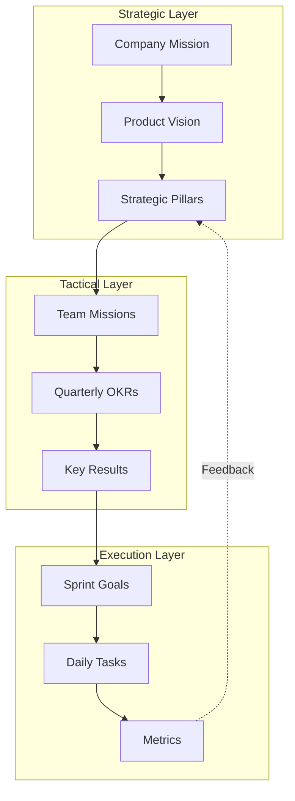
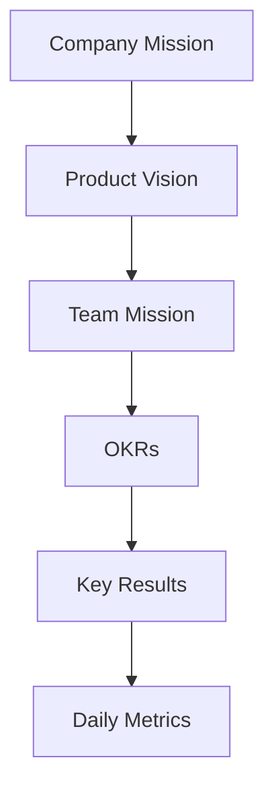

## Mission & Objectives Framework



## Mission Statement Structure

### Components
1. **Purpose** - Why we exist
2. **Scope** - What we do
3. **Differentiation** - How we're unique
4. **Impact** - Who benefits

### Template
```markdown
Help [target audience] achieve [outcome] through [approach] so that [impact].

Example:
Help small e-commerce sellers grow sustainably through automated operations
so they can focus on their products and customers.
```

## OKR Framework

### Structure
```yaml
objective:
  statement: "Become the preferred platform for SME sellers"
  timeframe: "Q2 2024"
  owner: "Commerce Platform Team"
  
  key_results:
    - metric: "Monthly Active Sellers"
      target: "5000"
      current: "3200"
      
    - metric: "Seller Satisfaction Score"
      target: "4.5/5"
      current: "4.1/5"
      
    - metric: "Average GMV per Seller"
      target: "$50k/month"
      current: "$35k/month"
```

### Scoring System
| Score | Meaning | Example |
|-------|---------|---------|
| 0.3 | Business as usual | +10% growth |
| 0.5 | Meaningful progress | +25% growth |
| 0.7 | Significant achievement | +50% growth |
| 1.0 | Breakthrough! | +100% growth |

## Mission-to-Metrics Flow

### 1. Strategic Cascade


### 2. Example Cascade
```yaml
company_mission: "Make e-commerce accessible to everyone"

product_vision: "Simplify online selling operations"

team_mission: "Automate inventory management"

quarterly_okr:
  objective: "Zero stock-outs for top sellers"
  key_results:
    - "95% inventory prediction accuracy"
    - "< 1% stockout rate"
    - "48hr restock turnaround"

daily_metrics:
  - prediction_accuracy
  - stock_coverage
  - restock_time
```

## Implementation Tools

### 1. Mission Canvas
```markdown
# Team Mission Canvas

## Purpose
- Primary goal
- Key stakeholders
- Success definition

## Scope
- Core activities
- Out of scope
- Dependencies

## Approach
- Key methods
- Tools used
- Unique aspects

## Metrics
- Leading indicators
- Lagging indicators
- Health metrics
```

### 2. OKR Review Template
```markdown
# Quarterly OKR Review

## Objective Health
- Score (0.0-1.0)
- Confidence (High/Medium/Low)
- Blockers

## Key Results Progress
- KR1: [Progress] [Narrative]
- KR2: [Progress] [Narrative]
- KR3: [Progress] [Narrative]

## Learnings
- What's working
- What's not
- Adjustments needed

## Next Steps
- Immediate actions
- Resource needs
- Support required
```

## Common Anti-patterns

### 1. Vanity Metrics
❌ **Problem**: Tracking numbers that look good but don't matter
✅ **Solution**: Focus on actionable, outcome-based metrics

### 2. Output Over Outcome
❌ **Problem**: Measuring activity instead of impact
✅ **Solution**: Define success by customer/business value

### 3. Set and Forget
❌ **Problem**: OKRs reviewed only at end of quarter
✅ **Solution**: Weekly check-ins, monthly deep dives

## Implementation Guide

### First 30 Days
1. Draft team mission statement
2. Set initial OKRs
3. Define key metrics

### 60-90 Days
1. Establish review cadence
2. Create dashboards
3. Start collecting data

### Beyond 90 Days
1. Refine objectives
2. Adjust metrics
3. Scale framework

## Integration Points

### With Other Practices
- Informs [Product Canvas](mission-product-canvas)
- Guides [Wardley Mapping](objectives-wardley)
- Feeds [Alignment & Feedback](alignment-feedback)

### With Tools & Systems
- OKR tracking software
- Metrics dashboards
- Documentation system

## Related Topics
- [Operating Model Overview](operating_alignment_model_wiki)
- [Culture Guide](culture)
- [Values Framework](values)

> **Pro Tip:** OKRs should be ambitious but not impossible. Aim for about 70% achievement rate - if you're hitting 100%, you're not stretching enough.

---

## Further Reading
- "Measure What Matters" by John Doerr
- "Radical Focus" by Christina Wodtke
- "The Art of Action" by Stephen Bungay
