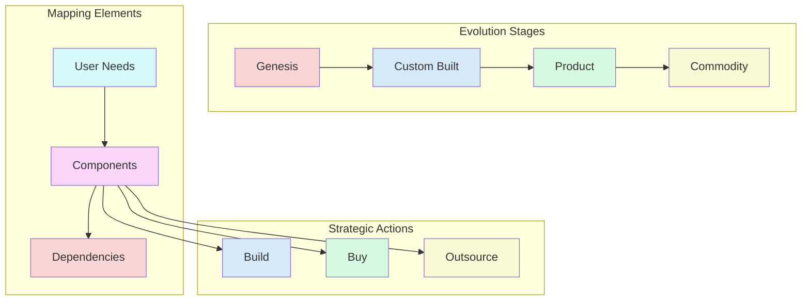

## Wardley Mapping Framework

## Mapping Process

### 1. List User Needs
- Identify primary user needs
- Map secondary needs
- Document pain points
- Capture future needs

### 2. Map Components vs Evolution
- Plot components on evolution axis
- Identify dependencies
- Note movement patterns
- Highlight opportunities

### 3. Strategic Decisions
- Build: Differentiating capabilities
- Buy: Market-available solutions
- Outsource: Non-core functions
- Retire: Obsolete components

## Implementation Guide

### First 30 Days
1. Train on Wardley mapping
2. Create initial maps
3. Identify quick wins

### 60-90 Days
1. Regular mapping sessions
2. Strategy alignment
3. Action planning

### Beyond 90 Days
1. Continuous mapping
2. Strategy evolution
3. Impact measurement

## Anti-patterns

### 1. Static Maps
❌ **Problem**: Maps become outdated
✅ **Solution**: Regular updates and reviews

### 2. Technology Focus
❌ **Problem**: Ignoring user needs
✅ **Solution**: Start with user needs

### 3. Isolated Mapping
❌ **Problem**: Maps not connected to strategy
✅ **Solution**: Link to business objectives

## Integration Points

### With Other Practices
- Informs [Mission & Objectives](mission-objectives)
- Guides [Team Structure](decoupling_teams)
- Supports [Cost Optimization](optimise-cost)

### With Tools & Systems
- Mapping software
- Strategy documentation
- Decision tracking

## Related Topics
- [Operating Model Overview](operating_alignment_model_wiki)
- [Product Strategy](why-purpose)
- [Team Structure](decoupling_teams)

> **Pro Tip:** Focus on the movement of components and the implications for your strategy, not just their current position.

---

## Further Reading
- "Wardley Maps" by Simon Wardley
- "The Art of Strategy" by Sun Tzu
- "Good Strategy, Bad Strategy" by Richard Rumelt
