## Product Canvas Framework

```mermaid
flowchart LR
    %% Product Canvas Structure
    VISION["🎯 Vision<br/>Long-term change<br/>in the world"]
    
    TARGET["👥 Target Group<br/>Primary users<br/>& personas"]
    
    NEEDS["💡 Needs<br/>User problems<br/>& pain points"]
    
    PRODUCT["📦 Product<br/>Key features<br/>& solutions"]
    
    BUSINESS["💰 Business Goals<br/>Revenue model<br/>& success metrics"]
    
    %% Canvas flow
    VISION --> TARGET
    TARGET --> NEEDS
    NEEDS --> PRODUCT
    PRODUCT --> BUSINESS
    
    %% Validation loop
    BUSINESS -.->|"Market Feedback"| VISION
    
    class VISION val1
    class TARGET,NEEDS val2
    class PRODUCT,BUSINESS val3
```

## Canvas Sections

### 1. Vision
- Long-term change in the world
- Market opportunity
- Competitive advantage
- Success criteria

### 2. Target Group
- Primary users
- Secondary users
- User personas
- Market segments

### 3. Needs
- User problems
- Pain points
- Desired gains
- Jobs to be done

### 4. Product
- Key features
- Value propositions
- Differentiators
- Technical requirements

### 5. Business Goals
- Revenue targets
- Market share
- Growth metrics
- Success indicators

## Implementation Guide

### First 30 Days
1. Train on canvas usage
2. Create initial canvas
3. Gather stakeholder input

### 60-90 Days
1. Regular reviews
2. Update based on feedback
3. Align with strategy

### Beyond 90 Days
1. Continuous refinement
2. Impact measurement
3. Strategy evolution

## Anti-patterns

### 1. Static Canvas
❌ **Problem**: Canvas becomes outdated
✅ **Solution**: Monthly reviews and updates

### 2. Feature Focus
❌ **Problem**: Ignoring user needs
✅ **Solution**: Start with user problems

### 3. Isolated Planning
❌ **Problem**: Not connected to strategy
✅ **Solution**: Link to business objectives

## Integration Points

### With Other Practices
- Informs [Mission & Objectives](../advanced/mission-objectives)
- Guides [Team Structure](../advanced/decoupling_teams)
- Supports [Flow Optimization](../optimization/optimise-flow)

### With Tools & Systems
- Product management tools
- User research platforms
- Analytics systems

## Related Topics
- [Operating Model Overview](../operating-model-framework)
- [Product Strategy](../foundation/why-purpose)
- [Team Structure](../advanced/decoupling_teams)

> **Pro Tip:** Keep the canvas visible on the team wall (or Miro) and revisit monthly. Focus on the connections between sections, not just filling them in.

---

## Further Reading
- "Product Strategy" by Roman Pichler
- "Product-Led Growth" by Wes Bush
- "Inspired" by Marty Cagan
