## Wardley Mapping Framework

```mermaid
flowchart TD
    %% Strategic Context
    USER_NEEDS["👥 User Needs<br/>Jobs to be done<br/>& pain points"]
    
    %% Mapping Process
    COMPONENTS["🧩 Component Mapping<br/>Plot on evolution axis<br/>Identify dependencies"]
    
    EVOLUTION["📈 Evolution Analysis<br/>Genesis → Custom<br/>Product → Commodity"]
    
    %% Strategic Decisions
    DECISIONS["⚖️ Strategic Decisions<br/>🏗️ Build differentiators<br/>💰 Buy commodities<br/>🤝 Outsource utilities"]
    
    %% Objectives & Results
    OBJECTIVES["🎯 OKRs<br/>Measurable objectives<br/>& key results"]
    
    %% Implementation
    ACTIONS["⚡ Actions<br/>Daily execution<br/>& metrics tracking"]
    
    %% Flow
    USER_NEEDS --> COMPONENTS
    COMPONENTS --> EVOLUTION
    EVOLUTION --> DECISIONS
    DECISIONS --> OBJECTIVES
    OBJECTIVES --> ACTIONS
    
    %% Learning loop
    ACTIONS -.->|"Market Learning"| USER_NEEDS
    
    class USER_NEEDS val1
    class COMPONENTS,EVOLUTION val2
    class DECISIONS,OBJECTIVES,ACTIONS val3
```

## Mapping Process

### 1. List User Needs
- Identify primary user needs
- Map secondary needs
- Document pain points
- Capture future needs

### 2. Map Components vs Evolution
- Plot components on evolution axis
- Identify dependencies
- Note movement patterns
- Highlight opportunities

### 3. Strategic Decisions
- Build: Differentiating capabilities
- Buy: Market-available solutions
- Outsource: Non-core functions
- Retire: Obsolete components

## Implementation Guide

### First 30 Days
1. Train on Wardley mapping
2. Create initial maps
3. Identify quick wins

### 60-90 Days
1. Regular mapping sessions
2. Strategy alignment
3. Action planning

### Beyond 90 Days
1. Continuous mapping
2. Strategy evolution
3. Impact measurement

## Anti-patterns

### 1. Static Maps
❌ **Problem**: Maps become outdated
✅ **Solution**: Regular updates and reviews

### 2. Technology Focus
❌ **Problem**: Ignoring user needs
✅ **Solution**: Start with user needs

### 3. Isolated Mapping
❌ **Problem**: Maps not connected to strategy
✅ **Solution**: Link to business objectives

## Integration Points

### With Other Practices
- Informs [Mission & Objectives](../advanced/mission-objectives)
- Guides [Team Structure](../advanced/decoupling_teams)
- Supports [Cost Optimization](../optimization/optimise-cost)

### With Tools & Systems
- Mapping software
- Strategy documentation
- Decision tracking

## Related Topics
- [Operating Model Overview](../operating-model-framework)
- [Product Strategy](../foundation/why-purpose)
- [Team Structure](../advanced/decoupling_teams)

> **Pro Tip:** Focus on the movement of components and the implications for your strategy, not just their current position.

---

## Further Reading
- "Wardley Maps" by Simon Wardley
- "The Art of Strategy" by Sun Tzu
- "Good Strategy, Bad Strategy" by Richard Rumelt
