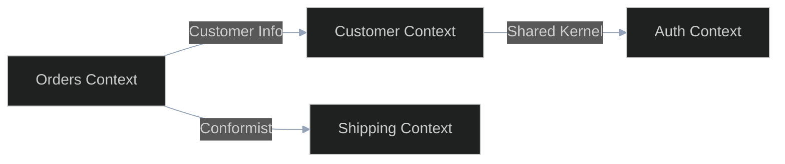

## Domain-Driven Organization

```mermaid
flowchart TD
    %% Business Domain
    BUSINESS_DOMAIN["🏢 Business Domain<br/>Core business problems<br/>& value delivery"]
    
    %% Domain Analysis
    SUBDOMAINS["🧩 Subdomain Analysis<br/>Core, Supporting<br/>& Generic domains"]
    
    %% Bounded Contexts
    CONTEXTS["🔲 Bounded Contexts<br/>Clear boundaries<br/>& explicit interfaces"]
    
    %% Team Organization
    TEAMS["👥 Stream-Aligned Teams<br/>One team per context<br/>End-to-end ownership"]
    
    %% Conway's Law Application
    ARCHITECTURE["🏗️ System Architecture<br/>Mirrors team structure<br/>Loose coupling"]
    
    %% Flow
    BUSINESS_DOMAIN --> SUBDOMAINS
    SUBDOMAINS --> CONTEXTS
    CONTEXTS --> TEAMS
    TEAMS --> ARCHITECTURE
    
    %% Feedback loop
    ARCHITECTURE -.->|"Domain Learning"| BUSINESS_DOMAIN
    
    class BUSINESS_DOMAIN val1
    class SUBDOMAINS,CONTEXTS val2
    class TEAMS,ARCHITECTURE val3
```



## Core DDD Concepts

### 1. Bounded Context
- Clear linguistic boundaries
- Explicit interfaces
- Own data model

### 2. Context Map


### 3. Domain Events
```yaml
event:
  name: "OrderPlaced"
  version: "1.0"
  timestamp: "2024-01-20T10:00:00Z"
  data:
    orderId: "ORD-123"
    customerId: "CUST-456"
    items:
      - productId: "PROD-789"
        quantity: 2
    total: 99.98
```

## Team Topology Patterns

### 1. Stream-Aligned Teams
```yaml
team:
  name: "Order Management"
  type: "stream-aligned"
  bounded_context: "orders"
  owns:
    - "order-service"
    - "order-api"
    - "order-db"
  interfaces:
    upstream:
      - "customer-context"
      - "product-context"
    downstream:
      - "shipping-context"
      - "billing-context"
```

### 2. Enabling Teams
```yaml
team:
  name: "Developer Experience"
  type: "enabling"
  supports:
    - "CI/CD practices"
    - "Testing frameworks"
    - "Development tools"
  interfaces:
    customers:
      - "all stream-aligned teams"
```

### 3. Platform Teams
```yaml
team:
  name: "Cloud Platform"
  type: "platform"
  provides:
    - "Kubernetes clusters"
    - "Observability stack"
    - "Security controls"
  interfaces:
    customers:
      - "all engineering teams"
```

## Context Mapping Patterns

### 1. Partnership
- Shared success
- Joint planning
- Two-way alignment

### 2. Customer-Supplier
- Clear upstream/downstream
- Service level agreements
- Formal interfaces

### 3. Conformist
- Follow upstream model
- Minimal translation
- Accept dependencies

## Implementation Guide

### 1. Domain Discovery
```markdown
# Event Storming Workshop

## Participants
- Domain experts
- Tech leads
- Product owners

## Process
1. Map business events
2. Identify aggregates
3. Draw context boundaries

## Outputs
- Event flow
- Context map
- Team boundaries
```

### 2. Team Formation
```yaml
steps:
  - identify_domains:
      method: "Event storming"
      output: "Context map"
  
  - align_teams:
      method: "Team topologies"
      output: "Team structure"
  
  - define_interfaces:
      method: "API design"
      output: "Interface contracts"
```

### 3. Interface Design
```markdown
# Context Interface Template

## API Contract
- Endpoints
- Data models
- Error handling

## Integration Pattern
- Sync/Async
- Protocol
- SLAs

## Evolution Strategy
- Versioning
- Migration
- Deprecation
```

## Common Anti-patterns

### 1. Big Ball of Mud
❌ **Problem**: No clear boundaries
✅ **Solution**: Explicit contexts and interfaces

### 2. Shared Database
❌ **Problem**: Hidden coupling through data
✅ **Solution**: Context-owned data, API access

### 3. God Context
❌ **Problem**: Too broad responsibility
✅ **Solution**: Split by subdomain

## Measuring Success

| Metric | Good | Warning | Action Needed |
|--------|------|---------|---------------|
| Context Independence | > 90% | 70-90% | < 70% |
| API Stability | < 1 break/quarter | 1-3 breaks/quarter | > 3 breaks/quarter |
| Team Autonomy | > 80% | 60-80% | < 60% |

## Integration Points

### With Other Practices
- Supports [Team Decoupling](../advanced/decoupling_teams)
- Enables [Flow Optimization](optimise-flow)
- Guides [Mission & Objectives](../advanced/mission-objectives)

### With Tools & Systems
- API gateways
- Event buses
- Service mesh

## Related Topics
- [Conway's Law](../advanced/conways-law)
- [Operating Model Overview](../operating-model-framework)
- [Alignment & Feedback](../optimization/alignment-feedback)

> **Pro Tip:** Start with a rough context map and refine it as you learn more about the domain. Perfect boundaries aren't as important as clear ones.

---

## Further Reading
- "Domain-Driven Design" by Eric Evans
- "Team Topologies" by Matthew Skelton & Manuel Pais
- "Building Microservices" by Sam Newman
