## Culture as Operating System

```mermaid
flowchart TD
    %% Core Principles
    PRINCIPLES["⚖️ Decision Principles<br/>🤝 Disagree & Commit<br/>📢 Default to Open<br/>🔄 You Build It, You Run It"]
    
    %% Engineering Rituals
    RITUALS["🔄 Engineering Rituals<br/>📅 Weekly planning & demos<br/>🎯 Monthly architecture reviews<br/>🚀 Innovation days"]
    
    %% Cultural Practices  
    PRACTICES["👥 Daily Practices<br/>💬 Context sharing<br/>📝 Decision documentation<br/>⚡ End-to-end ownership"]
    
    %% Cultural Artifacts
    ARTIFACTS["📋 Cultural Artifacts<br/>📖 Decision records<br/>🤝 Team agreements<br/>📊 Health metrics"]
    
    %% Organizational Outcomes
    ENVIRONMENT["🌟 Team Environment<br/>🔒 Psychological safety<br/>⚡ Fast decision-making<br/>🎯 Clear accountability"]
    
    %% Flow connections
    PRINCIPLES --> PRACTICES
    RITUALS --> PRACTICES
    PRACTICES --> ARTIFACTS
    ARTIFACTS --> ENVIRONMENT
    
    %% Feedback loop
    ENVIRONMENT -.->|"Culture Evolution"| PRINCIPLES
    ENVIRONMENT -.->|"Ritual Refinement"| RITUALS
    
    class PRINCIPLES val1
    class RITUALS val1
    class PRACTICES val2
    class ARTIFACTS val2
    class ENVIRONMENT val3
```



## Core Decision Principles

### 1. Disagree & Commit
- Voice concerns early
- Make decisions explicit
- Move forward as one team

### 2. Default to Open
- Share context broadly
- Document decisions
- Public-by-default channels

### 3. You Build It, You Run It
- End-to-end ownership
- Full-cycle development
- Direct customer feedback

## Engineering Rituals

### Weekly Cadence
| Day | Ritual | Purpose | Format |
|-----|---------|---------|---------|
| Monday | Team Planning | Set weekly focus | 30min, all hands |
| Wednesday | Demo Time | Share & learn | 45min, open invite |
| Thursday | Tech Talk | Deep dive topic | 60min, rotating presenter |
| Friday | Retro | Improve process | 45min, team only |

### Monthly Cadence
| Week | Ritual | Purpose | Format |
|------|---------|---------|---------|
| Week 1 | Architecture Review | System evolution | 90min, tech leads |
| Week 2 | Innovation Day | Explore new ideas | Full day, self-organized |
| Week 3 | Post-mortem Review | Learn from incidents | 60min, relevant teams |
| Week 4 | Tech Strategy | Align direction | 90min, leadership |

## Cultural Artifacts

### 1. Decision Records
```markdown
# Decision Record Template

## Context
- What's the current situation?
- Why is a decision needed?

## Decision
- What was decided?
- Who was involved?

## Consequences
- What changes as a result?
- What are the trade-offs?

## Follow-up
- What needs monitoring?
- When to revisit?
```

### 2. Team Agreements
```yaml
communication:
  async_first: true
  response_sla: "< 4 hours"
  escalation_path: ["team-lead", "engineering-manager", "CTO"]

code_practices:
  pr_review: "< 1 business day"
  test_coverage: "> 80%"
  documentation: "required for APIs"

on_call:
  rotation: "weekly"
  handover: "Friday 4pm"
  compensation: "time-off following week"
```

## Measuring Cultural Health

### 1. Quantitative Metrics
| Metric | Good | Warning | Action Needed |
|--------|------|---------|---------------|
| Decision Time | < 2 days | 2-5 days | > 5 days |
| Documentation Rate | > 90% | 70-90% | < 70% |
| Ritual Attendance | > 80% | 60-80% | < 60% |
| Cross-team PRs | > 20% | 10-20% | < 10% |

### 2. Qualitative Signals
- Psychological safety in retros
- Knowledge sharing frequency
- Innovation proposals
- Conflict resolution patterns

## Common Anti-patterns

### 1. Process Over Principles
❌ **Problem**: Adding rules to fix every issue
✅ **Solution**: Document principles, trust judgment

### 2. Ritual Without Purpose
❌ **Problem**: Meetings because "we always have them"
✅ **Solution**: Regular ritual reviews and adjustments

### 3. Culture by Decree
❌ **Problem**: Top-down culture mandates
✅ **Solution**: Co-create with teams, lead by example

## Implementation Guide

### First 30 Days
1. Document core principles
2. Start weekly demos
3. Set up decision record template

### 60-90 Days
1. Establish all key rituals
2. Begin measuring cultural metrics
3. Create team agreements

### Beyond 90 Days
1. Regular culture surveys
2. Ritual effectiveness reviews
3. Principle evolution process

## Integration Points

### With Other Practices
- Feeds into [Alignment & Feedback](../optimization/alignment-feedback)
- Supports [Team Decoupling](../advanced/decoupling_teams)
- Enables [Flow Optimization](../optimization/optimise-flow)

### With Tools & Systems
- Confluence/Notion for documentation
- Slack for communication
- GitHub for collaboration

## Related Topics
- [Values Framework](values)
- [Operating Model Overview](../operating-model-framework)
- [Mission & Objectives](../advanced/mission-objectives)

> **Pro Tip:** Culture needs constant gardening. Schedule regular "culture health checks" to ensure principles and rituals evolve with your team's needs.

---

## Further Reading
- "The Culture Code" by Daniel Coyle
- "Turn the Ship Around!" by L. David Marquet
- "Drive" by Daniel Pink
- "Project to Product" by Mik Kersten
