## Purpose Framework

```mermaid
flowchart TD
    %% ─────────────────── PURPOSE FOUNDATION ───────────────────
    subgraph Purpose_Foundation["🎯 Purpose Foundation"]
        direction TB
        WHY["❓ WHY<br/>Core Purpose & Mission"]
        VISION["🔮 VISION<br/>Future State (3-5 years)"]
        VALUES["💎 VALUES<br/>Decision Principles"]
        
        WHY --> VISION
        VISION --> VALUES
    end
    
    %% ─────────────────── STRATEGIC CONTEXT ───────────────────
    subgraph Strategic_Context["🗺️ Strategic Context"]
        direction LR
        MARKET["📊 Market Reality<br/>• Competition<br/>• Trends<br/>• Opportunities"]
        CUSTOMER["👥 Customer Needs<br/>• Jobs to be Done<br/>• Pain Points<br/>• Outcomes"]
        CAPABILITY["⚡ Capabilities<br/>• Strengths<br/>• Resources<br/>• Constraints"]
        
        MARKET --> CUSTOMER
        CUSTOMER --> CAPABILITY
    end
    
    %% ─────────────────── STRATEGIC DECISIONS ───────────────────
    subgraph Strategic_Decisions["⚖️ Strategic Decisions"]
        direction TB
        WHAT["🎯 WHAT<br/>Product Strategy<br/>Where to Play"]
        HOW["🛠️ HOW<br/>Operating Model<br/>How to Win"]
        WHEN["⏰ WHEN<br/>Roadmap Priority<br/>Sequence & Timing"]
        
        WHAT --> HOW
        HOW --> WHEN
    end
    
    %% ─────────────────── VALIDATION LOOPS ───────────────────
    subgraph Validation["🔄 Validation & Learning"]
        direction LR
        MEASURE["📈 Measure<br/>KPIs & Metrics"]
        LEARN["🧠 Learn<br/>Insights & Signals"]
        ADAPT["🔄 Adapt<br/>Strategy Evolution"]
        
        MEASURE --> LEARN
        LEARN --> ADAPT
        ADAPT --> MEASURE
    end
    
    %% ─────────────────── FLOW CONNECTIONS ───────────────────
    Purpose_Foundation --> Strategic_Decisions
    Strategic_Context --> Strategic_Decisions
    Strategic_Decisions --> Validation
    
    %% ─────────────────── FEEDBACK LOOPS ───────────────────
    Validation -.->|"Strategy Refresh"| Purpose_Foundation
    Validation -.->|"Context Updates"| Strategic_Context
    
    %% ─────────────────── OUTCOMES ───────────────────
    Strategic_Decisions --> OUTCOMES["🏆 Business Outcomes<br/>• Product-Market Fit<br/>• Growth Metrics<br/>• Team Alignment"]
    
    class Purpose_Foundation val1
    class Strategic_Context val2
    class Strategic_Decisions val3
    class Validation pill1
    class OUTCOMES pill3
```



## Why It Matters

A crisp sense of purpose aligns every decision, from architectural trade‑offs to hiring. It provides:
- Clear decision-making framework
- Team motivation and alignment
- Customer connection
- Strategic focus

## Key Practices

### 1. From/To Vision Statement
```yaml
vision:
  from: "Current state description"
  to: "Future state aspiration"
  timeframe: "3-5 years"
  success_criteria:
    - "Measurable outcome 1"
    - "Measurable outcome 2"
    - "Measurable outcome 3"
```

### 2. Continuous Validation
- Regular user interviews
- Market research
- Competitor analysis
- Trend monitoring

### 3. Strategy Review
- Quarterly strategy sessions
- Annual vision refresh
- Continuous feedback loops
- Impact assessment

## Implementation Guide

### First 30 Days
1. Define current state
2. Craft vision statement
3. Establish metrics

### 60-90 Days
1. Communicate vision
2. Align teams
3. Start feedback loops

### Beyond 90 Days
1. Regular reviews
2. Strategy evolution
3. Impact measurement

## Anti-patterns

### 1. Vague Vision
❌ **Problem**: Unclear direction
✅ **Solution**: Specific, measurable outcomes

### 2. Static Strategy
❌ **Problem**: Outdated approach
✅ **Solution**: Regular reviews and updates

### 3. Disconnected Purpose
❌ **Problem**: Purpose not lived
✅ **Solution**: Daily alignment and decisions

## Integration Points

### With Other Practices
- Guides [Mission & Objectives](../advanced/mission-objectives)
- Informs [Team Structure](../advanced/decoupling_teams)
- Shapes [Values](values)

### With Tools & Systems
- Strategy documentation
- OKR systems
- Feedback platforms

## Related Topics
- [Operating Model Overview](../operating-model-framework)
- [Product Strategy](../core-elements/mission-product-canvas)
- [Team Structure](../advanced/decoupling_teams)

> **Pro Tip:** Your purpose should be specific enough to guide decisions but broad enough to allow for innovation and adaptation.

---

## Further Reading
- "Start with Why" by Simon Sinek
- "Good to Great" by Jim Collins
- "The Advantage" by Patrick Lencioni

### Metrics
* Product/Market‑fit (PMF) survey
* Net Promoter Score (NPS)
