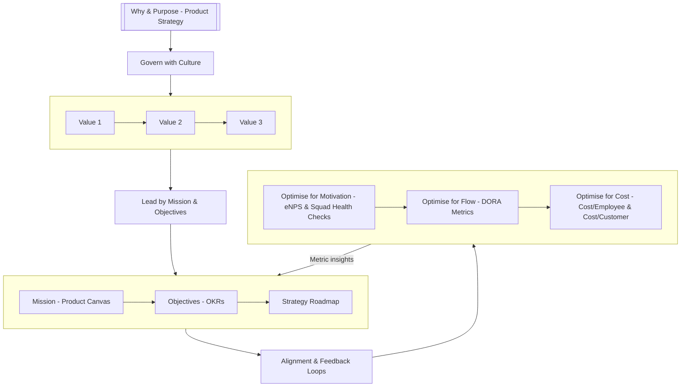

## Operating & Alignment Model Overview

This is the top-level guide to our operating and alignment model. Each section links to detailed wiki pages that dive deeper into specific aspects.

## Visual Overview

---

## Layer‑by‑Layer Explanation

Each layer of our operating model has its own detailed wiki page. Below is an overview with links to in-depth content:

### Foundation Layer
| Layer | Purpose | Key Practices | Detailed Guide |
|-------|---------|---------------|----------------|
| **Why & Purpose – Product Strategy** | Sets the North‑Star: *why we exist* and *where we play*. | * Product Vision Board * Quarterly strategy review | [Why & Purpose Deep-Dive](why-purpose) |
| **Govern with Culture** | Scales behaviour through principles rather than rules. | * Decision principles * Engineering rituals | [Culture Guide](culture) |
| **Values** | Shared beliefs that guide day‑to‑day trade‑offs. | * Hire & fire by values * Explicit behaviors | [Values Framework](values) |

### Core Elements
| Layer | Purpose | Key Practices | Detailed Guide |
|-------|---------|---------------|----------------|
| **Mission (Product Canvas)** | Captures *who, what, why* for a product slice. | * Product Canvas * Assumption mapping | [Mission & Product Canvas](mission-product-canvas) |
| **Objectives (Wardley Mapping)** | Stress‑test bets against landscape evolution. | * User‑need mapping * Strategic decisions | [Objectives & Wardley Mapping](objectives-wardley) |
| **Organization (DDD)** | Mirror domain boundaries in team topology. | * Context mapping * Team boundaries | [Organization & DDD](organization-ddd) |

### Optimization & Feedback
| Layer | Purpose | Key Practices | Detailed Guide |
|-------|---------|---------------|----------------|
| **Alignment & Feedback** | Close strategy-execution gap. | * Health checks * Retros | [Alignment & Feedback Loops](alignment-feedback) |
| **Optimise for Motivation** | Keep humans engaged and creative. | * eNPS tracking * Squad health | [Motivation Deep-Dive](optimise-motivation) |
| **Optimise for Flow** | Ship value quickly & safely. | * CI/CD * DORA metrics | [Flow Optimization](optimise-flow) |
| **Optimise for Cost** | Sustain profitability at scale. | * FinOps * Unit economics | [Cost Optimization](optimise-cost) |

### Advanced Topics
- [Conway's Law & Team Design](conways-law)
- [Decoupling Teams & Dependencies](decoupling_teams)
- [Mission & Objectives Alignment](mission-objectives)

---

## Implementation Guide

1. **Start with Why**
   - Begin with [Why & Purpose](why-purpose)
   - Establish [Cultural Foundations](culture)
   - Define [Core Values](values)

2. **Build Core Elements**
   - Create [Product Canvas](mission-product-canvas)
   - Map [Strategic Objectives](objectives-wardley)
   - Design [Team Structure](organization-ddd)

3. **Optimize & Align**
   - Implement [Feedback Loops](alignment-feedback)
   - Balance [Motivation](optimise-motivation), [Flow](optimise-flow), and [Cost](optimise-cost)
   - Monitor [Team Dependencies](decoupling_teams)

4. **Advanced Implementation**
   - Apply [Conway's Law](conways-law)
   - Align [Missions & Objectives](mission-objectives)

---

## Key Metrics Dashboard

| Category | Metrics | Target | Source |
|----------|---------|--------|--------|
| **Culture & Values** | eNPS Value alignment score | > 50 > 80% | Culture surveys |
| **Mission & Objectives** | OKR completion Strategy-execution gap | > 70% < 20% | OKR tool |
| **Flow & Delivery** | DORA metrics Lead time | Elite < 1 day | DevOps platform |
| **Cost & Efficiency** | Cost per customer Engineering ROI | < industry avg > 3x | FinOps dashboard |

---

## Further Reading & Resources

### Internal References
- [Team Topologies Implementation](decoupling_teams)
- [Domain-Driven Design Guide](organization-ddd)
- [Feedback Loop Design](alignment-feedback)

### External References
* **Product Canvas** – Roman Pichler  
* **Wardley Mapping** – Simon Wardley  
* **Team Topologies** – Skelton & Pais  
* **Accelerate** – Forsgren, Humble & Kim

---

> **Note:** This is a living document. Each linked page contains detailed implementation guides, examples, and metrics. Use the navigation above to dive deeper into specific areas of interest.
