## Alignment & Feedback System

```mermaid
flowchart TD
    %% Strategic Layer
    STRATEGY["🎯 Strategic Alignment<br/>📊 Quarterly OKR reviews<br/>🗺️ Strategy validation<br/>📈 Wardley map updates"]
    
    %% Tactical Layer
    TACTICAL["⚖️ Tactical Feedback<br/>💪 Squad health checks<br/>🔄 Sprint retrospectives<br/>📋 Monthly planning"]
    
    %% Operational Layer
    OPERATIONAL["⚡ Operational Loops<br/>👥 Daily standups<br/>📊 Metrics monitoring<br/>🚨 Incident learning"]
    
    %% Outcomes
    ALIGNMENT["🎯 Team Alignment"]
    PERFORMANCE["⚡ High Performance"]
    LEARNING["🧠 Continuous Learning"]
    
    %% Flow
    STRATEGY --> TACTICAL
    TACTICAL --> OPERATIONAL
    OPERATIONAL --> ALIGNMENT
    ALIGNMENT --> PERFORMANCE
    PERFORMANCE --> LEARNING
    
    %% Feedback loops
    LEARNING -.->|"Strategic Insights"| STRATEGY
    PERFORMANCE -.->|"Tactical Adjustments"| TACTICAL
    ALIGNMENT -.->|"Process Improvements"| OPERATIONAL
    
    class STRATEGY val1
    class TACTICAL val2
    class OPERATIONAL val2
    class ALIGNMENT,PERFORMANCE,LEARNING val3
```



## Feedback Cadences

### Strategic (Quarterly)
| Activity | Purpose | Key Outputs |
|----------|---------|-------------|
| Strategy Review | Validate direction | Updated [Wardley Maps](../core-elements/objectives-wardley) |
| OKR/Mission Check | Assess progress | OKR health scorecard |
| Planning | Resource alignment | Team roadmaps |

### Tactical (Monthly/Weekly)
| Activity | Purpose | Key Outputs |
|----------|---------|-------------|
| Squad Health Check | Team wellness | Health metrics dashboard |
| Sprint Reviews | Demo progress | Stakeholder feedback |
| Retros | Process improvement | Action items |

### Operational (Daily)
| Activity | Purpose | Key Outputs |
|----------|---------|-------------|
| Stand-ups | Coordination | Blockers identified |
| Metrics Review | Performance tracking | DORA metrics |
| Incident Analysis | Learning | Postmortem docs |

## Squad Health Check Implementation


### Health Check Categories
1. **Mission Clarity**
   - Team understands purpose
   - Clear success metrics
   - Aligned with strategy

2. **Technical Health**
   - Code quality
   - Test coverage
   - Technical debt

3. **Team Dynamics**
   - Psychological safety
   - Learning & growth
   - Work-life balance

4. **Delivery Flow**
   - Sprint predictability
   - Deployment frequency
   - Incident rate

## Metrics Framework

### 1. Learning Metrics
| Metric | Good | Warning | Action Needed |
|--------|------|---------|---------------|
| Time to Learning | < 1 day | 1-5 days | > 5 days |
| Experiment Cycle | < 2 weeks | 2-4 weeks | > 4 weeks |
| Hypothesis Rate | > 3/month | 1-3/month | < 1/month |

### 2. Decision Metrics
| Metric | Good | Warning | Action Needed |
|--------|------|---------|---------------|
| Decision Lead Time | < 2 days | 2-7 days | > 7 days |
| Decision Quality | > 80% good | 60-80% good | < 60% good |
| Stakeholder Alignment | > 90% | 70-90% | < 70% |

## Implementation Tools

### 1. Health Check Template
```yaml
team_health:
  mission_clarity: [red|amber|green]
  technical_health: [red|amber|green]
  team_dynamics: [red|amber|green]
  delivery_flow: [red|amber|green]
  
action_items:
  - area: "mission_clarity"
    action: "Review OKRs with team"
    owner: "Tech Lead"
    due: "2024-05-01"
```

### 2. Feedback Loop Canvas
```yaml
loop_name: "Sprint Retro"
cadence: "bi-weekly"
inputs:
  - Sprint metrics
  - Team feedback
  - Stakeholder input
outputs:
  - Action items
  - Process changes
  - Success metrics
```

## Integration Points

### With Other Practices
- Links to [Team Decoupling](../advanced/decoupling_teams)
- Feeds into [Culture](../foundation/culture-framework)
- Informs [Mission & Objectives](../advanced/mission-objectives)

### With Tools & Systems
- JIRA/Linear for tracking
- Miro for visualization
- Slack for notifications

## Common Anti-patterns

1. **Feedback Without Action**
   - Collecting metrics without follow-through
   - Solution: Action item owners and due dates

2. **Too Many Metrics**
   - Analysis paralysis
   - Solution: Focus on DORA + 2-3 custom metrics

3. **Inconsistent Cadence**
   - Skipping reviews when busy
   - Solution: Calendar blocks with high priority

## Getting Started

1. **First 30 Days**
   - Implement daily stand-ups
   - Set up basic DORA metrics
   - Start weekly retros

2. **60-90 Days**
   - Add monthly health checks
   - Begin OKR tracking
   - Establish learning metrics

3. **90+ Days**
   - Full feedback loop integration
   - Automated metrics collection
   - Regular review cycles

## Related Topics
- [Operating Model Overview](../operating-model-framework)
- [Team Decoupling](../advanced/decoupling_teams)
- [Culture Guide](../foundation/culture-framework)
- [Flow Optimization](optimise-flow)

> **Pro Tip:** Use the health check template as a starting point, but customize the categories and metrics based on your team's specific needs and challenges.

---

## Further Reading
- "Accelerate" by Nicole Forsgren
- "The Art of Business Value" by Mark Schwartz
- "Measure What Matters" by John Doerr
