# Optimization & Feedback

The optimization layer ensures your operating model delivers sustainable results through continuous measurement, feedback, and improvement.

## Optimization Framework

```mermaid
flowchart TD
    %% Feedback Foundation
    ALIGNMENT["🎯 Alignment & Feedback<br/>📊 Strategic reviews<br/>💪 Squad health checks<br/>⚡ Operational loops"]
    
    %% Three Optimization Pillars
    MOTIVATION["🚀 Motivation Optimization<br/>🔓 Autonomy & mastery<br/>🛡️ Psychological safety<br/>🌟 Recognition systems"]
    
    FLOW["⚡ Flow Optimization<br/>📊 DORA metrics<br/>🤖 CI/CD automation<br/>👀 Observability"]
    
    COST["💰 Cost Optimization<br/>📈 Unit economics<br/>☁️ FinOps practices<br/>⚖️ Resource governance"]
    
    %% Sustainable Outcomes
    PERFORMANCE["🏆 Sustainable Performance<br/>💪 High engagement<br/>⚡ Fast delivery<br/>💰 Cost efficiency"]
    
    %% Flow connections
    ALIGNMENT --> MOTIVATION
    ALIGNMENT --> FLOW
    ALIGNMENT --> COST
    
    MOTIVATION --> PERFORMANCE
    FLOW --> PERFORMANCE
    COST --> PERFORMANCE
    
    %% Optimization feedback loop
    PERFORMANCE -.->|"Continuous Learning"| ALIGNMENT
    
    class ALIGNMENT val1
    class MOTIVATION,FLOW,COST val2
    class PERFORMANCE val3
```

The optimization layer ensures your operating model delivers sustainable results through continuous measurement, feedback, and improvement.

## Layer Components

### Alignment & Feedback Loops
Close the strategy-execution gap through regular health checks, retrospectives, and course corrections.

### Optimize for Motivation
Keep humans engaged and creative through eNPS tracking, squad health monitoring, and psychological safety practices.

### Optimize for Flow
Ship value quickly and safely using CI/CD, DORA metrics, and lean delivery practices.

### Optimize for Cost
Sustain profitability at scale through FinOps, unit economics, and resource efficiency.

## Implementation Strategy

Build optimization capabilities incrementally:

1. **Establish Feedback Loops** - Create regular alignment and improvement cycles
2. **Monitor Key Metrics** - Track motivation, flow, and cost indicators
3. **Iterate & Improve** - Use data to drive continuous optimization
4. **Balance Trade-offs** - Optimize across all three dimensions sustainably

This layer transforms your operating model from static structure into dynamic, learning system.
