## Cost Optimization System

```mermaid
flowchart TD
    %% Cost Measurement Foundation
    METRICS["📊 Cost Metrics<br/>💰 Cost per customer<br/>👨‍💻 Cost per engineer<br/>☁️ Cloud unit economics<br/>📈 ROI measurement"]
    
    %% FinOps Capabilities
    VISIBILITY["👀 Cost Visibility<br/>📈 Real-time dashboards<br/>🏷️ Resource tagging<br/>📊 Allocation tracking"]
    
    AUTOMATION["🤖 Cost Automation<br/>⚡ Auto-scaling<br/>📅 Scheduled shutdowns<br/>🔄 Resource optimization"]
    
    GOVERNANCE["⚖️ Cost Governance<br/>💳 Budget controls<br/>👥 Spending policies<br/>🚨 Alert thresholds"]
    
    %% Business Outcomes
    EFFICIENCY["⚡ Resource Efficiency"]
    PROFITABILITY["💰 Improved Profitability"]
    SUSTAINABILITY["🌱 Sustainable Growth"]
    
    %% Flow connections
    METRICS --> VISIBILITY
    METRICS --> AUTOMATION
    METRICS --> GOVERNANCE
    
    VISIBILITY --> EFFICIENCY
    AUTOMATION --> EFFICIENCY
    GOVERNANCE --> PROFITABILITY
    
    EFFICIENCY --> PROFITABILITY
    PROFITABILITY --> SUSTAINABILITY
    
    %% Feedback loop
    SUSTAINABILITY -.->|"Cost Intelligence"| METRICS
    
    class METRICS val1
    class VISIBILITY,AUTOMATION,GOVERNANCE val2
    class EFFICIENCY,PROFITABILITY,SUSTAINABILITY val3
```

## Core Metrics

### 1. Cost per Customer
- Customer Acquisition Cost (CAC)
- Customer Lifetime Value (CLV)
- CAC/CLV Ratio
- Cost per Active User

### 2. Cost per Engineer
- Infrastructure cost per engineer
- Tooling and license costs
- Support and operational overhead
- Training and development costs

### 3. Cloud Unit Cost
- Cost per transaction
- Cost per compute unit
- Storage efficiency metrics
- Network cost optimization

## FinOps Practices

### 1. Resource Management
- Right-sizing infrastructure
- Automated scaling policies
- Resource tagging by team
- Cost allocation models

### 2. Cost Visibility
- Real-time cost dashboards
- Team-level cost reporting
- Anomaly detection
- Trend analysis

### 3. Optimization Strategies
- Reserved instance planning
- Spot instance utilization
- Storage tier optimization
- Network cost reduction

## Implementation Guide

### First 30 Days
1. Establish baseline metrics
2. Set up cost monitoring
3. Implement resource tagging

### 60-90 Days
1. Deploy FinOps tools
2. Train teams on cost awareness
3. Implement optimization policies

### Beyond 90 Days
1. Regular cost reviews
2. Continuous optimization
3. ROI tracking

## Anti-patterns

### 1. Cost Blindness
❌ **Problem**: Teams unaware of costs
✅ **Solution**: Cost visibility and education

### 2. Over-optimization
❌ **Problem**: Sacrificing quality for cost
✅ **Solution**: Balance cost vs. value

### 3. Silos
❌ **Problem**: Disconnected cost management
✅ **Solution**: Cross-functional FinOps team

## Integration Points

### With Other Practices
- Aligns with [Flow Optimization](optimise-flow)
- Supports [Mission & Objectives](../advanced/mission-objectives)
- Complements [Team Structure](../advanced/decoupling_teams)

### With Tools & Systems
- Cloud cost management tools
- Resource monitoring systems
- Financial reporting platforms

## Related Topics
- [Operating Model Overview](../operating-model-framework)
- [Flow Optimization](optimise-flow)
- [Motivation Optimization](optimise-motivation)

> **Pro Tip:** Focus on unit economics rather than absolute costs. The goal is to optimize the cost-to-value ratio, not just reduce costs.

---

## Further Reading
- "Cloud FinOps" by J.R. Storment
- "The Phoenix Project" by Gene Kim
- "Cost Optimization in the Cloud" by AWS
