## Flow Optimization System

```mermaid
flowchart TD
    %% DORA Measurement Foundation
    DORA["📊 DORA Metrics<br/>🚀 Deployment frequency<br/>⚡ Lead time for changes<br/>🛡️ Change failure rate<br/>🔧 Mean time to recovery"]
    
    %% Flow Capabilities
    AUTOMATION["🤖 Automation Systems<br/>🔄 CI/CD pipelines<br/>🧪 Automated testing<br/>📦 Infrastructure as code"]
    
    OBSERVABILITY["👀 Observability<br/>📈 Real-time monitoring<br/>🚨 Alerting systems<br/>📊 Performance dashboards"]
    
    PRACTICES["⚙️ Engineering Practices<br/>🌲 Trunk-based development<br/>🧩 Small batch sizes<br/>🔄 Continuous integration"]
    
    %% Flow Outcomes
    SPEED["⚡ Delivery Speed"]
    QUALITY["💎 High Quality"]
    STABILITY["🛡️ System Stability"]
    
    %% Flow connections
    DORA --> AUTOMATION
    DORA --> OBSERVABILITY
    DORA --> PRACTICES
    
    AUTOMATION --> SPEED
    OBSERVABILITY --> STABILITY
    PRACTICES --> QUALITY
    
    %% Quality reinforcement
    QUALITY --> SPEED
    STABILITY --> SPEED
    
    %% Feedback loop
    SPEED -.->|"Continuous Improvement"| DORA
    
    class DORA val1
    class AUTOMATION,OBSERVABILITY,PRACTICES val2
    class SPEED,QUALITY,STABILITY val3
```



## DORA Metrics Framework

### 1. Deployment Frequency
- How often code is deployed to production
- Target: Multiple times per day
- Measurement: Deployments per day/week

### 2. Lead Time for Change
- Time from commit to production
- Target: Less than one hour
- Measurement: Average time in minutes

### 3. Change Failure Rate
- Percentage of deployments causing incidents
- Target: Less than 15%
- Measurement: Failed deployments / Total deployments

### 4. Mean Time to Recovery
- Time to recover from incidents
- Target: Less than one hour
- Measurement: Average recovery time

## Implementation Tools

### 1. CI/CD Pipeline
```yaml
pipeline:
  stages:
    - build:
        - unit_tests
        - integration_tests
        - security_scan
    - deploy:
        - staging
        - production
    - monitor:
        - health_checks
        - metrics_collection
```

### 2. Value Stream Mapping


## Implementation Guide

### First 30 Days
1. Establish baseline metrics
2. Set up monitoring
3. Document current process

### 60-90 Days
1. Implement automation
2. Reduce manual steps
3. Establish feedback loops

### Beyond 90 Days
1. Continuous improvement
2. Advanced automation
3. Cross-team optimization

## Anti-patterns

### 1. Manual Deployments
❌ **Problem**: Human error and slow delivery
✅ **Solution**: Automated deployment pipeline

### 2. Long Feedback Loops
❌ **Problem**: Delayed issue detection
✅ **Solution**: Continuous monitoring and alerts

### 3. Siloed Operations
❌ **Problem**: Disconnected teams
✅ **Solution**: DevOps culture and practices

## Integration Points

### With Other Practices
- Supports [Cost Optimization](optimise-cost)
- Enables [Motivation](optimise-motivation)
- Drives [Mission Delivery](../advanced/mission-objectives)

### With Tools & Systems
- CI/CD platforms
- Monitoring systems
- Incident management

## Related Topics
- [Operating Model Overview](../operating-model-framework)
- [Cost Optimization](optimise-cost)
- [Motivation Optimization](optimise-motivation)

> **Pro Tip:** Focus on reducing lead time and increasing deployment frequency while maintaining stability. Speed without safety is dangerous.

---

## Further Reading
- "Accelerate" by Nicole Forsgren
- "The DevOps Handbook" by Gene Kim
- "Continuous Delivery" by Jez Humble
