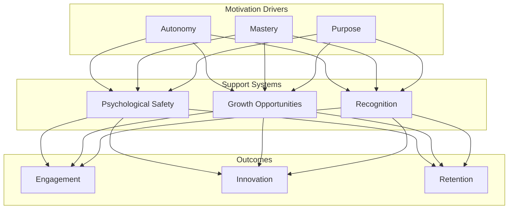

## Motivation Framework

## Core Metrics

### 1. Engagement Metrics
- eNPS trend
- Employee satisfaction surveys
- Participation in initiatives
- Voluntary contribution

### 2. Psychological Safety
- Team trust index
- Feedback frequency
- Error reporting rate
- Innovation attempts

### 3. Growth Indicators
- Skill development rate
- Internal mobility
- Mentorship participation
- Learning investment

## Motivation Levers

### 1. Meaningful Mission
- Clear purpose alignment
- Impact visibility
- Customer connection
- Value demonstration

### 2. Autonomy with Guardrails
- Decision-making freedom
- Clear boundaries
- Resource access
- Accountability framework

### 3. Growth Environment
- Learning opportunities
- Career pathways
- Skill development
- Challenge balance

## Implementation Guide

### First 30 Days
1. Assess current state
2. Establish baseline metrics
3. Identify quick wins

### 60-90 Days
1. Implement core programs
2. Train leaders
3. Establish feedback loops

### Beyond 90 Days
1. Refine programs
2. Scale successes
3. Continuous improvement

## Anti-patterns

### 1. Micromanagement
❌ **Problem**: Kills autonomy and creativity
✅ **Solution**: Clear boundaries and trust

### 2. Burnout Culture
❌ **Problem**: Short-term gains, long-term damage
✅ **Solution**: Sustainable pace and balance

### 3. Disconnected Purpose
❌ **Problem**: Work feels meaningless
✅ **Solution**: Clear mission and impact visibility

## Integration Points

### With Other Practices
- Supports [Flow Optimization](optimise-flow)
- Enables [Cost Efficiency](optimise-cost)
- Drives [Mission Delivery](../advanced/mission-objectives)

### With Tools & Systems
- Engagement platforms
- Learning management systems
- Recognition programs

## Related Topics
- [Operating Model Overview](../operating-model-framework)
- [Culture Guide](../foundation/culture-framework)
- [Values Framework](../foundation/values)

> **Pro Tip:** Focus on creating an environment where people can do their best work, rather than trying to motivate them directly.

---

## Further Reading
- "Drive" by Daniel Pink
- "The Culture Code" by Daniel Coyle
- "Radical Candor" by Kim Scott
