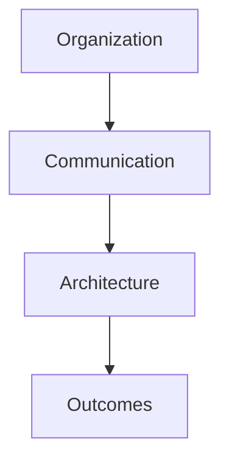
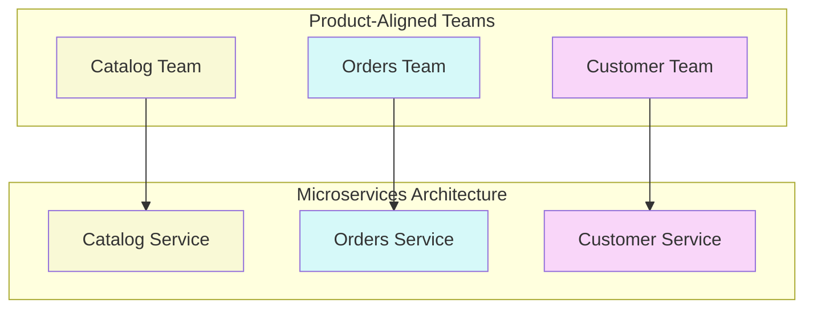

## Conway's Law Explained

> "Organizations which design systems are constrained to produce designs which are copies of the communication structures of these organizations."
> — Melvin Conway, 1967

### Visual Representation

## Impact on System Design

### 1. Direct Consequences
- Communication patterns become architecture
- Team boundaries become API boundaries
- Organizational silos create system silos

### 2. Common Anti-patterns
- Monolithic systems from hierarchical orgs
- Integration nightmares from disconnected teams
- Duplicate functionality from competing teams

## The Inverse Conway Maneuver

### Strategy
1. Design target architecture first
2. Structure teams to match
3. Allow architecture to evolve naturally

## Implementation Guide

### 1. Team Structure Assessment
- Map current communication patterns
- Identify architectural goals
- Spot misalignments

### 2. Reorganization Approach
- Align teams with business domains
- Create clear team boundaries
- Establish interface contracts

### 3. Supporting Practices
- Team API documentation
- Cross-team architecture reviews
- Regular boundary assessments

## Measuring Success

| Metric | Good | Warning | Action Needed |
|--------|------|---------|---------------|
| Cross-team Dependencies | < 2 per sprint | 2-5 per sprint | > 5 per sprint |
| API Changes | Backward compatible | Breaking w/notice | Breaking w/o notice |
| Deployment Independence | > 90% solo deploys | 60-90% solo | < 60% solo |

## Related Topics
- [Team Decoupling Guide](decoupling_teams)
- [Domain-Driven Design](organization-ddd)
- [Operating Model Overview](operating_alignment_model_wiki)

## Further Reading
- "Team Topologies" by Matthew Skelton & Manuel Pais
- "Building Evolutionary Architectures" by Neal Ford
- "Accelerate" by Nicole Forsgren

> **Pro Tip:** Use the team dependency metrics from this guide in conjunction with the [Alignment & Feedback](alignment-feedback) process to continuously improve team boundaries.
