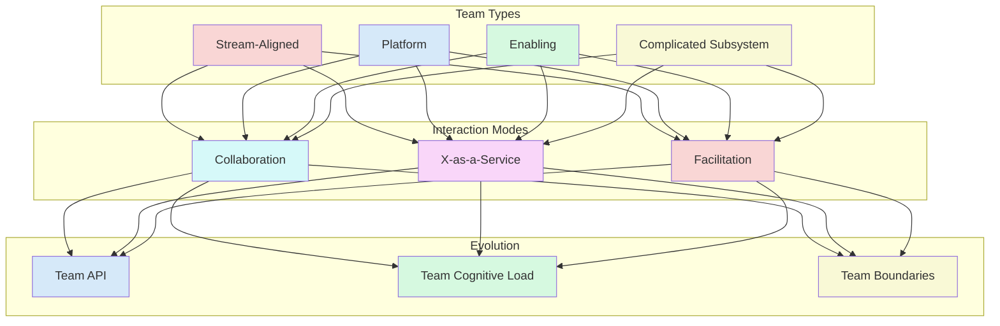

## Team Topologies Framework

## Core Team Types

### 1. Stream-Aligned Teams
- End-to-end ownership of a product/service
- Cross-functional composition
- Focus on user value delivery
- Autonomous decision-making

### 2. Platform Teams
- Provide internal services
- Reduce cognitive load
- Enable stream-aligned teams
- Focus on reliability and usability

### 3. Enabling Teams
- Specialized expertise
- Help other teams improve
- Temporary or permanent
- Focus on capability building

### 4. Complicated Subsystem Teams
- Deep technical expertise
- Complex domain knowledge
- Focus on specific subsystems
- Reduce cognitive load

## Interaction Modes

### 1. Collaboration
- Close, real-time cooperation
- Shared goals and responsibilities
- High communication overhead
- Temporary arrangement

### 2. X-as-a-Service
- Clear service boundaries
- Well-defined interfaces
- Low communication overhead
- Long-term arrangement

### 3. Facilitation
- Help other teams improve
- Knowledge transfer
- Temporary arrangement
- Focus on capability building

## Implementation Guide

### First 30 Days
1. Assess current team structure
2. Map team interactions
3. Identify quick wins

### 60-90 Days
1. Implement new team types
2. Establish interaction modes
3. Define team APIs

### Beyond 90 Days
1. Optimize team boundaries
2. Reduce cognitive load
3. Evolve team structure

## Anti-patterns

### 1. Team Silos
❌ **Problem**: Isolated teams
✅ **Solution**: Clear interaction modes

### 2. Cognitive Overload
❌ **Problem**: Teams doing too much
✅ **Solution**: Right-size team scope

### 3. Unclear Boundaries
❌ **Problem**: Confusion about responsibilities
✅ **Solution**: Well-defined team APIs

## Team Evolution

### 1. Team API
- Clear interfaces
- Documentation
- Versioning
- Support model

### 2. Cognitive Load
- Team size
- Domain complexity
- Technical complexity
- Operational complexity

### 3. Team Boundaries
- Clear responsibilities
- Decision rights
- Dependencies
- Interaction patterns

## Integration Points

### With Other Practices
- Supports [Flow Optimization](optimise-flow)
- Enables [Cost Efficiency](optimise-cost)
- Drives [Mission Delivery](mission-objectives)

### With Tools & Systems
- Team collaboration tools
- Documentation systems
- Monitoring platforms

## Related Topics
- [Operating Model Overview](operating_alignment_model_wiki)
- [Team Structure](decoupling_teams)
- [Flow Optimization](optimise-flow)

> **Pro Tip:** Focus on team cognitive load and clear boundaries. A team that's doing too much will struggle to deliver effectively.

---

## Further Reading
- "Team Topologies" by Matthew Skelton and Manuel Pais
- "The DevOps Handbook" by Gene Kim
- "Accelerate" by Nicole Forsgren 